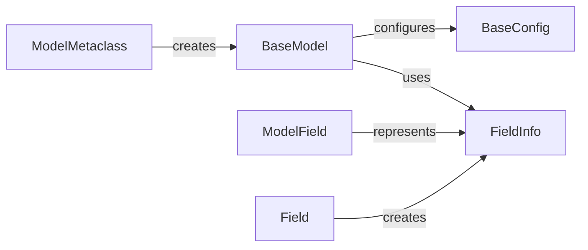

## Component Details

The Model Definition and Management component in Pydantic is responsible for defining, configuring, and managing data models. It revolves around the `BaseModel` class, which serves as the foundation for creating data structures with built-in parsing, validation, and serialization capabilities. The `ModelMetaclass` handles the creation of model classes, processing field definitions and configurations. `FieldInfo` and `ModelField` store metadata about individual fields, while the `Field` function allows customization of field properties. `BaseConfig` provides options for configuring model behavior. Together, these components enable the creation of robust and flexible data models within the Pydantic ecosystem.

### BaseModel
The `BaseModel` class is the core component for creating Pydantic models. It provides the foundation for data validation, serialization, and deserialization. It defines methods for object creation, copying, representation, and schema generation.

**Related Classes/Methods**:

- <a href="https://github.com/pydantic/pydantic/blob/master/pydantic/main.py#L121-L1643" target="_blank" rel="noopener noreferrer">`pydantic.main.BaseModel` (121:1643)</a>
- <a href="https://github.com/pydantic/pydantic/blob/master/pydantic/main.py#L307-L385" target="_blank" rel="noopener noreferrer">`pydantic.main.BaseModel:model_construct` (307:385)</a>
- <a href="https://github.com/pydantic/pydantic/blob/master/pydantic/main.py#L387-L419" target="_blank" rel="noopener noreferrer">`pydantic.main.BaseModel:model_copy` (387:419)</a>
- <a href="https://github.com/pydantic/pydantic/blob/master/pydantic/main.py#L1204-L1230" target="_blank" rel="noopener noreferrer">`pydantic.main.BaseModel:__repr_args__` (1204:1230)</a>
- <a href="https://github.com/pydantic/pydantic/blob/master/pydantic/main.py#L1269-L1291" target="_blank" rel="noopener noreferrer">`pydantic.main.BaseModel:dict` (1269:1291)</a>
- <a href="https://github.com/pydantic/pydantic/blob/master/pydantic/main.py#L1294-L1325" target="_blank" rel="noopener noreferrer">`pydantic.main.BaseModel:json` (1294:1325)</a>
- <a href="https://github.com/pydantic/pydantic/blob/master/pydantic/main.py#L1329-L1335" target="_blank" rel="noopener noreferrer">`pydantic.main.BaseModel:parse_obj` (1329:1335)</a>
- <a href="https://github.com/pydantic/pydantic/blob/master/pydantic/main.py#L1343-L1389" target="_blank" rel="noopener noreferrer">`pydantic.main.BaseModel:parse_raw` (1343:1389)</a>
- <a href="https://github.com/pydantic/pydantic/blob/master/pydantic/main.py#L1397-L1421" target="_blank" rel="noopener noreferrer">`pydantic.main.BaseModel:parse_file` (1397:1421)</a>
- <a href="https://github.com/pydantic/pydantic/blob/master/pydantic/main.py#L1429-L1440" target="_blank" rel="noopener noreferrer">`pydantic.main.BaseModel:from_orm` (1429:1440)</a>
- <a href="https://github.com/pydantic/pydantic/blob/master/pydantic/main.py#L1444-L1450" target="_blank" rel="noopener noreferrer">`pydantic.main.BaseModel:construct` (1444:1450)</a>
- <a href="https://github.com/pydantic/pydantic/blob/master/pydantic/main.py#L1531-L1539" target="_blank" rel="noopener noreferrer">`pydantic.main.BaseModel:schema` (1531:1539)</a>
- <a href="https://github.com/pydantic/pydantic/blob/master/pydantic/main.py#L1546-L1562" target="_blank" rel="noopener noreferrer">`pydantic.main.BaseModel:schema_json` (1546:1562)</a>
- <a href="https://github.com/pydantic/pydantic/blob/master/pydantic/main.py#L1566-L1572" target="_blank" rel="noopener noreferrer">`pydantic.main.BaseModel:validate` (1566:1572)</a>
- <a href="https://github.com/pydantic/pydantic/blob/master/pydantic/main.py#L1579-L1587" target="_blank" rel="noopener noreferrer">`pydantic.main.BaseModel:update_forward_refs` (1579:1587)</a>

### ModelMetaclass
The `ModelMetaclass` is a metaclass responsible for creating `BaseModel` classes. It handles the processing of field definitions, configurations, and other metadata to set up the model's structure and behavior.

**Related Classes/Methods**:

- `pydantic.main.ModelMetaclass` (full file reference)
- <a href="https://github.com/pydantic/pydantic/blob/master/pydantic/_internal/_model_construction.py#L79-L331" target="_blank" rel="noopener noreferrer">`pydantic._internal._model_construction.ModelMetaclass` (79:331)</a>

### FieldInfo
The `FieldInfo` class stores information about a field in a Pydantic model, including metadata, default values, and other properties that define how the field should be validated and serialized.

**Related Classes/Methods**:

- <a href="https://github.com/pydantic/pydantic/blob/master/pydantic/fields.py#L100-L736" target="_blank" rel="noopener noreferrer">`pydantic.fields.FieldInfo` (100:736)</a>
- <a href="https://github.com/pydantic/pydantic/blob/master/pydantic/fields.py#L210-L261" target="_blank" rel="noopener noreferrer">`pydantic.fields.FieldInfo:__init__` (210:261)</a>
- <a href="https://github.com/pydantic/pydantic/blob/master/pydantic/fields.py#L264-L289" target="_blank" rel="noopener noreferrer">`pydantic.fields.FieldInfo:from_field` (264:289)</a>
- <a href="https://github.com/pydantic/pydantic/blob/master/pydantic/fields.py#L292-L366" target="_blank" rel="noopener noreferrer">`pydantic.fields.FieldInfo:from_annotation` (292:366)</a>
- <a href="https://github.com/pydantic/pydantic/blob/master/pydantic/fields.py#L369-L469" target="_blank" rel="noopener noreferrer">`pydantic.fields.FieldInfo:from_annotated_attribute` (369:469)</a>
- <a href="https://github.com/pydantic/pydantic/blob/master/pydantic/fields.py#L472-L535" target="_blank" rel="noopener noreferrer">`pydantic.fields.FieldInfo:merge_field_infos` (472:535)</a>
- <a href="https://github.com/pydantic/pydantic/blob/master/pydantic/fields.py#L538-L561" target="_blank" rel="noopener noreferrer">`pydantic.fields.FieldInfo:_from_dataclass_field` (538:561)</a>
- <a href="https://github.com/pydantic/pydantic/blob/master/pydantic/fields.py#L703-L736" target="_blank" rel="noopener noreferrer">`pydantic.fields.FieldInfo:__repr_args__` (703:736)</a>

### ModelField
The `ModelField` class represents a field within a Pydantic model. It encapsulates the field's type, default value, and other metadata, and provides methods for validation and serialization.

**Related Classes/Methods**:

- `pydantic.fields.ModelField` (full file reference)

### Field
The `Field` function is used to define and customize fields within Pydantic models. It allows specifying default values, aliases, validation constraints, and other metadata for individual fields.

**Related Classes/Methods**:

- <a href="https://github.com/pydantic/pydantic/blob/master/pydantic/fields.py#L784-L821" target="_blank" rel="noopener noreferrer">`pydantic.fields.Field` (784:821)</a>

### BaseConfig
The `BaseConfig` class provides configuration options for Pydantic models. It allows customizing model behavior, such as validation settings, alias generation, and JSON schema generation.

**Related Classes/Methods**:

- `pydantic.config.BaseConfig` (full file reference)