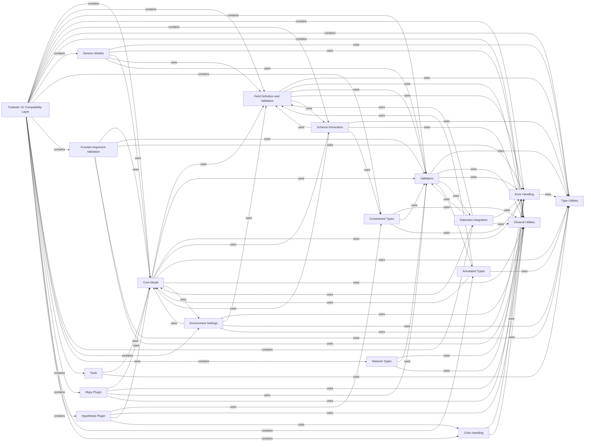

## Component Details

This graph provides an overview of the Pydantic V1 Compatibility Layer, detailing its core components, their individual responsibilities, and how they interact. The main purpose of this layer is to offer backward compatibility for Pydantic V1 codebases, facilitating migration to Pydantic V2 while maintaining the distinct V1 API for model definition, validation, serialization, type handling, and utility functions. The central flow involves defining models, validating data against these models, handling errors, and generating schemas, with various sub-components supporting specific functionalities like generic models, constrained types, environment settings, and integration with other tools like Mypy and Hypothesis.

### Pydantic V1 Compatibility Layer
This component provides the complete Pydantic V1 API, including its distinct model definition, validation, serialization, type handling, and utility functions. It exists primarily for backward compatibility and to aid in the migration of existing V1 codebases to Pydantic V2.

**Related Classes/Methods**:

- <a href="https://github.com/pydantic/pydantic/blob/master/pydantic/v1/main.py#L316-L922" target="_blank" rel="noopener noreferrer">`pydantic.v1.main.BaseModel` (316:922)</a>
- <a href="https://github.com/pydantic/pydantic/blob/master/pydantic/v1/class_validators.py#L52-L104" target="_blank" rel="noopener noreferrer">`pydantic.v1.class_validators.validator` (52:104)</a>
- <a href="https://github.com/pydantic/pydantic/blob/master/pydantic/v1/class_validators.py#L108-L109" target="_blank" rel="noopener noreferrer">`pydantic.v1.class_validators.root_validator` (108:109)</a>
- `pydantic.v1.generics` (full file reference)
- `pydantic.v1.types` (full file reference)
- `pydantic.v1.networks` (full file reference)
- `pydantic.v1.json` (full file reference)
- `pydantic.v1.error_wrappers` (full file reference)
- `pydantic.v1.tools` (full file reference)
- `pydantic.v1.typing` (full file reference)
- `pydantic.v1.errors` (full file reference)
- `pydantic.v1.mypy` (full file reference)
- `pydantic.v1.dataclasses` (full file reference)
- `pydantic.v1.decorator` (full file reference)
- <a href="https://github.com/pydantic/pydantic/blob/master/pydantic/v1/schema.py#L109-L159" target="_blank" rel="noopener noreferrer">`pydantic.v1.schema` (109:159)</a>
- `pydantic.v1.fields` (full file reference)
- `pydantic.v1.validators` (full file reference)
- `pydantic.v1.config` (full file reference)
- `pydantic.v1.parse` (full file reference)
- `pydantic.v1.env_settings` (full file reference)
- `pydantic.v1.datetime_parse` (full file reference)
- `pydantic.v1.annotated_types` (full file reference)
- `pydantic.v1.utils` (full file reference)
- `pydantic.v1.color` (full file reference)
- `pydantic.v1._hypothesis_plugin` (full file reference)

### Core Model
The fundamental component for defining data models with validation within Pydantic V1. It handles model creation, initialization, attribute setting, data serialization (dict, JSON), parsing from various sources (object, raw data, file, ORM), and schema generation. Its metaclass is responsible for collecting fields, validators, and configuration during class creation.

**Related Classes/Methods**:

- <a href="https://github.com/pydantic/pydantic/blob/master/pydantic/v1/main.py#L316-L922" target="_blank" rel="noopener noreferrer">`pydantic.v1.main.BaseModel` (316:922)</a>
- <a href="https://github.com/pydantic/pydantic/blob/master/pydantic/v1/main.py#L121-L310" target="_blank" rel="noopener noreferrer">`pydantic.v1.main.ModelMetaclass` (121:310)</a>
- <a href="https://github.com/pydantic/pydantic/blob/master/pydantic/v1/main.py#L929-L939" target="_blank" rel="noopener noreferrer">`pydantic.v1.main.create_model` (929:939)</a>
- <a href="https://github.com/pydantic/pydantic/blob/master/pydantic/v1/main.py#L1036-L1113" target="_blank" rel="noopener noreferrer">`pydantic.v1.main.validate_model` (1036:1113)</a>

### Field Definition and Validation
This component represents a single field within a Pydantic V1 model. It is responsible for inferring types, handling default values, applying validators, and performing the actual validation of input data against its defined type and constraints.

**Related Classes/Methods**:

- <a href="https://github.com/pydantic/pydantic/blob/master/pydantic/v1/fields.py#L364-L1201" target="_blank" rel="noopener noreferrer">`pydantic.v1.fields.ModelField` (364:1201)</a>
- <a href="https://github.com/pydantic/pydantic/blob/master/pydantic/v1/fields.py#L97-L218" target="_blank" rel="noopener noreferrer">`pydantic.v1.fields.FieldInfo` (97:218)</a>
- <a href="https://github.com/pydantic/pydantic/blob/master/pydantic/v1/fields.py#L221-L330" target="_blank" rel="noopener noreferrer">`pydantic.v1.fields.Field` (221:330)</a>
- <a href="https://github.com/pydantic/pydantic/blob/master/pydantic/v1/fields.py#L1221-L1243" target="_blank" rel="noopener noreferrer">`pydantic.v1.fields.PrivateAttr` (1221:1243)</a>
- <a href="https://github.com/pydantic/pydantic/blob/master/pydantic/v1/fields.py#L1204-L1218" target="_blank" rel="noopener noreferrer">`pydantic.v1.fields.ModelPrivateAttr` (1204:1218)</a>

### Validators
A collection of functions and classes responsible for performing various types of data validation (e.g., string, number, list, UUID, email, URL) within Pydantic V1. The `find_validators` function discovers appropriate validators for a given type, and `class_validators` provides decorators (`validator`, `root_validator`) to define custom validation logic within models.

**Related Classes/Methods**:

- <a href="https://github.com/pydantic/pydantic/blob/master/pydantic/v1/validators.py#L699-L768" target="_blank" rel="noopener noreferrer">`pydantic.v1.validators.find_validators` (699:768)</a>
- <a href="https://github.com/pydantic/pydantic/blob/master/pydantic/v1/class_validators.py#L52-L104" target="_blank" rel="noopener noreferrer">`pydantic.v1.class_validators.validator` (52:104)</a>
- <a href="https://github.com/pydantic/pydantic/blob/master/pydantic/v1/class_validators.py#L108-L109" target="_blank" rel="noopener noreferrer">`pydantic.v1.class_validators.root_validator` (108:109)</a>
- <a href="https://github.com/pydantic/pydantic/blob/master/pydantic/v1/class_validators.py#L161-L192" target="_blank" rel="noopener noreferrer">`pydantic.v1.class_validators.ValidatorGroup` (161:192)</a>
- <a href="https://github.com/pydantic/pydantic/blob/master/pydantic/v1/validators.py#L60-L72" target="_blank" rel="noopener noreferrer">`pydantic.v1.validators.str_validator` (60:72)</a>
- <a href="https://github.com/pydantic/pydantic/blob/master/pydantic/v1/validators.py#L128-L144" target="_blank" rel="noopener noreferrer">`pydantic.v1.validators.int_validator` (128:144)</a>
- <a href="https://github.com/pydantic/pydantic/blob/master/pydantic/v1/validators.py#L81-L91" target="_blank" rel="noopener noreferrer">`pydantic.v1.validators.bytes_validator` (81:91)</a>
- <a href="https://github.com/pydantic/pydantic/blob/master/pydantic/v1/validators.py#L262-L268" target="_blank" rel="noopener noreferrer">`pydantic.v1.validators.list_validator` (262:268)</a>
- <a href="https://github.com/pydantic/pydantic/blob/master/pydantic/v1/validators.py#L271-L277" target="_blank" rel="noopener noreferrer">`pydantic.v1.validators.tuple_validator` (271:277)</a>
- <a href="https://github.com/pydantic/pydantic/blob/master/pydantic/v1/validators.py#L280-L286" target="_blank" rel="noopener noreferrer">`pydantic.v1.validators.set_validator` (280:286)</a>
- <a href="https://github.com/pydantic/pydantic/blob/master/pydantic/v1/validators.py#L289-L295" target="_blank" rel="noopener noreferrer">`pydantic.v1.validators.frozenset_validator` (289:295)</a>
- <a href="https://github.com/pydantic/pydantic/blob/master/pydantic/v1/validators.py#L298-L304" target="_blank" rel="noopener noreferrer">`pydantic.v1.validators.deque_validator` (298:304)</a>
- <a href="https://github.com/pydantic/pydantic/blob/master/pydantic/v1/validators.py#L179-L185" target="_blank" rel="noopener noreferrer">`pydantic.v1.validators.number_multiple_validator` (179:185)</a>
- <a href="https://github.com/pydantic/pydantic/blob/master/pydantic/v1/validators.py#L481-L495" target="_blank" rel="noopener noreferrer">`pydantic.v1.validators.make_literal_validator` (481:495)</a>
- <a href="https://github.com/pydantic/pydantic/blob/master/pydantic/v1/validators.py#L559-L565" target="_blank" rel="noopener noreferrer">`pydantic.v1.validators.make_class_validator` (559:565)</a>
- <a href="https://github.com/pydantic/pydantic/blob/master/pydantic/v1/validators.py#L580-L589" target="_blank" rel="noopener noreferrer">`pydantic.v1.validators.pattern_validator` (580:589)</a>
- <a href="https://github.com/pydantic/pydantic/blob/master/pydantic/v1/validators.py#L595-L617" target="_blank" rel="noopener noreferrer">`pydantic.v1.validators.make_namedtuple_validator` (595:617)</a>
- <a href="https://github.com/pydantic/pydantic/blob/master/pydantic/v1/validators.py#L620-L635" target="_blank" rel="noopener noreferrer">`pydantic.v1.validators.make_typeddict_validator` (620:635)</a>

### Error Handling
This component manages and formats validation errors within Pydantic V1. `ValidationError` collects `ErrorWrapper` instances, which encapsulate the original exception and its location, and provides methods to display errors in a human-readable or JSON format.

**Related Classes/Methods**:

- <a href="https://github.com/pydantic/pydantic/blob/master/pydantic/v1/error_wrappers.py#L50-L79" target="_blank" rel="noopener noreferrer">`pydantic.v1.error_wrappers.ValidationError` (50:79)</a>
- <a href="https://github.com/pydantic/pydantic/blob/master/pydantic/v1/error_wrappers.py#L28-L42" target="_blank" rel="noopener noreferrer">`pydantic.v1.error_wrappers.ErrorWrapper` (28:42)</a>
- <a href="https://github.com/pydantic/pydantic/blob/master/pydantic/v1/errors.py#L141-L142" target="_blank" rel="noopener noreferrer">`pydantic.v1.errors.ConfigError` (141:142)</a>
- <a href="https://github.com/pydantic/pydantic/blob/master/pydantic/v1/errors.py#L145-L146" target="_blank" rel="noopener noreferrer">`pydantic.v1.errors.MissingError` (145:146)</a>
- <a href="https://github.com/pydantic/pydantic/blob/master/pydantic/v1/errors.py#L149-L150" target="_blank" rel="noopener noreferrer">`pydantic.v1.errors.ExtraError` (149:150)</a>
- <a href="https://github.com/pydantic/pydantic/blob/master/pydantic/v1/errors.py#L153-L155" target="_blank" rel="noopener noreferrer">`pydantic.v1.errors.NoneIsNotAllowedError` (153:155)</a>
- <a href="https://github.com/pydantic/pydantic/blob/master/pydantic/v1/errors.py#L634-L646" target="_blank" rel="noopener noreferrer">`pydantic.v1.errors.InvalidDiscriminator` (634:646)</a>

### Schema Generation
Responsible for generating JSON Schema representations of Pydantic V1 models. It recursively processes models and their fields to produce a comprehensive schema, including definitions for nested models and handling aliases and constraints.

**Related Classes/Methods**:

- <a href="https://github.com/pydantic/pydantic/blob/master/pydantic/v1/schema.py#L109-L159" target="_blank" rel="noopener noreferrer">`pydantic.v1.schema.schema` (109:159)</a>
- <a href="https://github.com/pydantic/pydantic/blob/master/pydantic/v1/schema.py#L162-L197" target="_blank" rel="noopener noreferrer">`pydantic.v1.schema.model_schema` (162:197)</a>
- <a href="https://github.com/pydantic/pydantic/blob/master/pydantic/v1/schema.py#L222-L270" target="_blank" rel="noopener noreferrer">`pydantic.v1.schema.field_schema` (222:270)</a>
- <a href="https://github.com/pydantic/pydantic/blob/master/pydantic/v1/schema.py#L200-L219" target="_blank" rel="noopener noreferrer">`pydantic.v1.schema.get_field_info_schema` (200:219)</a>
- <a href="https://github.com/pydantic/pydantic/blob/master/pydantic/v1/schema.py#L322-L346" target="_blank" rel="noopener noreferrer">`pydantic.v1.schema.get_model_name_map` (322:346)</a>
- <a href="https://github.com/pydantic/pydantic/blob/master/pydantic/v1/schema.py#L349-L366" target="_blank" rel="noopener noreferrer">`pydantic.v1.schema.get_flat_models_from_model` (349:366)</a>
- <a href="https://github.com/pydantic/pydantic/blob/master/pydantic/v1/schema.py#L369-L395" target="_blank" rel="noopener noreferrer">`pydantic.v1.schema.get_flat_models_from_field` (369:395)</a>
- <a href="https://github.com/pydantic/pydantic/blob/master/pydantic/v1/schema.py#L398-L413" target="_blank" rel="noopener noreferrer">`pydantic.v1.schema.get_flat_models_from_fields` (398:413)</a>
- <a href="https://github.com/pydantic/pydantic/blob/master/pydantic/v1/schema.py#L416-L425" target="_blank" rel="noopener noreferrer">`pydantic.v1.schema.get_flat_models_from_models` (416:425)</a>
- <a href="https://github.com/pydantic/pydantic/blob/master/pydantic/v1/schema.py#L432-L548" target="_blank" rel="noopener noreferrer">`pydantic.v1.schema.field_type_schema` (432:548)</a>
- <a href="https://github.com/pydantic/pydantic/blob/master/pydantic/v1/schema.py#L551-L598" target="_blank" rel="noopener noreferrer">`pydantic.v1.schema.model_process_schema` (551:598)</a>
- <a href="https://github.com/pydantic/pydantic/blob/master/pydantic/v1/schema.py#L601-L652" target="_blank" rel="noopener noreferrer">`pydantic.v1.schema.model_type_schema` (601:652)</a>
- <a href="https://github.com/pydantic/pydantic/blob/master/pydantic/v1/schema.py#L655-L678" target="_blank" rel="noopener noreferrer">`pydantic.v1.schema.enum_process_schema` (655:678)</a>
- <a href="https://github.com/pydantic/pydantic/blob/master/pydantic/v1/schema.py#L681-L769" target="_blank" rel="noopener noreferrer">`pydantic.v1.schema.field_singleton_sub_fields_schema` (681:769)</a>
- <a href="https://github.com/pydantic/pydantic/blob/master/pydantic/v1/schema.py#L804-L815" target="_blank" rel="noopener noreferrer">`pydantic.v1.schema.add_field_type_to_schema` (804:815)</a>
- <a href="https://github.com/pydantic/pydantic/blob/master/pydantic/v1/schema.py#L826-L951" target="_blank" rel="noopener noreferrer">`pydantic.v1.schema.field_singleton_schema` (826:951)</a>
- <a href="https://github.com/pydantic/pydantic/blob/master/pydantic/v1/schema.py#L954-L973" target="_blank" rel="noopener noreferrer">`pydantic.v1.schema.multitypes_literal_field_for_schema` (954:973)</a>
- <a href="https://github.com/pydantic/pydantic/blob/master/pydantic/v1/schema.py#L976-L995" target="_blank" rel="noopener noreferrer">`pydantic.v1.schema.encode_default` (976:995)</a>
- <a href="https://github.com/pydantic/pydantic/blob/master/pydantic/v1/schema.py#L1001-L1027" target="_blank" rel="noopener noreferrer">`pydantic.v1.schema.get_annotation_from_field_info` (1001:1027)</a>
- <a href="https://github.com/pydantic/pydantic/blob/master/pydantic/v1/schema.py#L1030-L1147" target="_blank" rel="noopener noreferrer">`pydantic.v1.schema.get_annotation_with_constraints` (1030:1147)</a>

### Type Utilities
Provides a set of utility functions for introspecting and manipulating Python types, especially those from the `typing` module, within Pydantic V1. This includes functions for getting origins and arguments of generic types, resolving forward references, and displaying types as strings.

**Related Classes/Methods**:

- <a href="https://github.com/pydantic/pydantic/blob/master/pydantic/v1/typing.py#L367-L382" target="_blank" rel="noopener noreferrer">`pydantic.v1.typing.display_as_type` (367:382)</a>
- `pydantic.v1.typing.get_args` (full file reference)
- `pydantic.v1.typing.get_origin` (full file reference)
- <a href="https://github.com/pydantic/pydantic/blob/master/pydantic/v1/typing.py#L420-L421" target="_blank" rel="noopener noreferrer">`pydantic.v1.typing.is_callable_type` (420:421)</a>
- <a href="https://github.com/pydantic/pydantic/blob/master/pydantic/v1/typing.py#L424-L425" target="_blank" rel="noopener noreferrer">`pydantic.v1.typing.is_literal_type` (424:425)</a>
- <a href="https://github.com/pydantic/pydantic/blob/master/pydantic/v1/typing.py#L428-L429" target="_blank" rel="noopener noreferrer">`pydantic.v1.typing.literal_values` (428:429)</a>
- <a href="https://github.com/pydantic/pydantic/blob/master/pydantic/v1/typing.py#L432-L442" target="_blank" rel="noopener noreferrer">`pydantic.v1.typing.all_literal_values` (432:442)</a>
- <a href="https://github.com/pydantic/pydantic/blob/master/pydantic/v1/typing.py#L445-L452" target="_blank" rel="noopener noreferrer">`pydantic.v1.typing.is_namedtuple` (445:452)</a>
- <a href="https://github.com/pydantic/pydantic/blob/master/pydantic/v1/typing.py#L455-L462" target="_blank" rel="noopener noreferrer">`pydantic.v1.typing.is_typeddict` (455:462)</a>
- <a href="https://github.com/pydantic/pydantic/blob/master/pydantic/v1/typing.py#L469-L473" target="_blank" rel="noopener noreferrer">`pydantic.v1.typing.is_typeddict_special` (469:473)</a>
- <a href="https://github.com/pydantic/pydantic/blob/master/pydantic/v1/typing.py#L509-L518" target="_blank" rel="noopener noreferrer">`pydantic.v1.typing.is_classvar` (509:518)</a>
- <a href="https://github.com/pydantic/pydantic/blob/master/pydantic/v1/typing.py#L521-L522" target="_blank" rel="noopener noreferrer">`pydantic.v1.typing.is_finalvar` (521:522)</a>
- <a href="https://github.com/pydantic/pydantic/blob/master/pydantic/v1/typing.py#L525-L544" target="_blank" rel="noopener noreferrer">`pydantic.v1.typing.update_field_forward_refs` (525:544)</a>
- <a href="https://github.com/pydantic/pydantic/blob/master/pydantic/v1/typing.py#L547-L583" target="_blank" rel="noopener noreferrer">`pydantic.v1.typing.update_model_forward_refs` (547:583)</a>
- <a href="https://github.com/pydantic/pydantic/blob/master/pydantic/v1/typing.py#L586-L601" target="_blank" rel="noopener noreferrer">`pydantic.v1.typing.get_class` (586:601)</a>
- <a href="https://github.com/pydantic/pydantic/blob/master/pydantic/v1/typing.py#L604-L615" target="_blank" rel="noopener noreferrer">`pydantic.v1.typing.get_sub_types` (604:615)</a>

### General Utilities
A collection of miscellaneous utility functions used across the Pydantic V1 library, such as deep merging dictionaries, checking for valid identifiers, and providing a base for `__repr__` methods.

**Related Classes/Methods**:

- <a href="https://github.com/pydantic/pydantic/blob/master/pydantic/v1/utils.py#L214-L222" target="_blank" rel="noopener noreferrer">`pydantic.v1.utils.deep_update` (214:222)</a>
- <a href="https://github.com/pydantic/pydantic/blob/master/pydantic/v1/utils.py#L361-L418" target="_blank" rel="noopener noreferrer">`pydantic.v1.utils.Representation` (361:418)</a>
- <a href="https://github.com/pydantic/pydantic/blob/master/pydantic/v1/utils.py#L421-L480" target="_blank" rel="noopener noreferrer">`pydantic.v1.utils.GetterDict` (421:480)</a>
- <a href="https://github.com/pydantic/pydantic/blob/master/pydantic/v1/utils.py#L483-L626" target="_blank" rel="noopener noreferrer">`pydantic.v1.utils.ValueItems` (483:626)</a>
- <a href="https://github.com/pydantic/pydantic/blob/master/pydantic/v1/utils.py#L236-L298" target="_blank" rel="noopener noreferrer">`pydantic.v1.utils.generate_model_signature` (236:298)</a>
- <a href="https://github.com/pydantic/pydantic/blob/master/pydantic/v1/utils.py#L318-L322" target="_blank" rel="noopener noreferrer">`pydantic.v1.utils.to_lower_camel` (318:322)</a>
- <a href="https://github.com/pydantic/pydantic/blob/master/pydantic/v1/utils.py#L716-L717" target="_blank" rel="noopener noreferrer">`pydantic.v1.utils.is_valid_private_name` (716:717)</a>
- <a href="https://github.com/pydantic/pydantic/blob/master/pydantic/v1/utils.py#L749-L756" target="_blank" rel="noopener noreferrer">`pydantic.v1.utils.get_unique_discriminator_alias` (749:756)</a>
- <a href="https://github.com/pydantic/pydantic/blob/master/pydantic/v1/utils.py#L759-L797" target="_blank" rel="noopener noreferrer">`pydantic.v1.utils.get_discriminator_alias_and_values` (759:797)</a>
- <a href="https://github.com/pydantic/pydantic/blob/master/pydantic/v1/utils.py#L800-L806" target="_blank" rel="noopener noreferrer">`pydantic.v1.utils._get_union_alias_and_all_values` (800:806)</a>

### Generic Models
Extends `BaseModel` to support generic types within Pydantic V1. It handles the parametrization of models with type variables, creating concrete model classes at runtime based on the provided type arguments.

**Related Classes/Methods**:

- <a href="https://github.com/pydantic/pydantic/blob/master/pydantic/v1/generics.py#L64-L248" target="_blank" rel="noopener noreferrer">`pydantic.v1.generics.GenericModel` (64:248)</a>
- <a href="https://github.com/pydantic/pydantic/blob/master/pydantic/v1/generics.py#L251-L330" target="_blank" rel="noopener noreferrer">`pydantic.v1.generics.replace_types` (251:330)</a>
- <a href="https://github.com/pydantic/pydantic/blob/master/pydantic/v1/generics.py#L344-L356" target="_blank" rel="noopener noreferrer">`pydantic.v1.generics.iter_contained_typevars` (344:356)</a>
- <a href="https://github.com/pydantic/pydantic/blob/master/pydantic/v1/generics.py#L377-L400" target="_blank" rel="noopener noreferrer">`pydantic.v1.generics._prepare_model_fields` (377:400)</a>

### Constrained Types
Provides classes and functions for defining types with specific constraints (e.g., `min_length`, `max_value`, `regex`) within Pydantic V1. These types integrate with Pydantic's validation system to enforce these constraints.

**Related Classes/Methods**:

- <a href="https://github.com/pydantic/pydantic/blob/master/pydantic/v1/types.py#L405-L446" target="_blank" rel="noopener noreferrer">`pydantic.v1.types.ConstrainedStr` (405:446)</a>
- <a href="https://github.com/pydantic/pydantic/blob/master/pydantic/v1/types.py#L202-L225" target="_blank" rel="noopener noreferrer">`pydantic.v1.types.ConstrainedInt` (202:225)</a>
- <a href="https://github.com/pydantic/pydantic/blob/master/pydantic/v1/types.py#L269-L303" target="_blank" rel="noopener noreferrer">`pydantic.v1.types.ConstrainedFloat` (269:303)</a>
- <a href="https://github.com/pydantic/pydantic/blob/master/pydantic/v1/types.py#L352-L370" target="_blank" rel="noopener noreferrer">`pydantic.v1.types.ConstrainedBytes` (352:370)</a>
- <a href="https://github.com/pydantic/pydantic/blob/master/pydantic/v1/types.py#L575-L620" target="_blank" rel="noopener noreferrer">`pydantic.v1.types.ConstrainedList` (575:620)</a>
- <a href="https://github.com/pydantic/pydantic/blob/master/pydantic/v1/types.py#L486-L517" target="_blank" rel="noopener noreferrer">`pydantic.v1.types.ConstrainedSet` (486:517)</a>
- <a href="https://github.com/pydantic/pydantic/blob/master/pydantic/v1/types.py#L528-L559" target="_blank" rel="noopener noreferrer">`pydantic.v1.types.ConstrainedFrozenSet` (528:559)</a>
- <a href="https://github.com/pydantic/pydantic/blob/master/pydantic/v1/types.py#L667-L732" target="_blank" rel="noopener noreferrer">`pydantic.v1.types.ConstrainedDecimal` (667:732)</a>
- <a href="https://github.com/pydantic/pydantic/blob/master/pydantic/v1/types.py#L875-L916" target="_blank" rel="noopener noreferrer">`pydantic.v1.types.SecretStr` (875:916)</a>
- <a href="https://github.com/pydantic/pydantic/blob/master/pydantic/v1/types.py#L919-L960" target="_blank" rel="noopener noreferrer">`pydantic.v1.types.SecretBytes` (919:960)</a>
- <a href="https://github.com/pydantic/pydantic/blob/master/pydantic/v1/types.py#L978-L1068" target="_blank" rel="noopener noreferrer">`pydantic.v1.types.PaymentCardNumber` (978:1068)</a>
- <a href="https://github.com/pydantic/pydantic/blob/master/pydantic/v1/types.py#L1092-L1143" target="_blank" rel="noopener noreferrer">`pydantic.v1.types.ByteSize` (1092:1143)</a>
- `pydantic.v1.types.Json` (full file reference)
- <a href="https://github.com/pydantic/pydantic/blob/master/pydantic/v1/types.py#L157-L166" target="_blank" rel="noopener noreferrer">`pydantic.v1.types.ConstrainedNumberMeta` (157:166)</a>

### Function Argument Validation
A decorator that allows Pydantic V1's validation capabilities to be applied to function arguments, effectively turning a function's signature into a Pydantic model for validation purposes.

**Related Classes/Methods**:

- <a href="https://github.com/pydantic/pydantic/blob/master/pydantic/v1/decorator.py#L21-L22" target="_blank" rel="noopener noreferrer">`pydantic.v1.decorator.validate_arguments` (21:22)</a>
- <a href="https://github.com/pydantic/pydantic/blob/master/pydantic/v1/decorator.py#L60-L264" target="_blank" rel="noopener noreferrer">`pydantic.v1.decorator.ValidatedFunction` (60:264)</a>

### Dataclass Integration
Provides a decorator to integrate Pydantic V1's validation with standard library dataclasses, allowing dataclasses to benefit from Pydantic's validation features.

**Related Classes/Methods**:

- <a href="https://github.com/pydantic/pydantic/blob/master/pydantic/v1/dataclasses.py#L176-L238" target="_blank" rel="noopener noreferrer">`pydantic.v1.dataclasses.dataclass` (176:238)</a>
- <a href="https://github.com/pydantic/pydantic/blob/master/pydantic/v1/dataclasses.py#L251-L274" target="_blank" rel="noopener noreferrer">`pydantic.v1.dataclasses.DataclassProxy` (251:274)</a>
- <a href="https://github.com/pydantic/pydantic/blob/master/pydantic/v1/dataclasses.py#L380-L416" target="_blank" rel="noopener noreferrer">`pydantic.v1.dataclasses.create_pydantic_model_from_dataclass` (380:416)</a>
- <a href="https://github.com/pydantic/pydantic/blob/master/pydantic/v1/dataclasses.py#L277-L360" target="_blank" rel="noopener noreferrer">`pydantic.v1.dataclasses._add_pydantic_validation_attributes` (277:360)</a>
- <a href="https://github.com/pydantic/pydantic/blob/master/pydantic/v1/dataclasses.py#L367-L377" target="_blank" rel="noopener noreferrer">`pydantic.v1.dataclasses._validate_dataclass` (367:377)</a>
- <a href="https://github.com/pydantic/pydantic/blob/master/pydantic/v1/dataclasses.py#L430-L449" target="_blank" rel="noopener noreferrer">`pydantic.v1.dataclasses._dataclass_validate_values` (430:449)</a>
- <a href="https://github.com/pydantic/pydantic/blob/master/pydantic/v1/dataclasses.py#L452-L462" target="_blank" rel="noopener noreferrer">`pydantic.v1.dataclasses._dataclass_validate_assignment_setattr` (452:462)</a>
- <a href="https://github.com/pydantic/pydantic/blob/master/pydantic/v1/dataclasses.py#L494-L500" target="_blank" rel="noopener noreferrer">`pydantic.v1.dataclasses.make_dataclass_validator` (494:500)</a>

### Environment Settings
A specialized `BaseModel` subclass for loading configuration from environment variables and `.env` files within Pydantic V1, supporting nested structures and secret management.

**Related Classes/Methods**:

- <a href="https://github.com/pydantic/pydantic/blob/master/pydantic/v1/env_settings.py#L23-L135" target="_blank" rel="noopener noreferrer">`pydantic.v1.env_settings.BaseSettings` (23:135)</a>
- <a href="https://github.com/pydantic/pydantic/blob/master/pydantic/v1/env_settings.py#L151-L272" target="_blank" rel="noopener noreferrer">`pydantic.v1.env_settings.EnvSettingsSource` (151:272)</a>
- <a href="https://github.com/pydantic/pydantic/blob/master/pydantic/v1/env_settings.py#L275-L323" target="_blank" rel="noopener noreferrer">`pydantic.v1.env_settings.SecretsSettingsSource` (275:323)</a>

### Network Types
Provides specialized types for validating network-related data like URLs, email addresses, and IP addresses within Pydantic V1.

**Related Classes/Methods**:

- <a href="https://github.com/pydantic/pydantic/blob/master/pydantic/v1/networks.py#L171-L396" target="_blank" rel="noopener noreferrer">`pydantic.v1.networks.AnyUrl` (171:396)</a>
- <a href="https://github.com/pydantic/pydantic/blob/master/pydantic/v1/networks.py#L583-L598" target="_blank" rel="noopener noreferrer">`pydantic.v1.networks.EmailStr` (583:598)</a>
- <a href="https://github.com/pydantic/pydantic/blob/master/pydantic/v1/networks.py#L423-L484" target="_blank" rel="noopener noreferrer">`pydantic.v1.networks.MultiHostDsn` (423:484)</a>
- <a href="https://github.com/pydantic/pydantic/blob/master/pydantic/v1/networks.py#L601-L629" target="_blank" rel="noopener noreferrer">`pydantic.v1.networks.NameEmail` (601:629)</a>

### Tools
Offers utility functions for parsing arbitrary objects, raw data, or files into Pydantic V1 types, and for generating schemas of arbitrary types.

**Related Classes/Methods**:

- <a href="https://github.com/pydantic/pydantic/blob/master/pydantic/v1/tools.py#L36-L38" target="_blank" rel="noopener noreferrer">`pydantic.v1.tools.parse_obj_as` (36:38)</a>
- <a href="https://github.com/pydantic/pydantic/blob/master/pydantic/v1/tools.py#L41-L60" target="_blank" rel="noopener noreferrer">`pydantic.v1.tools.parse_file_as` (41:60)</a>
- <a href="https://github.com/pydantic/pydantic/blob/master/pydantic/v1/tools.py#L63-L82" target="_blank" rel="noopener noreferrer">`pydantic.v1.tools.parse_raw_as` (63:82)</a>
- <a href="https://github.com/pydantic/pydantic/blob/master/pydantic/v1/tools.py#L85-L87" target="_blank" rel="noopener noreferrer">`pydantic.v1.tools.schema_of` (85:87)</a>
- <a href="https://github.com/pydantic/pydantic/blob/master/pydantic/v1/tools.py#L90-L92" target="_blank" rel="noopener noreferrer">`pydantic.v1.tools.schema_json_of` (90:92)</a>

### Mypy Plugin
Provides static analysis capabilities for Pydantic V1 models within Mypy, helping to catch type-related errors during development.

**Related Classes/Methods**:

- <a href="https://github.com/pydantic/pydantic/blob/master/pydantic/v1/mypy.py#L108-L222" target="_blank" rel="noopener noreferrer">`pydantic.v1.mypy.PydanticPlugin` (108:222)</a>
- <a href="https://github.com/pydantic/pydantic/blob/master/pydantic/v1/mypy.py#L287-L715" target="_blank" rel="noopener noreferrer">`pydantic.v1.mypy.PydanticModelTransformer` (287:715)</a>
- <a href="https://github.com/pydantic/pydantic/blob/master/pydantic/v1/mypy.py#L225-L259" target="_blank" rel="noopener noreferrer">`pydantic.v1.mypy.PydanticPluginConfig` (225:259)</a>
- <a href="https://github.com/pydantic/pydantic/blob/master/pydantic/v1/mypy.py#L262-L284" target="_blank" rel="noopener noreferrer">`pydantic.v1.mypy.from_orm_callback` (262:284)</a>
- <a href="https://github.com/pydantic/pydantic/blob/master/pydantic/v1/mypy.py#L718-L752" target="_blank" rel="noopener noreferrer">`pydantic.v1.mypy.PydanticModelField` (718:752)</a>
- <a href="https://github.com/pydantic/pydantic/blob/master/pydantic/v1/mypy.py#L755-L783" target="_blank" rel="noopener noreferrer">`pydantic.v1.mypy.ModelConfigData` (755:783)</a>

### Hypothesis Plugin
Registers Hypothesis strategies for Pydantic V1 custom types, enabling automatic generation of test data for Pydantic models.

**Related Classes/Methods**:

- <a href="https://github.com/pydantic/pydantic/blob/master/pydantic/v1/_hypothesis_plugin.py#L223-L239" target="_blank" rel="noopener noreferrer">`pydantic.v1._hypothesis_plugin.resolve_json` (223:239)</a>
- <a href="https://github.com/pydantic/pydantic/blob/master/pydantic/v1/_hypothesis_plugin.py#L122-L128" target="_blank" rel="noopener noreferrer">`pydantic.v1._hypothesis_plugin.add_luhn_digit` (122:128)</a>
- <a href="https://github.com/pydantic/pydantic/blob/master/pydantic/v1/_hypothesis_plugin.py#L243-L260" target="_blank" rel="noopener noreferrer">`pydantic.v1._hypothesis_plugin.resolve_conbytes` (243:260)</a>
- <a href="https://github.com/pydantic/pydantic/blob/master/pydantic/v1/_hypothesis_plugin.py#L264-L278" target="_blank" rel="noopener noreferrer">`pydantic.v1._hypothesis_plugin.resolve_condecimal` (264:278)</a>
- <a href="https://github.com/pydantic/pydantic/blob/master/pydantic/v1/_hypothesis_plugin.py#L282-L310" target="_blank" rel="noopener noreferrer">`pydantic.v1._hypothesis_plugin.resolve_confloat` (282:310)</a>
- <a href="https://github.com/pydantic/pydantic/blob/master/pydantic/v1/_hypothesis_plugin.py#L314-L333" target="_blank" rel="noopener noreferrer">`pydantic.v1._hypothesis_plugin.resolve_conint` (314:333)</a>
- <a href="https://github.com/pydantic/pydantic/blob/master/pydantic/v1/_hypothesis_plugin.py#L337-L352" target="_blank" rel="noopener noreferrer">`pydantic.v1._hypothesis_plugin.resolve_condate` (337:352)</a>
- <a href="https://github.com/pydantic/pydantic/blob/master/pydantic/v1/_hypothesis_plugin.py#L356-L384" target="_blank" rel="noopener noreferrer">`pydantic.v1._hypothesis_plugin.resolve_constr` (356:384)</a>

### Annotated Types
Provides functions to create Pydantic V1 models from standard Python types like `TypedDict` and `NamedTuple`, bridging them with Pydantic's validation.

**Related Classes/Methods**:

- <a href="https://github.com/pydantic/pydantic/blob/master/pydantic/v1/annotated_types.py#L22-L55" target="_blank" rel="noopener noreferrer">`pydantic.v1.annotated_types.create_model_from_typeddict` (22:55)</a>
- <a href="https://github.com/pydantic/pydantic/blob/master/pydantic/v1/annotated_types.py#L58-L72" target="_blank" rel="noopener noreferrer">`pydantic.v1.annotated_types.create_model_from_namedtuple` (58:72)</a>

### Color Handling
Provides a `Color` type for parsing and representing colors in various formats (named, hex, RGB, HSL) within Pydantic V1.

**Related Classes/Methods**:

- <a href="https://github.com/pydantic/pydantic/blob/master/pydantic/v1/color.py#L63-L205" target="_blank" rel="noopener noreferrer">`pydantic.v1.color.Color` (63:205)</a>
- <a href="https://github.com/pydantic/pydantic/blob/master/pydantic/v1/color.py#L208-L219" target="_blank" rel="noopener noreferrer">`pydantic.v1.color.parse_tuple` (208:219)</a>
- <a href="https://github.com/pydantic/pydantic/blob/master/pydantic/v1/color.py#L222-L277" target="_blank" rel="noopener noreferrer">`pydantic.v1.color.parse_str` (222:277)</a>
- <a href="https://github.com/pydantic/pydantic/blob/master/pydantic/v1/color.py#L280-L281" target="_blank" rel="noopener noreferrer">`pydantic.v1.color.ints_to_rgba` (280:281)</a>
- <a href="https://github.com/pydantic/pydantic/blob/master/pydantic/v1/color.py#L284-L296" target="_blank" rel="noopener noreferrer">`pydantic.v1.color.parse_color_value` (284:296)</a>
- <a href="https://github.com/pydantic/pydantic/blob/master/pydantic/v1/color.py#L299-L318" target="_blank" rel="noopener noreferrer">`pydantic.v1.color.parse_float_alpha` (299:318)</a>
- <a href="https://github.com/pydantic/pydantic/blob/master/pydantic/v1/color.py#L321-L337" target="_blank" rel="noopener noreferrer">`pydantic.v1.color.parse_hsl` (321:337)</a>

### [FAQ](https://github.com/CodeBoarding/GeneratedOnBoardings/tree/main?tab=readme-ov-file#faq)