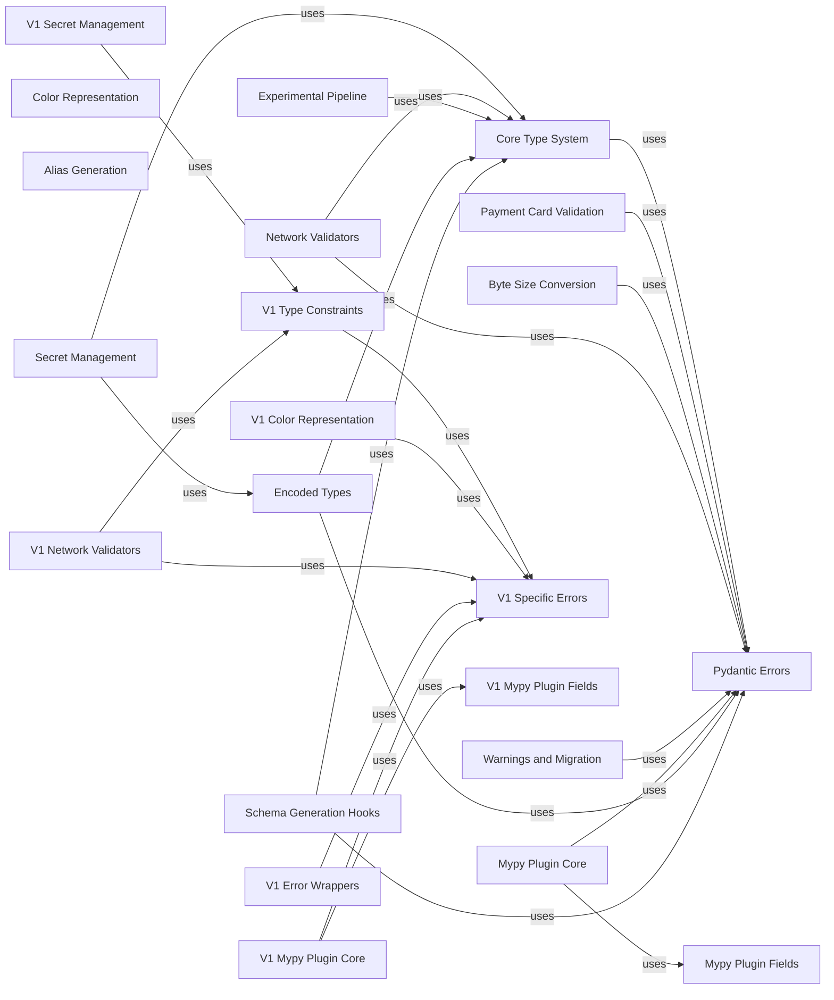

## Component Details

This graph provides an overview of the 'Pydantic V2 Built-in Types & Utilities' subsystem, detailing its various components, their functionalities, and their interdependencies. It covers core type handling, secret management, specialized validators for network and payment card data, byte size conversions, color representation, alias generation, error handling, MyPy plugin integration, experimental pipeline features, and backward compatibility for Pydantic V1 types and utilities. The main flow involves data validation and transformation using these built-in types and utilities, with error handling and MyPy integration supporting development and debugging.

### Core Type System
Handles fundamental Pydantic types and their constraints, including strict mode, numerical constraints, string constraints, UUID versions, path validation, JSON handling, and error omission/fail-fast behavior.

**Related Classes/Methods**:

- <a href="https://github.com/pydantic/pydantic/blob/master/pydantic/types.py#L151-L235" target="_blank" rel="noopener noreferrer">`pydantic.types.conint` (151:235)</a>
- <a href="https://github.com/pydantic/pydantic/blob/master/pydantic/types.py#L411-L497" target="_blank" rel="noopener noreferrer">`pydantic.types.confloat` (411:497)</a>
- <a href="https://github.com/pydantic/pydantic/blob/master/pydantic/types.py#L663-L683" target="_blank" rel="noopener noreferrer">`pydantic.types.conbytes` (663:683)</a>
- <a href="https://github.com/pydantic/pydantic/blob/master/pydantic/types.py#L694-L746" target="_blank" rel="noopener noreferrer">`pydantic.types.StringConstraints` (694:746)</a>
- <a href="https://github.com/pydantic/pydantic/blob/master/pydantic/types.py#L749-L828" target="_blank" rel="noopener noreferrer">`pydantic.types.constr` (749:828)</a>
- <a href="https://github.com/pydantic/pydantic/blob/master/pydantic/types.py#L874-L903" target="_blank" rel="noopener noreferrer">`pydantic.types.conlist` (874:903)</a>
- <a href="https://github.com/pydantic/pydantic/blob/master/pydantic/types.py#L1041-L1132" target="_blank" rel="noopener noreferrer">`pydantic.types.condecimal` (1041:1132)</a>
- <a href="https://github.com/pydantic/pydantic/blob/master/pydantic/types.py#L1139-L1180" target="_blank" rel="noopener noreferrer">`pydantic.types.UuidVersion` (1139:1180)</a>
- <a href="https://github.com/pydantic/pydantic/blob/master/pydantic/types.py#L1286-L1341" target="_blank" rel="noopener noreferrer">`pydantic.types.PathType` (1286:1341)</a>
- <a href="https://github.com/pydantic/pydantic/blob/master/pydantic/types.py#L2130-L2167" target="_blank" rel="noopener noreferrer">`pydantic.types.JsonValue` (2130:2167)</a>
- <a href="https://github.com/pydantic/pydantic/blob/master/pydantic/types.py#L2170-L2182" target="_blank" rel="noopener noreferrer">`pydantic.types.OnErrorOmit` (2170:2182)</a>
- <a href="https://github.com/pydantic/pydantic/blob/master/pydantic/types.py#L2242-L2266" target="_blank" rel="noopener noreferrer">`pydantic.types.condate` (2242:2266)</a>
- <a href="https://github.com/pydantic/pydantic/blob/master/pydantic/types.py#L3256-L3285" target="_blank" rel="noopener noreferrer">`pydantic.types.FailFast` (3256:3285)</a>
- <a href="https://github.com/pydantic/pydantic/blob/master/pydantic/types.py#L117-L140" target="_blank" rel="noopener noreferrer">`pydantic.types.Strict` (117:140)</a>
- `pydantic.types.Json` (full file reference)
- <a href="https://github.com/pydantic/pydantic/blob/master/pydantic/types.py#L2193-L2195" target="_blank" rel="noopener noreferrer">`pydantic.types._check_annotated_type` (2193:2195)</a>
- <a href="https://github.com/pydantic/pydantic/blob/master/pydantic/types.py#L3153-L3157" target="_blank" rel="noopener noreferrer">`pydantic.types._AllowAnyJson` (3153:3157)</a>

### Secret Management
Provides types for handling sensitive information (strings and bytes) by masking their values in representations while allowing access to the actual value.

**Related Classes/Methods**:

- <a href="https://github.com/pydantic/pydantic/blob/master/pydantic/types.py#L1541-L1566" target="_blank" rel="noopener noreferrer">`pydantic.types._SecretBase` (1541:1566)</a>
- <a href="https://github.com/pydantic/pydantic/blob/master/pydantic/types.py#L1576-L1733" target="_blank" rel="noopener noreferrer">`pydantic.types.Secret` (1576:1733)</a>
- <a href="https://github.com/pydantic/pydantic/blob/master/pydantic/types.py#L1806-L1870" target="_blank" rel="noopener noreferrer">`pydantic.types.SecretStr` (1806:1870)</a>
- <a href="https://github.com/pydantic/pydantic/blob/master/pydantic/types.py#L1873-L1903" target="_blank" rel="noopener noreferrer">`pydantic.types.SecretBytes` (1873:1903)</a>
- <a href="https://github.com/pydantic/pydantic/blob/master/pydantic/types.py#L1569-L1573" target="_blank" rel="noopener noreferrer">`pydantic.types._serialize_secret` (1569:1573)</a>
- <a href="https://github.com/pydantic/pydantic/blob/master/pydantic/types.py#L1736-L1737" target="_blank" rel="noopener noreferrer">`pydantic.types._secret_display` (1736:1737)</a>
- <a href="https://github.com/pydantic/pydantic/blob/master/pydantic/types.py#L1740-L1748" target="_blank" rel="noopener noreferrer">`pydantic.types._serialize_secret_field` (1740:1748)</a>
- <a href="https://github.com/pydantic/pydantic/blob/master/pydantic/types.py#L1751-L1803" target="_blank" rel="noopener noreferrer">`pydantic.types._SecretField` (1751:1803)</a>

### Payment Card Validation
Implements validation logic for payment card numbers, including digit validation, Luhn algorithm check, and brand identification.

**Related Classes/Methods**:

- <a href="https://github.com/pydantic/pydantic/blob/master/pydantic/types.py#L1924-L2024" target="_blank" rel="noopener noreferrer">`pydantic.types.PaymentCardNumber` (1924:2024)</a>
- <a href="https://github.com/pydantic/pydantic/blob/master/pydantic/types.py#L1909-L1916" target="_blank" rel="noopener noreferrer">`pydantic.types.PaymentCardBrand` (1909:1916)</a>

### Byte Size Conversion
Enables conversion and representation of byte sizes from strings with units to integers and vice-versa, supporting both decimal and binary units.

**Related Classes/Methods**:

- <a href="https://github.com/pydantic/pydantic/blob/master/pydantic/types.py#L2030-L2187" target="_blank" rel="noopener noreferrer">`pydantic.types.ByteSize` (2030:2187)</a>

### Color Representation
Manages the parsing, validation, and representation of colors in various formats (RGB, HSL, Hex, Named).

**Related Classes/Methods**:

- `pydantic.color` (full file reference)
- <a href="https://github.com/pydantic/pydantic/blob/master/pydantic/color.py#L77-L255" target="_blank" rel="noopener noreferrer">`pydantic.color.Color` (77:255)</a>
- <a href="https://github.com/pydantic/pydantic/blob/master/pydantic/color.py#L258-L277" target="_blank" rel="noopener noreferrer">`pydantic.color.parse_tuple` (258:277)</a>
- <a href="https://github.com/pydantic/pydantic/blob/master/pydantic/color.py#L280-L336" target="_blank" rel="noopener noreferrer">`pydantic.color.parse_str` (280:336)</a>
- <a href="https://github.com/pydantic/pydantic/blob/master/pydantic/color.py#L339-L351" target="_blank" rel="noopener noreferrer">`pydantic.color.ints_to_rgba` (339:351)</a>
- <a href="https://github.com/pydantic/pydantic/blob/master/pydantic/color.py#L411-L436" target="_blank" rel="noopener noreferrer">`pydantic.color.parse_hsl` (411:436)</a>
- <a href="https://github.com/pydantic/pydantic/blob/master/pydantic/color.py#L439-L451" target="_blank" rel="noopener noreferrer">`pydantic.color.float_to_255` (439:451)</a>
- <a href="https://github.com/pydantic/pydantic/blob/master/pydantic/color.py#L33-L47" target="_blank" rel="noopener noreferrer">`pydantic.color.RGBA` (33:47)</a>
- <a href="https://github.com/pydantic/pydantic/blob/master/pydantic/color.py#L354-L378" target="_blank" rel="noopener noreferrer">`pydantic.color.parse_color_value` (354:378)</a>
- <a href="https://github.com/pydantic/pydantic/blob/master/pydantic/color.py#L381-L408" target="_blank" rel="noopener noreferrer">`pydantic.color.parse_float_alpha` (381:408)</a>

### Network Validators
Provides types and validation for various network-related data, such as URLs and email addresses.

**Related Classes/Methods**:

- `pydantic.networks` (full file reference)
- <a href="https://github.com/pydantic/pydantic/blob/master/pydantic/networks.py#L71-L120" target="_blank" rel="noopener noreferrer">`pydantic.networks.UrlConstraints` (71:120)</a>
- <a href="https://github.com/pydantic/pydantic/blob/master/pydantic/networks.py#L123-L340" target="_blank" rel="noopener noreferrer">`pydantic.networks._BaseUrl` (123:340)</a>
- <a href="https://github.com/pydantic/pydantic/blob/master/pydantic/networks.py#L343-L526" target="_blank" rel="noopener noreferrer">`pydantic.networks._BaseMultiHostUrl` (343:526)</a>
- <a href="https://github.com/pydantic/pydantic/blob/master/pydantic/networks.py#L530-L531" target="_blank" rel="noopener noreferrer">`pydantic.networks._build_type_adapter` (530:531)</a>
- <a href="https://github.com/pydantic/pydantic/blob/master/pydantic/networks.py#L1002-L1088" target="_blank" rel="noopener noreferrer">`pydantic.networks.NameEmail` (1002:1088)</a>
- <a href="https://github.com/pydantic/pydantic/blob/master/pydantic/networks.py#L1264-L1309" target="_blank" rel="noopener noreferrer">`pydantic.networks.validate_email` (1264:1309)</a>
- <a href="https://github.com/pydantic/pydantic/blob/master/pydantic/networks.py#L943-L950" target="_blank" rel="noopener noreferrer">`pydantic.networks.import_email_validator` (943:950)</a>

### Alias Generation
Handles the generation of aliases for model fields, including camel case and pascal case conversions.

**Related Classes/Methods**:

- `pydantic.alias_generators` (full file reference)
- <a href="https://github.com/pydantic/pydantic/blob/master/pydantic/aliases.py#L89-L135" target="_blank" rel="noopener noreferrer">`pydantic.aliases.AliasGenerator` (89:135)</a>
- <a href="https://github.com/pydantic/pydantic/blob/master/pydantic/alias_generators.py#L25-L40" target="_blank" rel="noopener noreferrer">`pydantic.alias_generators.to_camel` (25:40)</a>
- <a href="https://github.com/pydantic/pydantic/blob/master/pydantic/alias_generators.py#L12-L22" target="_blank" rel="noopener noreferrer">`pydantic.alias_generators.to_pascal` (12:22)</a>

### Pydantic Errors
Defines various custom error types used throughout Pydantic for validation and import issues.

**Related Classes/Methods**:

- `pydantic.errors` (full file reference)
- <a href="https://github.com/pydantic/pydantic/blob/master/pydantic/errors.py#L101-L102" target="_blank" rel="noopener noreferrer">`pydantic.errors.PydanticUserError` (101:102)</a>
- <a href="https://github.com/pydantic/pydantic/blob/master/pydantic/errors.py#L105-L131" target="_blank" rel="noopener noreferrer">`pydantic.errors.PydanticUndefinedAnnotation` (105:131)</a>
- <a href="https://github.com/pydantic/pydantic/blob/master/pydantic/errors.py#L134-L142" target="_blank" rel="noopener noreferrer">`pydantic.errors.PydanticImportError` (134:142)</a>
- <a href="https://github.com/pydantic/pydantic/blob/master/pydantic/errors.py#L145-L153" target="_blank" rel="noopener noreferrer">`pydantic.errors.PydanticSchemaGenerationError` (145:153)</a>
- <a href="https://github.com/pydantic/pydantic/blob/master/pydantic/errors.py#L156-L164" target="_blank" rel="noopener noreferrer">`pydantic.errors.PydanticInvalidForJsonSchema` (156:164)</a>
- <a href="https://github.com/pydantic/pydantic/blob/master/pydantic/errors.py#L167-L186" target="_blank" rel="noopener noreferrer">`pydantic.errors.PydanticForbiddenQualifier` (167:186)</a>
- <a href="https://github.com/pydantic/pydantic/blob/master/pydantic/errors.py#L82-L98" target="_blank" rel="noopener noreferrer">`pydantic.errors.PydanticErrorMixin` (82:98)</a>

### Mypy Plugin Core
Provides the core functionality for the Pydantic Mypy plugin, including configuration and the main model transformation logic.

**Related Classes/Methods**:

- `pydantic.mypy` (full file reference)
- <a href="https://github.com/pydantic/pydantic/blob/master/pydantic/mypy.py#L124-L175" target="_blank" rel="noopener noreferrer">`pydantic.mypy.PydanticPlugin` (124:175)</a>
- <a href="https://github.com/pydantic/pydantic/blob/master/pydantic/mypy.py#L178-L221" target="_blank" rel="noopener noreferrer">`pydantic.mypy.PydanticPluginConfig` (178:221)</a>
- <a href="https://github.com/pydantic/pydantic/blob/master/pydantic/mypy.py#L422-L1159" target="_blank" rel="noopener noreferrer">`pydantic.mypy.PydanticModelTransformer` (422:1159)</a>
- <a href="https://github.com/pydantic/pydantic/blob/master/pydantic/mypy.py#L1360-L1380" target="_blank" rel="noopener noreferrer">`pydantic.mypy.parse_toml` (1360:1380)</a>
- <a href="https://github.com/pydantic/pydantic/blob/master/pydantic/mypy.py#L1251-L1259" target="_blank" rel="noopener noreferrer">`pydantic.mypy.error_unexpected_behavior` (1251:1259)</a>
- <a href="https://github.com/pydantic/pydantic/blob/master/pydantic/mypy.py#L1233-L1235" target="_blank" rel="noopener noreferrer">`pydantic.mypy.error_from_attributes` (1233:1235)</a>
- <a href="https://github.com/pydantic/pydantic/blob/master/pydantic/mypy.py#L1219-L1221" target="_blank" rel="noopener noreferrer">`pydantic.mypy.is_root_model` (1219:1221)</a>
- <a href="https://github.com/pydantic/pydantic/blob/master/pydantic/mypy.py#L1176-L1216" target="_blank" rel="noopener noreferrer">`pydantic.mypy.ModelConfigData` (1176:1216)</a>
- <a href="https://github.com/pydantic/pydantic/blob/master/pydantic/mypy.py#L1243-L1248" target="_blank" rel="noopener noreferrer">`pydantic.mypy.error_required_dynamic_aliases` (1243:1248)</a>
- <a href="https://github.com/pydantic/pydantic/blob/master/pydantic/mypy.py#L1267-L1269" target="_blank" rel="noopener noreferrer">`pydantic.mypy.error_extra_fields_on_root_model` (1267:1269)</a>
- <a href="https://github.com/pydantic/pydantic/blob/master/pydantic/mypy.py#L1262-L1264" target="_blank" rel="noopener noreferrer">`pydantic.mypy.error_untyped_fields` (1262:1264)</a>
- <a href="https://github.com/pydantic/pydantic/blob/master/pydantic/mypy.py#L1238-L1240" target="_blank" rel="noopener noreferrer">`pydantic.mypy.error_invalid_config_value` (1238:1240)</a>
- <a href="https://github.com/pydantic/pydantic/blob/master/pydantic/mypy.py#L1162-L1173" target="_blank" rel="noopener noreferrer">`pydantic.mypy.ChangeExplicitTypeOfAny` (1162:1173)</a>
- <a href="https://github.com/pydantic/pydantic/blob/master/pydantic/mypy.py#L1272-L1357" target="_blank" rel="noopener noreferrer">`pydantic.mypy.add_method` (1272:1357)</a>

### Mypy Plugin Fields
Manages the representation and transformation of model fields and class variables within the Mypy plugin.

**Related Classes/Methods**:

- <a href="https://github.com/pydantic/pydantic/blob/master/pydantic/mypy.py#L250-L394" target="_blank" rel="noopener noreferrer">`pydantic.mypy.PydanticModelField` (250:394)</a>
- <a href="https://github.com/pydantic/pydantic/blob/master/pydantic/mypy.py#L397-L419" target="_blank" rel="noopener noreferrer">`pydantic.mypy.PydanticModelClassVar` (397:419)</a>

### Experimental Pipeline
An experimental feature for chaining validation and transformation steps, allowing for complex data processing pipelines.

**Related Classes/Methods**:

- `pydantic.experimental.pipeline` (full file reference)
- <a href="https://github.com/pydantic/pydantic/blob/master/pydantic/experimental/pipeline.py#L129-L353" target="_blank" rel="noopener noreferrer">`pydantic.experimental.pipeline._Pipeline` (129:353)</a>
- <a href="https://github.com/pydantic/pydantic/blob/master/pydantic/experimental/pipeline.py#L52-L53" target="_blank" rel="noopener noreferrer">`pydantic.experimental.pipeline._Transform` (52:53)</a>
- <a href="https://github.com/pydantic/pydantic/blob/master/pydantic/experimental/pipeline.py#L37-L39" target="_blank" rel="noopener noreferrer">`pydantic.experimental.pipeline._ValidateAs` (37:39)</a>
- <a href="https://github.com/pydantic/pydantic/blob/master/pydantic/experimental/pipeline.py#L43-L48" target="_blank" rel="noopener noreferrer">`pydantic.experimental.pipeline._ValidateAsDefer` (43:48)</a>
- <a href="https://github.com/pydantic/pydantic/blob/master/pydantic/experimental/pipeline.py#L109-L110" target="_blank" rel="noopener noreferrer">`pydantic.experimental.pipeline._Constraint` (109:110)</a>
- <a href="https://github.com/pydantic/pydantic/blob/master/pydantic/experimental/pipeline.py#L69-L70" target="_blank" rel="noopener noreferrer">`pydantic.experimental.pipeline._Eq` (69:70)</a>
- <a href="https://github.com/pydantic/pydantic/blob/master/pydantic/experimental/pipeline.py#L74-L75" target="_blank" rel="noopener noreferrer">`pydantic.experimental.pipeline._NotEq` (74:75)</a>
- <a href="https://github.com/pydantic/pydantic/blob/master/pydantic/experimental/pipeline.py#L79-L80" target="_blank" rel="noopener noreferrer">`pydantic.experimental.pipeline._In` (79:80)</a>
- <a href="https://github.com/pydantic/pydantic/blob/master/pydantic/experimental/pipeline.py#L84-L85" target="_blank" rel="noopener noreferrer">`pydantic.experimental.pipeline._NotIn` (84:85)</a>
- <a href="https://github.com/pydantic/pydantic/blob/master/pydantic/experimental/pipeline.py#L377-L393" target="_blank" rel="noopener noreferrer">`pydantic.experimental.pipeline._apply_step` (377:393)</a>
- <a href="https://github.com/pydantic/pydantic/blob/master/pydantic/experimental/pipeline.py#L396-L416" target="_blank" rel="noopener noreferrer">`pydantic.experimental.pipeline._apply_parse` (396:416)</a>
- <a href="https://github.com/pydantic/pydantic/blob/master/pydantic/experimental/pipeline.py#L419-L441" target="_blank" rel="noopener noreferrer">`pydantic.experimental.pipeline._apply_transform` (419:441)</a>
- <a href="https://github.com/pydantic/pydantic/blob/master/pydantic/experimental/pipeline.py#L444-L646" target="_blank" rel="noopener noreferrer">`pydantic.experimental.pipeline._apply_constraint` (444:646)</a>
- <a href="https://github.com/pydantic/pydantic/blob/master/pydantic/experimental/pipeline.py#L361-L374" target="_blank" rel="noopener noreferrer">`pydantic.experimental.pipeline._check_func` (361:374)</a>

### V1 Type Constraints
Provides backward-compatible constrained types for numbers, bytes, strings, sets, lists, and decimals from Pydantic V1.

**Related Classes/Methods**:

- <a href="https://github.com/pydantic/pydantic/blob/master/pydantic/v1/types.py#L157-L166" target="_blank" rel="noopener noreferrer">`pydantic.v1.types.ConstrainedNumberMeta` (157:166)</a>
- <a href="https://github.com/pydantic/pydantic/blob/master/pydantic/v1/types.py#L202-L225" target="_blank" rel="noopener noreferrer">`pydantic.v1.types.ConstrainedInt` (202:225)</a>
- <a href="https://github.com/pydantic/pydantic/blob/master/pydantic/v1/types.py#L269-L303" target="_blank" rel="noopener noreferrer">`pydantic.v1.types.ConstrainedFloat` (269:303)</a>
- <a href="https://github.com/pydantic/pydantic/blob/master/pydantic/v1/types.py#L352-L370" target="_blank" rel="noopener noreferrer">`pydantic.v1.types.ConstrainedBytes` (352:370)</a>
- <a href="https://github.com/pydantic/pydantic/blob/master/pydantic/v1/types.py#L405-L446" target="_blank" rel="noopener noreferrer">`pydantic.v1.types.ConstrainedStr` (405:446)</a>
- <a href="https://github.com/pydantic/pydantic/blob/master/pydantic/v1/types.py#L486-L517" target="_blank" rel="noopener noreferrer">`pydantic.v1.types.ConstrainedSet` (486:517)</a>
- <a href="https://github.com/pydantic/pydantic/blob/master/pydantic/v1/types.py#L528-L559" target="_blank" rel="noopener noreferrer">`pydantic.v1.types.ConstrainedFrozenSet` (528:559)</a>
- <a href="https://github.com/pydantic/pydantic/blob/master/pydantic/v1/types.py#L575-L620" target="_blank" rel="noopener noreferrer">`pydantic.v1.types.ConstrainedList` (575:620)</a>
- <a href="https://github.com/pydantic/pydantic/blob/master/pydantic/v1/types.py#L667-L732" target="_blank" rel="noopener noreferrer">`pydantic.v1.types.ConstrainedDecimal` (667:732)</a>
- <a href="https://github.com/pydantic/pydantic/blob/master/pydantic/v1/types.py#L1180-L1193" target="_blank" rel="noopener noreferrer">`pydantic.v1.types.ConstrainedDate` (1180:1193)</a>
- <a href="https://github.com/pydantic/pydantic/blob/master/pydantic/v1/types.py#L137-L138" target="_blank" rel="noopener noreferrer">`pydantic.v1.types._registered` (137:138)</a>
- <a href="https://github.com/pydantic/pydantic/blob/master/pydantic/v1/utils.py#L225-L226" target="_blank" rel="noopener noreferrer">`pydantic.v1.utils.update_not_none` (225:226)</a>
- <a href="https://github.com/pydantic/pydantic/blob/master/pydantic/v1/validators.py#L280-L286" target="_blank" rel="noopener noreferrer">`pydantic.v1.validators.set_validator` (280:286)</a>
- <a href="https://github.com/pydantic/pydantic/blob/master/pydantic/v1/validators.py#L289-L295" target="_blank" rel="noopener noreferrer">`pydantic.v1.validators.frozenset_validator` (289:295)</a>
- <a href="https://github.com/pydantic/pydantic/blob/master/pydantic/v1/validators.py#L262-L268" target="_blank" rel="noopener noreferrer">`pydantic.v1.validators.list_validator` (262:268)</a>
- <a href="https://github.com/pydantic/pydantic/blob/master/pydantic/v1/validators.py#L60-L72" target="_blank" rel="noopener noreferrer">`pydantic.v1.validators.str_validator` (60:72)</a>
- <a href="https://github.com/pydantic/pydantic/blob/master/pydantic/v1/validators.py#L81-L91" target="_blank" rel="noopener noreferrer">`pydantic.v1.validators.bytes_validator` (81:91)</a>

### V1 Secret Management
Backward-compatible secret types for strings and bytes from Pydantic V1.

**Related Classes/Methods**:

- <a href="https://github.com/pydantic/pydantic/blob/master/pydantic/v1/types.py#L850-L872" target="_blank" rel="noopener noreferrer">`pydantic.v1.types.SecretField` (850:872)</a>
- <a href="https://github.com/pydantic/pydantic/blob/master/pydantic/v1/types.py#L875-L916" target="_blank" rel="noopener noreferrer">`pydantic.v1.types.SecretStr` (875:916)</a>
- <a href="https://github.com/pydantic/pydantic/blob/master/pydantic/v1/types.py#L919-L960" target="_blank" rel="noopener noreferrer">`pydantic.v1.types.SecretBytes` (919:960)</a>

### V1 Color Representation
Backward-compatible color parsing and representation from Pydantic V1.

**Related Classes/Methods**:

- <a href="https://github.com/pydantic/pydantic/blob/master/pydantic/v1/color.py#L63-L205" target="_blank" rel="noopener noreferrer">`pydantic.v1.color.Color` (63:205)</a>
- <a href="https://github.com/pydantic/pydantic/blob/master/pydantic/v1/color.py#L208-L219" target="_blank" rel="noopener noreferrer">`pydantic.v1.color.parse_tuple` (208:219)</a>
- <a href="https://github.com/pydantic/pydantic/blob/master/pydantic/v1/color.py#L222-L277" target="_blank" rel="noopener noreferrer">`pydantic.v1.color.parse_str` (222:277)</a>
- <a href="https://github.com/pydantic/pydantic/blob/master/pydantic/v1/color.py#L280-L281" target="_blank" rel="noopener noreferrer">`pydantic.v1.color.ints_to_rgba` (280:281)</a>
- <a href="https://github.com/pydantic/pydantic/blob/master/pydantic/v1/color.py#L284-L296" target="_blank" rel="noopener noreferrer">`pydantic.v1.color.parse_color_value` (284:296)</a>
- <a href="https://github.com/pydantic/pydantic/blob/master/pydantic/v1/color.py#L299-L318" target="_blank" rel="noopener noreferrer">`pydantic.v1.color.parse_float_alpha` (299:318)</a>
- <a href="https://github.com/pydantic/pydantic/blob/master/pydantic/v1/color.py#L321-L337" target="_blank" rel="noopener noreferrer">`pydantic.v1.color.parse_hsl` (321:337)</a>
- <a href="https://github.com/pydantic/pydantic/blob/master/pydantic/v1/color.py#L26-L42" target="_blank" rel="noopener noreferrer">`pydantic.v1.color.RGBA` (26:42)</a>
- <a href="https://github.com/pydantic/pydantic/blob/master/pydantic/v1/errors.py#L598-L599" target="_blank" rel="noopener noreferrer">`pydantic.v1.errors.ColorError` (598:599)</a>
- <a href="https://github.com/pydantic/pydantic/blob/master/pydantic/v1/utils.py#L229-L233" target="_blank" rel="noopener noreferrer">`pydantic.v1.utils.almost_equal_floats` (229:233)</a>

### V1 Network Validators
Backward-compatible network type validation for URLs and email addresses from Pydantic V1.

**Related Classes/Methods**:

- <a href="https://github.com/pydantic/pydantic/blob/master/pydantic/v1/networks.py#L171-L396" target="_blank" rel="noopener noreferrer">`pydantic.v1.networks.AnyUrl` (171:396)</a>
- <a href="https://github.com/pydantic/pydantic/blob/master/pydantic/v1/networks.py#L423-L484" target="_blank" rel="noopener noreferrer">`pydantic.v1.networks.MultiHostDsn` (423:484)</a>
- <a href="https://github.com/pydantic/pydantic/blob/master/pydantic/v1/networks.py#L583-L598" target="_blank" rel="noopener noreferrer">`pydantic.v1.networks.EmailStr` (583:598)</a>
- <a href="https://github.com/pydantic/pydantic/blob/master/pydantic/v1/networks.py#L601-L629" target="_blank" rel="noopener noreferrer">`pydantic.v1.networks.NameEmail` (601:629)</a>
- <a href="https://github.com/pydantic/pydantic/blob/master/pydantic/v1/networks.py#L711-L747" target="_blank" rel="noopener noreferrer">`pydantic.v1.networks.validate_email` (711:747)</a>
- <a href="https://github.com/pydantic/pydantic/blob/master/pydantic/v1/networks.py#L575-L580" target="_blank" rel="noopener noreferrer">`pydantic.v1.networks.import_email_validator` (575:580)</a>
- `pydantic.v1.networks.Parts` (full file reference)
- <a href="https://github.com/pydantic/pydantic/blob/master/pydantic/v1/networks.py#L113-L120" target="_blank" rel="noopener noreferrer">`pydantic.v1.networks.url_regex` (113:120)</a>
- <a href="https://github.com/pydantic/pydantic/blob/master/pydantic/v1/networks.py#L141-L149" target="_blank" rel="noopener noreferrer">`pydantic.v1.networks.ascii_domain_regex` (141:149)</a>
- <a href="https://github.com/pydantic/pydantic/blob/master/pydantic/v1/networks.py#L152-L158" target="_blank" rel="noopener noreferrer">`pydantic.v1.networks.int_domain_regex` (152:158)</a>
- <a href="https://github.com/pydantic/pydantic/blob/master/pydantic/v1/networks.py#L123-L138" target="_blank" rel="noopener noreferrer">`pydantic.v1.networks.multi_host_url_regex` (123:138)</a>
- <a href="https://github.com/pydantic/pydantic/blob/master/pydantic/v1/networks.py#L161-L168" target="_blank" rel="noopener noreferrer">`pydantic.v1.networks.host_regex` (161:168)</a>
- <a href="https://github.com/pydantic/pydantic/blob/master/pydantic/v1/validators.py#L60-L72" target="_blank" rel="noopener noreferrer">`pydantic.v1.validators.str_validator` (60:72)</a>
- <a href="https://github.com/pydantic/pydantic/blob/master/pydantic/v1/validators.py#L498-L509" target="_blank" rel="noopener noreferrer">`pydantic.v1.validators.constr_length_validator` (498:509)</a>

### V1 Error Wrappers
Backward-compatible error wrapping and display for validation errors from Pydantic V1.

**Related Classes/Methods**:

- <a href="https://github.com/pydantic/pydantic/blob/master/pydantic/v1/error_wrappers.py#L28-L42" target="_blank" rel="noopener noreferrer">`pydantic.v1.error_wrappers.ErrorWrapper` (28:42)</a>
- <a href="https://github.com/pydantic/pydantic/blob/master/pydantic/v1/error_wrappers.py#L50-L79" target="_blank" rel="noopener noreferrer">`pydantic.v1.error_wrappers.ValidationError` (50:79)</a>
- <a href="https://github.com/pydantic/pydantic/blob/master/pydantic/v1/error_wrappers.py#L99-L116" target="_blank" rel="noopener noreferrer">`pydantic.v1.error_wrappers.flatten_errors` (99:116)</a>
- <a href="https://github.com/pydantic/pydantic/blob/master/pydantic/v1/error_wrappers.py#L82-L83" target="_blank" rel="noopener noreferrer">`pydantic.v1.error_wrappers.display_errors` (82:83)</a>
- <a href="https://github.com/pydantic/pydantic/blob/master/pydantic/v1/error_wrappers.py#L119-L133" target="_blank" rel="noopener noreferrer">`pydantic.v1.error_wrappers.error_dict` (119:133)</a>
- <a href="https://github.com/pydantic/pydantic/blob/master/pydantic/v1/error_wrappers.py#L139-L146" target="_blank" rel="noopener noreferrer">`pydantic.v1.error_wrappers.get_exc_type` (139:146)</a>
- <a href="https://github.com/pydantic/pydantic/blob/master/pydantic/v1/error_wrappers.py#L86-L87" target="_blank" rel="noopener noreferrer">`pydantic.v1.error_wrappers._display_error_loc` (86:87)</a>
- <a href="https://github.com/pydantic/pydantic/blob/master/pydantic/v1/error_wrappers.py#L90-L96" target="_blank" rel="noopener noreferrer">`pydantic.v1.error_wrappers._display_error_type_and_ctx` (90:96)</a>
- <a href="https://github.com/pydantic/pydantic/blob/master/pydantic/v1/error_wrappers.py#L149-L161" target="_blank" rel="noopener noreferrer">`pydantic.v1.error_wrappers._get_exc_type` (149:161)</a>

### V1 Specific Errors
Defines various backward-compatible custom error types from Pydantic V1.

**Related Classes/Methods**:

- <a href="https://github.com/pydantic/pydantic/blob/master/pydantic/v1/errors.py#L201-L206" target="_blank" rel="noopener noreferrer">`pydantic.v1.errors.UrlSchemePermittedError` (201:206)</a>
- <a href="https://github.com/pydantic/pydantic/blob/master/pydantic/v1/errors.py#L254-L256" target="_blank" rel="noopener noreferrer">`pydantic.v1.errors._PathValueError` (254:256)</a>
- <a href="https://github.com/pydantic/pydantic/blob/master/pydantic/v1/errors.py#L306-L311" target="_blank" rel="noopener noreferrer">`pydantic.v1.errors.TupleLengthError` (306:311)</a>
- <a href="https://github.com/pydantic/pydantic/blob/master/pydantic/v1/errors.py#L314-L319" target="_blank" rel="noopener noreferrer">`pydantic.v1.errors.ListMinLengthError` (314:319)</a>
- <a href="https://github.com/pydantic/pydantic/blob/master/pydantic/v1/errors.py#L322-L327" target="_blank" rel="noopener noreferrer">`pydantic.v1.errors.ListMaxLengthError` (322:327)</a>
- <a href="https://github.com/pydantic/pydantic/blob/master/pydantic/v1/errors.py#L335-L340" target="_blank" rel="noopener noreferrer">`pydantic.v1.errors.SetMinLengthError` (335:340)</a>
- <a href="https://github.com/pydantic/pydantic/blob/master/pydantic/v1/errors.py#L343-L348" target="_blank" rel="noopener noreferrer">`pydantic.v1.errors.SetMaxLengthError` (343:348)</a>
- <a href="https://github.com/pydantic/pydantic/blob/master/pydantic/v1/errors.py#L351-L356" target="_blank" rel="noopener noreferrer">`pydantic.v1.errors.FrozenSetMinLengthError` (351:356)</a>
- <a href="https://github.com/pydantic/pydantic/blob/master/pydantic/v1/errors.py#L359-L364" target="_blank" rel="noopener noreferrer">`pydantic.v1.errors.FrozenSetMaxLengthError` (359:364)</a>
- <a href="https://github.com/pydantic/pydantic/blob/master/pydantic/v1/errors.py#L367-L372" target="_blank" rel="noopener noreferrer">`pydantic.v1.errors.AnyStrMinLengthError` (367:372)</a>
- <a href="https://github.com/pydantic/pydantic/blob/master/pydantic/v1/errors.py#L375-L380" target="_blank" rel="noopener noreferrer">`pydantic.v1.errors.AnyStrMaxLengthError` (375:380)</a>
- <a href="https://github.com/pydantic/pydantic/blob/master/pydantic/v1/errors.py#L387-L392" target="_blank" rel="noopener noreferrer">`pydantic.v1.errors.StrRegexError` (387:392)</a>
- <a href="https://github.com/pydantic/pydantic/blob/master/pydantic/v1/errors.py#L395-L397" target="_blank" rel="noopener noreferrer">`pydantic.v1.errors._NumberBoundError` (395:397)</a>
- <a href="https://github.com/pydantic/pydantic/blob/master/pydantic/v1/errors.py#L425-L430" target="_blank" rel="noopener noreferrer">`pydantic.v1.errors.NumberNotMultipleError` (425:430)</a>
- <a href="https://github.com/pydantic/pydantic/blob/master/pydantic/v1/errors.py#L442-L447" target="_blank" rel="noopener noreferrer">`pydantic.v1.errors.DecimalMaxDigitsError` (442:447)</a>
- <a href="https://github.com/pydantic/pydantic/blob/master/pydantic/v1/errors.py#L450-L455" target="_blank" rel="noopener noreferrer">`pydantic.v1.errors.DecimalMaxPlacesError` (450:455)</a>
- <a href="https://github.com/pydantic/pydantic/blob/master/pydantic/v1/errors.py#L458-L463" target="_blank" rel="noopener noreferrer">`pydantic.v1.errors.DecimalWholeDigitsError` (458:463)</a>
- <a href="https://github.com/pydantic/pydantic/blob/master/pydantic/v1/errors.py#L500-L505" target="_blank" rel="noopener noreferrer">`pydantic.v1.errors.UUIDVersionError` (500:505)</a>
- <a href="https://github.com/pydantic/pydantic/blob/master/pydantic/v1/errors.py#L508-L513" target="_blank" rel="noopener noreferrer">`pydantic.v1.errors.ArbitraryTypeError` (508:513)</a>
- <a href="https://github.com/pydantic/pydantic/blob/master/pydantic/v1/errors.py#L521-L526" target="_blank" rel="noopener noreferrer">`pydantic.v1.errors.SubclassError` (521:526)</a>
- <a href="https://github.com/pydantic/pydantic/blob/master/pydantic/v1/errors.py#L634-L646" target="_blank" rel="noopener noreferrer">`pydantic.v1.errors.InvalidDiscriminator` (634:646)</a>
- <a href="https://github.com/pydantic/pydantic/blob/master/pydantic/v1/errors.py#L119-L130" target="_blank" rel="noopener noreferrer">`pydantic.v1.errors.PydanticErrorMixin` (119:130)</a>
- <a href="https://github.com/pydantic/pydantic/blob/master/pydantic/v1/typing.py#L367-L382" target="_blank" rel="noopener noreferrer">`pydantic.v1.typing.display_as_type` (367:382)</a>

### V1 Mypy Plugin Core
Backward-compatible core functionality for the Pydantic V1 Mypy plugin.

**Related Classes/Methods**:

- <a href="https://github.com/pydantic/pydantic/blob/master/pydantic/v1/mypy.py#L108-L222" target="_blank" rel="noopener noreferrer">`pydantic.v1.mypy.PydanticPlugin` (108:222)</a>
- <a href="https://github.com/pydantic/pydantic/blob/master/pydantic/v1/mypy.py#L225-L259" target="_blank" rel="noopener noreferrer">`pydantic.v1.mypy.PydanticPluginConfig` (225:259)</a>
- <a href="https://github.com/pydantic/pydantic/blob/master/pydantic/v1/mypy.py#L287-L715" target="_blank" rel="noopener noreferrer">`pydantic.v1.mypy.PydanticModelTransformer` (287:715)</a>
- <a href="https://github.com/pydantic/pydantic/blob/master/pydantic/v1/mypy.py#L927-L949" target="_blank" rel="noopener noreferrer">`pydantic.v1.mypy.parse_toml` (927:949)</a>
- <a href="https://github.com/pydantic/pydantic/blob/master/pydantic/v1/mypy.py#L806-L813" target="_blank" rel="noopener noreferrer">`pydantic.v1.mypy.error_unexpected_behavior` (806:813)</a>
- <a href="https://github.com/pydantic/pydantic/blob/master/pydantic/v1/mypy.py#L794-L795" target="_blank" rel="noopener noreferrer">`pydantic.v1.mypy.error_from_orm` (794:795)</a>
- <a href="https://github.com/pydantic/pydantic/blob/master/pydantic/v1/mypy.py#L820-L821" target="_blank" rel="noopener noreferrer">`pydantic.v1.mypy.error_default_and_default_factory_specified` (820:821)</a>
- <a href="https://github.com/pydantic/pydantic/blob/master/pydantic/v1/mypy.py#L802-L803" target="_blank" rel="noopener noreferrer">`pydantic.v1.mypy.error_required_dynamic_aliases` (802:803)</a>
- <a href="https://github.com/pydantic/pydantic/blob/master/pydantic/v1/mypy.py#L798-L799" target="_blank" rel="noopener noreferrer">`pydantic.v1.mypy.error_invalid_config_value` (798:799)</a>
- <a href="https://github.com/pydantic/pydantic/blob/master/pydantic/v1/utils.py#L697-L700" target="_blank" rel="noopener noreferrer">`pydantic.v1.utils.is_valid_field` (697:700)</a>
- <a href="https://github.com/pydantic/pydantic/blob/master/pydantic/v1/mypy.py#L824-L904" target="_blank" rel="noopener noreferrer">`pydantic.v1.mypy.add_method` (824:904)</a>
- <a href="https://github.com/pydantic/pydantic/blob/master/pydantic/v1/mypy.py#L907-L914" target="_blank" rel="noopener noreferrer">`pydantic.v1.mypy.get_fullname` (907:914)</a>
- <a href="https://github.com/pydantic/pydantic/blob/master/pydantic/v1/mypy.py#L917-L924" target="_blank" rel="noopener noreferrer">`pydantic.v1.mypy.get_name` (917:924)</a>
- <a href="https://github.com/pydantic/pydantic/blob/master/pydantic/v1/mypy.py#L755-L783" target="_blank" rel="noopener noreferrer">`pydantic.v1.mypy.ModelConfigData` (755:783)</a>

### V1 Mypy Plugin Fields
Backward-compatible field handling for the Pydantic V1 Mypy plugin.

**Related Classes/Methods**:

- <a href="https://github.com/pydantic/pydantic/blob/master/pydantic/v1/mypy.py#L718-L752" target="_blank" rel="noopener noreferrer">`pydantic.v1.mypy.PydanticModelField` (718:752)</a>

### Warnings and Migration
Manages deprecation warnings and provides migration utilities for Pydantic.

**Related Classes/Methods**:

- `pydantic.warnings` (full file reference)
- `pydantic._migration` (full file reference)
- <a href="https://github.com/pydantic/pydantic/blob/master/pydantic/warnings.py#L18-L49" target="_blank" rel="noopener noreferrer">`pydantic.warnings.PydanticDeprecationWarning` (18:49)</a>
- <a href="https://github.com/pydantic/pydantic/blob/master/pydantic/warnings.py#L52-L56" target="_blank" rel="noopener noreferrer">`pydantic.warnings.PydanticDeprecatedSince20` (52:56)</a>
- <a href="https://github.com/pydantic/pydantic/blob/master/pydantic/warnings.py#L59-L63" target="_blank" rel="noopener noreferrer">`pydantic.warnings.PydanticDeprecatedSince26` (59:63)</a>
- <a href="https://github.com/pydantic/pydantic/blob/master/pydantic/warnings.py#L66-L70" target="_blank" rel="noopener noreferrer">`pydantic.warnings.PydanticDeprecatedSince29` (66:70)</a>
- <a href="https://github.com/pydantic/pydantic/blob/master/pydantic/warnings.py#L73-L77" target="_blank" rel="noopener noreferrer">`pydantic.warnings.PydanticDeprecatedSince210` (73:77)</a>
- <a href="https://github.com/pydantic/pydantic/blob/master/pydantic/warnings.py#L80-L84" target="_blank" rel="noopener noreferrer">`pydantic.warnings.PydanticDeprecatedSince211` (80:84)</a>
- <a href="https://github.com/pydantic/pydantic/blob/master/pydantic/version.py#L13-L18" target="_blank" rel="noopener noreferrer">`pydantic.version.version_short` (13:18)</a>
- <a href="https://github.com/pydantic/pydantic/blob/master/pydantic/_migration.py#L249-L308" target="_blank" rel="noopener noreferrer">`pydantic._migration.getattr_migration` (249:308)</a>
- <a href="https://github.com/pydantic/pydantic/blob/master/pydantic/_internal/_validators.py#L67-L75" target="_blank" rel="noopener noreferrer">`pydantic._internal._validators.import_string` (67:75)</a>

### Encoded Types
Provides types for handling encoded bytes and strings (e.g., Base64), with custom encoder support.

**Related Classes/Methods**:

- <a href="https://github.com/pydantic/pydantic/blob/master/pydantic/types.py#L2477-L2572" target="_blank" rel="noopener noreferrer">`pydantic.types.EncodedBytes` (2477:2572)</a>
- <a href="https://github.com/pydantic/pydantic/blob/master/pydantic/types.py#L2576-L2671" target="_blank" rel="noopener noreferrer">`pydantic.types.EncodedStr` (2576:2671)</a>
- <a href="https://github.com/pydantic/pydantic/blob/master/pydantic/types.py#L2359-L2393" target="_blank" rel="noopener noreferrer">`pydantic.types.EncoderProtocol` (2359:2393)</a>
- <a href="https://github.com/pydantic/pydantic/blob/master/pydantic/types.py#L2396-L2433" target="_blank" rel="noopener noreferrer">`pydantic.types.Base64Encoder` (2396:2433)</a>
- <a href="https://github.com/pydantic/pydantic/blob/master/pydantic/types.py#L2436-L2473" target="_blank" rel="noopener noreferrer">`pydantic.types.Base64UrlEncoder` (2436:2473)</a>
- `pydantic.types.Base64Bytes` (full file reference)
- `pydantic.types.Base64Str` (full file reference)
- `pydantic.types.Base64UrlBytes` (full file reference)
- `pydantic.types.Base64UrlStr` (full file reference)

### Schema Generation Hooks
Provides a mechanism for custom types to define how they generate Pydantic Core schemas and JSON schemas, including support for discriminated unions.

**Related Classes/Methods**:

- <a href="https://github.com/pydantic/pydantic/blob/master/pydantic/types.py#L2980-L3126" target="_blank" rel="noopener noreferrer">`pydantic.types.Discriminator` (2980:3126)</a>
- <a href="https://github.com/pydantic/pydantic/blob/master/pydantic/types.py#L2895-L2976" target="_blank" rel="noopener noreferrer">`pydantic.types.Tag` (2895:2976)</a>
- <a href="https://github.com/pydantic/pydantic/blob/master/pydantic/types.py#L2848-L2891" target="_blank" rel="noopener noreferrer">`pydantic.types.GetPydanticSchema` (2848:2891)</a>

### [FAQ](https://github.com/CodeBoarding/GeneratedOnBoardings/tree/main?tab=readme-ov-file#faq)