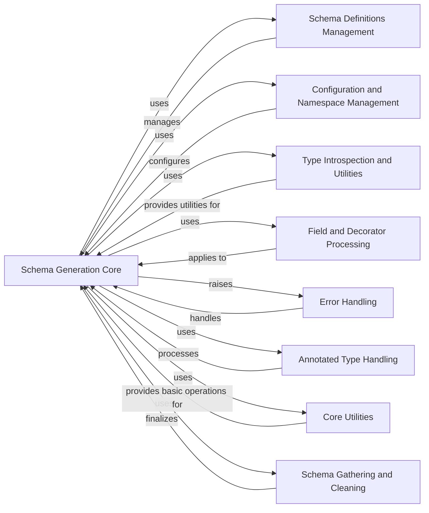

## Component Details

The `Pydantic V2 Core Schema Generation` component is responsible for converting Python types and Pydantic model definitions into low-level `pydantic-core` schemas. This process is crucial for subsequent validation and serialization. The main flow involves the `GenerateSchema` class, which orchestrates the schema generation by recursively traversing Python types, handling various Pydantic-specific constructs like `BaseModel`, `TypedDict`, `dataclasses`, and `Annotated` types. It manages configuration settings, resolves forward references, applies field and model validators/serializers, and handles error conditions related to schema generation. The component interacts with other internal Pydantic modules for type introspection, configuration management, decorator processing, and schema definition management.

### Schema Generation Core
This is the central component responsible for generating the core Pydantic schema from various Python types and Pydantic constructs. It contains the main logic for type matching, recursive schema generation, and application of Pydantic-specific features like validators and serializers.

**Related Classes/Methods**:

- <a href="https://github.com/pydantic/pydantic/blob/master/pydantic/_internal/_generate_schema.py#L312-L2333" target="_blank" rel="noopener noreferrer">`pydantic._internal._generate_schema.GenerateSchema` (312:2333)</a>
- <a href="https://github.com/pydantic/pydantic/blob/master/pydantic/_internal/_generate_schema.py#L673-L710" target="_blank" rel="noopener noreferrer">`pydantic._internal._generate_schema.GenerateSchema.generate_schema` (673:710)</a>
- <a href="https://github.com/pydantic/pydantic/blob/master/pydantic/_internal/_generate_schema.py#L1001-L1117" target="_blank" rel="noopener noreferrer">`pydantic._internal._generate_schema.GenerateSchema.match_type` (1001:1117)</a>
- <a href="https://github.com/pydantic/pydantic/blob/master/pydantic/_internal/_generate_schema.py#L712-L852" target="_blank" rel="noopener noreferrer">`pydantic._internal._generate_schema.GenerateSchema._model_schema` (712:852)</a>
- <a href="https://github.com/pydantic/pydantic/blob/master/pydantic/_internal/_generate_schema.py#L1354-L1460" target="_blank" rel="noopener noreferrer">`pydantic._internal._generate_schema.GenerateSchema._typed_dict_schema` (1354:1460)</a>
- <a href="https://github.com/pydantic/pydantic/blob/master/pydantic/_internal/_generate_schema.py#L1748-L1855" target="_blank" rel="noopener noreferrer">`pydantic._internal._generate_schema.GenerateSchema._dataclass_schema` (1748:1855)</a>
- <a href="https://github.com/pydantic/pydantic/blob/master/pydantic/_internal/_generate_schema.py#L2092-L2105" target="_blank" rel="noopener noreferrer">`pydantic._internal._generate_schema.GenerateSchema._annotated_schema` (2092:2105)</a>

### Schema Definitions Management
This component is responsible for managing schema definitions and references, particularly for handling recursive types and ensuring efficient schema generation by avoiding redundant computations.

**Related Classes/Methods**:

- <a href="https://github.com/pydantic/pydantic/blob/master/pydantic/_internal/_generate_schema.py#L2554-L2705" target="_blank" rel="noopener noreferrer">`pydantic._internal._generate_schema._Definitions` (2554:2705)</a>
- <a href="https://github.com/pydantic/pydantic/blob/master/pydantic/_internal/_generate_schema.py#L2580-L2610" target="_blank" rel="noopener noreferrer">`pydantic._internal._generate_schema._Definitions.get_schema_or_ref` (2580:2610)</a>
- <a href="https://github.com/pydantic/pydantic/blob/master/pydantic/_internal/_generate_schema.py#L2616-L2623" target="_blank" rel="noopener noreferrer">`pydantic._internal._generate_schema._Definitions.create_definition_reference_schema` (2616:2623)</a>
- <a href="https://github.com/pydantic/pydantic/blob/master/pydantic/_internal/_generate_schema.py#L2631-L2687" target="_blank" rel="noopener noreferrer">`pydantic._internal._generate_schema._Definitions.finalize_schema` (2631:2687)</a>

### Configuration and Namespace Management
This component handles the configuration settings and manages the type namespaces during schema generation, ensuring that type hints and forward references are correctly resolved based on the current context.

**Related Classes/Methods**:

- <a href="https://github.com/pydantic/pydantic/blob/master/pydantic/_internal/_config.py#L235-L258" target="_blank" rel="noopener noreferrer">`pydantic._internal._config.ConfigWrapperStack` (235:258)</a>
- <a href="https://github.com/pydantic/pydantic/blob/master/pydantic/_internal/_namespace_utils.py#L143-L293" target="_blank" rel="noopener noreferrer">`pydantic._internal._namespace_utils.NsResolver` (143:293)</a>
- <a href="https://github.com/pydantic/pydantic/blob/master/pydantic/_internal/_generate_schema.py#L324-L336" target="_blank" rel="noopener noreferrer">`pydantic._internal._generate_schema.GenerateSchema.__init__` (324:336)</a>

### Type Introspection and Utilities
This component provides utility functions for type introspection, handling of generic types, and other foundational operations necessary for understanding and processing Python type hints during schema generation.

**Related Classes/Methods**:

- `pydantic._internal._typing_extra` (full file reference)
- `pydantic._internal._generics` (full file reference)
- <a href="https://github.com/pydantic/pydantic/blob/master/pydantic/_internal/_generate_schema.py#L919-L939" target="_blank" rel="noopener noreferrer">`pydantic._internal._generate_schema.GenerateSchema._resolve_forward_ref` (919:939)</a>
- <a href="https://github.com/pydantic/pydantic/blob/master/pydantic/_internal/_generate_schema.py#L942-L942" target="_blank" rel="noopener noreferrer">`pydantic._internal._generate_schema.GenerateSchema._get_args_resolving_forward_refs` (942:942)</a>

### Field and Decorator Processing
This component is responsible for processing field information and applying decorators (validators and serializers) to the generated schemas. It ensures that field-specific rules and custom logic are correctly integrated into the core schema.

**Related Classes/Methods**:

- `pydantic._internal._fields` (full file reference)
- `pydantic._internal._decorators` (full file reference)
- <a href="https://github.com/pydantic/pydantic/blob/master/pydantic/_internal/_generate_schema.py#L1227-L1293" target="_blank" rel="noopener noreferrer">`pydantic._internal._generate_schema.GenerateSchema._common_field_schema` (1227:1293)</a>
- <a href="https://github.com/pydantic/pydantic/blob/master/pydantic/_internal/_generate_schema.py#L2353-L2374" target="_blank" rel="noopener noreferrer">`pydantic._internal._generate_schema.apply_validators` (2353:2374)</a>
- <a href="https://github.com/pydantic/pydantic/blob/master/pydantic/_internal/_generate_schema.py#L2393-L2437" target="_blank" rel="noopener noreferrer">`pydantic._internal._generate_schema.apply_model_validators` (2393:2437)</a>
- <a href="https://github.com/pydantic/pydantic/blob/master/pydantic/_internal/_generate_schema.py#L2232-L2286" target="_blank" rel="noopener noreferrer">`pydantic._internal._generate_schema.GenerateSchema._apply_field_serializers` (2232:2286)</a>
- <a href="https://github.com/pydantic/pydantic/blob/master/pydantic/_internal/_generate_schema.py#L2288-L2333" target="_blank" rel="noopener noreferrer">`pydantic._internal._generate_schema.GenerateSchema._apply_model_serializers` (2288:2333)</a>

### Error Handling
This component defines and raises specific error types related to schema generation, providing clear feedback when Pydantic encounters issues during the schema creation process.

**Related Classes/Methods**:

- <a href="https://github.com/pydantic/pydantic/blob/master/pydantic/errors.py#L145-L153" target="_blank" rel="noopener noreferrer">`pydantic.errors.PydanticSchemaGenerationError` (145:153)</a>
- <a href="https://github.com/pydantic/pydantic/blob/master/pydantic/errors.py#L105-L131" target="_blank" rel="noopener noreferrer">`pydantic.errors.PydanticUndefinedAnnotation` (105:131)</a>
- <a href="https://github.com/pydantic/pydantic/blob/master/pydantic/_internal/_generate_schema.py#L308-L309" target="_blank" rel="noopener noreferrer">`pydantic._internal._generate_schema.InvalidSchemaError` (308:309)</a>

### Annotated Type Handling
This component specifically handles `typing.Annotated` types, extracting metadata and applying it to the generated schema, allowing for custom validation and serialization behaviors defined via annotations.

**Related Classes/Methods**:

- <a href="https://github.com/pydantic/pydantic/blob/master/pydantic/annotated_handlers.py#L66-L122" target="_blank" rel="noopener noreferrer">`pydantic.annotated_handlers.GetCoreSchemaHandler` (66:122)</a>
- <a href="https://github.com/pydantic/pydantic/blob/master/pydantic/_internal/_generate_schema.py#L2092-L2105" target="_blank" rel="noopener noreferrer">`pydantic._internal._generate_schema.GenerateSchema._annotated_schema` (2092:2105)</a>
- <a href="https://github.com/pydantic/pydantic/blob/master/pydantic/_internal/_generate_schema.py#L2107-L2149" target="_blank" rel="noopener noreferrer">`pydantic._internal._generate_schema.GenerateSchema._apply_annotations` (2107:2149)</a>

### Core Utilities
This component provides fundamental utility functions used across the schema generation process, such as retrieving type references and validating core schemas.

**Related Classes/Methods**:

- `pydantic._internal._core_utils` (full file reference)
- <a href="https://github.com/pydantic/pydantic/blob/master/pydantic/_internal/_core_utils.py#L105-L109" target="_blank" rel="noopener noreferrer">`pydantic._internal._core_utils.get_ref` (105:109)</a>
- <a href="https://github.com/pydantic/pydantic/blob/master/pydantic/_internal/_core_utils.py#L67-L102" target="_blank" rel="noopener noreferrer">`pydantic._internal._core_utils.get_type_ref` (67:102)</a>
- <a href="https://github.com/pydantic/pydantic/blob/master/pydantic/_internal/_core_utils.py#L112-L115" target="_blank" rel="noopener noreferrer">`pydantic._internal._core_utils.validate_core_schema` (112:115)</a>

### Schema Gathering and Cleaning
This component is responsible for gathering and cleaning the generated schemas, including resolving definitions and applying deferred discriminators, ensuring the final schema is well-formed and optimized.

**Related Classes/Methods**:

- `pydantic._internal._schema_gather` (full file reference)
- <a href="https://github.com/pydantic/pydantic/blob/master/pydantic/_internal/_schema_gather.py#L192-L209" target="_blank" rel="noopener noreferrer">`pydantic._internal._schema_gather.gather_schemas_for_cleaning` (192:209)</a>
- <a href="https://github.com/pydantic/pydantic/blob/master/pydantic/_internal/_generate_schema.py#L657-L660" target="_blank" rel="noopener noreferrer">`pydantic._internal._generate_schema.GenerateSchema.clean_schema` (657:660)</a>

### [FAQ](https://github.com/CodeBoarding/GeneratedOnBoardings/tree/main?tab=readme-ov-file#faq)