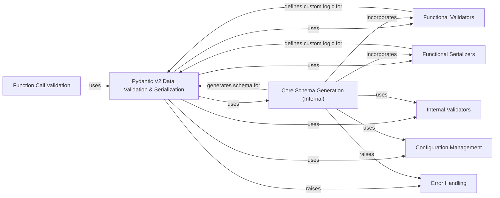

## Component Details

This component is central to Pydantic V2's data processing, handling the core validation and serialization of data. It acts as the runtime engine, applying the optimized schemas generated by the internal schema generation process. It offers flexible interfaces for various Python types and integrates custom validation and serialization logic defined by users, ensuring data integrity and proper formatting.

### Pydantic V2 Data Validation & Serialization
This component handles the actual validation and serialization of data using the generated pydantic-core schemas. It provides flexible interfaces like TypeAdapter for various Python types and integrates functional validators and serializers for custom logic.

**Related Classes/Methods**:

- <a href="https://github.com/pydantic/pydantic/blob/master/pydantic/type_adapter.py#L69-L727" target="_blank" rel="noopener noreferrer">`pydantic.type_adapter.TypeAdapter` (69:727)</a>
- <a href="https://github.com/pydantic/pydantic/blob/master/pydantic/functional_validators.py#L27-L84" target="_blank" rel="noopener noreferrer">`pydantic.functional_validators.AfterValidator` (27:84)</a>
- <a href="https://github.com/pydantic/pydantic/blob/master/pydantic/functional_validators.py#L88-L151" target="_blank" rel="noopener noreferrer">`pydantic.functional_validators.BeforeValidator` (88:151)</a>
- <a href="https://github.com/pydantic/pydantic/blob/master/pydantic/functional_validators.py#L155-L247" target="_blank" rel="noopener noreferrer">`pydantic.functional_validators.PlainValidator` (155:247)</a>
- <a href="https://github.com/pydantic/pydantic/blob/master/pydantic/functional_validators.py#L251-L322" target="_blank" rel="noopener noreferrer">`pydantic.functional_validators.WrapValidator` (251:322)</a>
- <a href="https://github.com/pydantic/pydantic/blob/master/pydantic/functional_validators.py#L372-L379" target="_blank" rel="noopener noreferrer">`pydantic.functional_validators.field_validator` (372:379)</a>
- <a href="https://github.com/pydantic/pydantic/blob/master/pydantic/functional_validators.py#L639-L644" target="_blank" rel="noopener noreferrer">`pydantic.functional_validators.model_validator` (639:644)</a>
- <a href="https://github.com/pydantic/pydantic/blob/master/pydantic/functional_serializers.py#L19-L85" target="_blank" rel="noopener noreferrer">`pydantic.functional_serializers.PlainSerializer` (19:85)</a>
- <a href="https://github.com/pydantic/pydantic/blob/master/pydantic/functional_serializers.py#L89-L188" target="_blank" rel="noopener noreferrer">`pydantic.functional_serializers.WrapSerializer` (89:188)</a>
- <a href="https://github.com/pydantic/pydantic/blob/master/pydantic/functional_serializers.py#L208-L216" target="_blank" rel="noopener noreferrer">`pydantic.functional_serializers.field_serializer` (208:216)</a>
- <a href="https://github.com/pydantic/pydantic/blob/master/pydantic/functional_serializers.py#L328-L328" target="_blank" rel="noopener noreferrer">`pydantic.functional_serializers.model_serializer` (328:328)</a>
- <a href="https://github.com/pydantic/pydantic/blob/master/pydantic/_internal/_validate_call.py#L49-L140" target="_blank" rel="noopener noreferrer">`pydantic._internal._validate_call.ValidateCallWrapper` (49:140)</a>
- `pydantic._internal._validators` (full file reference)
- <a href="https://github.com/pydantic/pydantic/blob/master/pydantic/plugin/_schema_validator.py#L22-L51" target="_blank" rel="noopener noreferrer">`pydantic.plugin._schema_validator.create_schema_validator` (22:51)</a>
- `pydantic_core.SchemaValidator` (full file reference)
- `pydantic_core.SchemaSerializer` (full file reference)

### Core Schema Generation (Internal)
An internal, low-level component responsible for converting Python types into `pydantic-core`'s highly optimized `CoreSchema` representation. It handles complex type resolution, application of validators and serializers, and management of schema definitions during the model building process.

**Related Classes/Methods**:

- <a href="https://github.com/pydantic/pydantic/blob/master/pydantic/_internal/_generate_schema.py#L312-L2333" target="_blank" rel="noopener noreferrer">`pydantic._internal._generate_schema.GenerateSchema` (312:2333)</a>

### Functional Validators
Offers decorators and classes for injecting custom validation logic into the data processing pipeline. It enables users to define 'before', 'after', 'plain', and 'wrap' validators for fields and models, extending Pydantic's built-in validation capabilities.

**Related Classes/Methods**:

- <a href="https://github.com/pydantic/pydantic/blob/master/pydantic/functional_validators.py#L27-L84" target="_blank" rel="noopener noreferrer">`pydantic.functional_validators.AfterValidator` (27:84)</a>
- <a href="https://github.com/pydantic/pydantic/blob/master/pydantic/functional_validators.py#L88-L151" target="_blank" rel="noopener noreferrer">`pydantic.functional_validators.BeforeValidator` (88:151)</a>
- <a href="https://github.com/pydantic/pydantic/blob/master/pydantic/functional_validators.py#L155-L247" target="_blank" rel="noopener noreferrer">`pydantic.functional_validators.PlainValidator` (155:247)</a>
- <a href="https://github.com/pydantic/pydantic/blob/master/pydantic/functional_validators.py#L251-L322" target="_blank" rel="noopener noreferrer">`pydantic.functional_validators.WrapValidator` (251:322)</a>
- <a href="https://github.com/pydantic/pydantic/blob/master/pydantic/functional_validators.py#L372-L379" target="_blank" rel="noopener noreferrer">`pydantic.functional_validators.field_validator` (372:379)</a>
- <a href="https://github.com/pydantic/pydantic/blob/master/pydantic/functional_validators.py#L639-L644" target="_blank" rel="noopener noreferrer">`pydantic.functional_validators.model_validator` (639:644)</a>

### Functional Serializers
Provides decorators and classes for customizing how Pydantic models and fields are serialized into different formats (e.g., Python dictionaries or JSON strings). It allows users to define 'plain' and 'wrap' serializers to transform data during output.

**Related Classes/Methods**:

- <a href="https://github.com/pydantic/pydantic/blob/master/pydantic/functional_serializers.py#L19-L85" target="_blank" rel="noopener noreferrer">`pydantic.functional_serializers.PlainSerializer` (19:85)</a>
- <a href="https://github.com/pydantic/pydantic/blob/master/pydantic/functional_serializers.py#L89-L188" target="_blank" rel="noopener noreferrer">`pydantic.functional_serializers.WrapSerializer` (89:188)</a>
- <a href="https://github.com/pydantic/pydantic/blob/master/pydantic/functional_serializers.py#L208-L216" target="_blank" rel="noopener noreferrer">`pydantic.functional_serializers.field_serializer` (208:216)</a>
- <a href="https://github.com/pydantic/pydantic/blob/master/pydantic/functional_serializers.py#L328-L328" target="_blank" rel="noopener noreferrer">`pydantic.functional_serializers.model_serializer` (328:328)</a>

### Internal Validators
A collection of low-level validator functions used by `pydantic-core` to perform specific type and constraint checks. These functions are the workhorses of Pydantic's validation engine, invoked by the generated `CoreSchema`.

**Related Classes/Methods**:

- `pydantic._internal._validators` (full file reference)

### Configuration Management
Provides a structured dictionary (`ConfigDict`) for configuring various aspects of Pydantic's behavior, including validation strictness, handling of extra fields, immutability, and alias generation. It allows fine-grained control over model processing.

**Related Classes/Methods**:

- <a href="https://github.com/pydantic/pydantic/blob/master/pydantic/config.py#L36-L1138" target="_blank" rel="noopener noreferrer">`pydantic.config.ConfigDict` (36:1138)</a>
- <a href="https://github.com/pydantic/pydantic/blob/master/pydantic/_internal/_config.py#L34-L232" target="_blank" rel="noopener noreferrer">`pydantic._internal._config.ConfigWrapper` (34:232)</a>

### Error Handling
Defines a comprehensive set of custom exception classes for Pydantic. These errors provide detailed, categorized feedback to users regarding incorrect usage, unresolved type hints, or migration issues, aiding in debugging and development.

**Related Classes/Methods**:

- <a href="https://github.com/pydantic/pydantic/blob/master/pydantic/errors.py#L101-L102" target="_blank" rel="noopener noreferrer">`pydantic.errors.PydanticUserError` (101:102)</a>
- <a href="https://github.com/pydantic/pydantic/blob/master/pydantic/errors.py#L105-L131" target="_blank" rel="noopener noreferrer">`pydantic.errors.PydanticUndefinedAnnotation` (105:131)</a>

### Function Call Validation
Enables validation of function arguments and return values using Pydantic's validation engine. This decorator ensures that data passed to and returned from functions adheres to specified type hints and constraints.

**Related Classes/Methods**:

- <a href="https://github.com/pydantic/pydantic/blob/master/pydantic/_internal/_validate_call.py#L49-L140" target="_blank" rel="noopener noreferrer">`pydantic._internal._validate_call.ValidateCallWrapper` (49:140)</a>

### [FAQ](https://github.com/CodeBoarding/GeneratedOnBoardings/tree/main?tab=readme-ov-file#faq)