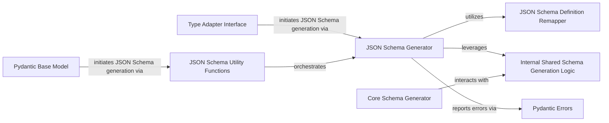

## Component Details

This subsystem is dedicated to generating OpenAPI/JSON schemas from Pydantic's internal core schemas. The main flow involves Pydantic models or arbitrary types initiating the schema generation process, which is then handled by the JSON Schema Generator. This generator, in turn, relies on the Core Schema Generator to produce the initial internal schema representation, and utilizes the JSON Schema Definition Remapper for optimizing schema definitions. Various utility functions and shared internal logic support this process, with errors being reported through dedicated Pydantic error types.

### JSON Schema Generator
This is the primary engine for converting Pydantic's internal CoreSchema representations into JSON Schema compliant dictionaries. It handles various schema types, validations, and references. It also manages its own internal state for definitions and reference mappings.

**Related Classes/Methods**:

- <a href="https://github.com/pydantic/pydantic/blob/master/pydantic/json_schema.py#L216-L2373" target="_blank" rel="noopener noreferrer">`pydantic.json_schema.GenerateJsonSchema` (216:2373)</a>
- <a href="https://github.com/pydantic/pydantic/blob/master/pydantic/json_schema.py#L256-L290" target="_blank" rel="noopener noreferrer">`pydantic.json_schema.GenerateJsonSchema:__init__` (256:290)</a>
- <a href="https://github.com/pydantic/pydantic/blob/master/pydantic/json_schema.py#L378-L425" target="_blank" rel="noopener noreferrer">`pydantic.json_schema.GenerateJsonSchema:generate` (378:425)</a>
- <a href="https://github.com/pydantic/pydantic/blob/master/pydantic/json_schema.py#L329-L376" target="_blank" rel="noopener noreferrer">`pydantic.json_schema.GenerateJsonSchema:generate_definitions` (329:376)</a>
- <a href="https://github.com/pydantic/pydantic/blob/master/pydantic/json_schema.py#L427-L566" target="_blank" rel="noopener noreferrer">`pydantic.json_schema.GenerateJsonSchema:generate_inner` (427:566)</a>
- <a href="https://github.com/pydantic/pydantic/blob/master/pydantic/json_schema.py#L568-L580" target="_blank" rel="noopener noreferrer">`pydantic.json_schema.GenerateJsonSchema:sort` (568:580)</a>
- <a href="https://github.com/pydantic/pydantic/blob/master/pydantic/json_schema.py#L582-L598" target="_blank" rel="noopener noreferrer">`pydantic.json_schema.GenerateJsonSchema:_sort_recursive` (582:598)</a>
- <a href="https://github.com/pydantic/pydantic/blob/master/pydantic/json_schema.py#L640-L652" target="_blank" rel="noopener noreferrer">`pydantic.json_schema.GenerateJsonSchema:int_schema` (640:652)</a>
- <a href="https://github.com/pydantic/pydantic/blob/master/pydantic/json_schema.py#L654-L666" target="_blank" rel="noopener noreferrer">`pydantic.json_schema.GenerateJsonSchema:float_schema` (654:666)</a>
- <a href="https://github.com/pydantic/pydantic/blob/master/pydantic/json_schema.py#L668-L699" target="_blank" rel="noopener noreferrer">`pydantic.json_schema.GenerateJsonSchema:decimal_schema` (668:699)</a>
- <a href="https://github.com/pydantic/pydantic/blob/master/pydantic/json_schema.py#L701-L715" target="_blank" rel="noopener noreferrer">`pydantic.json_schema.GenerateJsonSchema:str_schema` (701:715)</a>
- <a href="https://github.com/pydantic/pydantic/blob/master/pydantic/json_schema.py#L717-L728" target="_blank" rel="noopener noreferrer">`pydantic.json_schema.GenerateJsonSchema:bytes_schema` (717:728)</a>
- <a href="https://github.com/pydantic/pydantic/blob/master/pydantic/json_schema.py#L844-L855" target="_blank" rel="noopener noreferrer">`pydantic.json_schema.GenerateJsonSchema:is_instance_schema` (844:855)</a>
- <a href="https://github.com/pydantic/pydantic/blob/master/pydantic/json_schema.py#L871-L882" target="_blank" rel="noopener noreferrer">`pydantic.json_schema.GenerateJsonSchema:callable_schema` (871:882)</a>
- <a href="https://github.com/pydantic/pydantic/blob/master/pydantic/json_schema.py#L884-L896" target="_blank" rel="noopener noreferrer">`pydantic.json_schema.GenerateJsonSchema:list_schema` (884:896)</a>
- <a href="https://github.com/pydantic/pydantic/blob/master/pydantic/json_schema.py#L900-L907" target="_blank" rel="noopener noreferrer">`pydantic.json_schema.GenerateJsonSchema:tuple_positional_schema` (900:907)</a>
- <a href="https://github.com/pydantic/pydantic/blob/master/pydantic/json_schema.py#L911-L918" target="_blank" rel="noopener noreferrer">`pydantic.json_schema.GenerateJsonSchema:tuple_variable_schema` (911:918)</a>
- <a href="https://github.com/pydantic/pydantic/blob/master/pydantic/json_schema.py#L920-L953" target="_blank" rel="noopener noreferrer">`pydantic.json_schema.GenerateJsonSchema:tuple_schema` (920:953)</a>
- <a href="https://github.com/pydantic/pydantic/blob/master/pydantic/json_schema.py#L955-L964" target="_blank" rel="noopener noreferrer">`pydantic.json_schema.GenerateJsonSchema:set_schema` (955:964)</a>
- <a href="https://github.com/pydantic/pydantic/blob/master/pydantic/json_schema.py#L966-L975" target="_blank" rel="noopener noreferrer">`pydantic.json_schema.GenerateJsonSchema:frozenset_schema` (966:975)</a>
- <a href="https://github.com/pydantic/pydantic/blob/master/pydantic/json_schema.py#L977-L981" target="_blank" rel="noopener noreferrer">`pydantic.json_schema.GenerateJsonSchema:_common_set_schema` (977:981)</a>
- <a href="https://github.com/pydantic/pydantic/blob/master/pydantic/json_schema.py#L983-L995" target="_blank" rel="noopener noreferrer">`pydantic.json_schema.GenerateJsonSchema:generator_schema` (983:995)</a>
- <a href="https://github.com/pydantic/pydantic/blob/master/pydantic/json_schema.py#L997-L1043" target="_blank" rel="noopener noreferrer">`pydantic.json_schema.GenerateJsonSchema:dict_schema` (997:1043)</a>
- <a href="https://github.com/pydantic/pydantic/blob/master/pydantic/json_schema.py#L1045-L1057" target="_blank" rel="noopener noreferrer">`pydantic.json_schema.GenerateJsonSchema:function_before_schema` (1045:1057)</a>
- <a href="https://github.com/pydantic/pydantic/blob/master/pydantic/json_schema.py#L1059-L1068" target="_blank" rel="noopener noreferrer">`pydantic.json_schema.GenerateJsonSchema:function_after_schema` (1059:1068)</a>
- <a href="https://github.com/pydantic/pydantic/blob/master/pydantic/json_schema.py#L1070-L1084" target="_blank" rel="noopener noreferrer">`pydantic.json_schema.GenerateJsonSchema:function_plain_schema` (1070:1084)</a>
- <a href="https://github.com/pydantic/pydantic/blob/master/pydantic/json_schema.py#L1086-L1098" target="_blank" rel="noopener noreferrer">`pydantic.json_schema.GenerateJsonSchema:function_wrap_schema` (1086:1098)</a>
- <a href="https://github.com/pydantic/pydantic/blob/master/pydantic/json_schema.py#L1100-L1152" target="_blank" rel="noopener noreferrer">`pydantic.json_schema.GenerateJsonSchema:default_schema` (1100:1152)</a>
- <a href="https://github.com/pydantic/pydantic/blob/master/pydantic/json_schema.py#L1169-L1186" target="_blank" rel="noopener noreferrer">`pydantic.json_schema.GenerateJsonSchema:nullable_schema` (1169:1186)</a>
- <a href="https://github.com/pydantic/pydantic/blob/master/pydantic/json_schema.py#L1188-L1211" target="_blank" rel="noopener noreferrer">`pydantic.json_schema.GenerateJsonSchema:union_schema` (1188:1211)</a>
- <a href="https://github.com/pydantic/pydantic/blob/master/pydantic/json_schema.py#L1213-L1248" target="_blank" rel="noopener noreferrer">`pydantic.json_schema.GenerateJsonSchema:tagged_union_schema` (1213:1248)</a>
- <a href="https://github.com/pydantic/pydantic/blob/master/pydantic/json_schema.py#L1250-L1293" target="_blank" rel="noopener noreferrer">`pydantic.json_schema.GenerateJsonSchema:_extract_discriminator` (1250:1293)</a>
- <a href="https://github.com/pydantic/pydantic/blob/master/pydantic/json_schema.py#L1295-L1308" target="_blank" rel="noopener noreferrer">`pydantic.json_schema.GenerateJsonSchema:chain_schema` (1295:1308)</a>
- <a href="https://github.com/pydantic/pydantic/blob/master/pydantic/json_schema.py#L1310-L1327" target="_blank" rel="noopener noreferrer">`pydantic.json_schema.GenerateJsonSchema:lax_or_strict_schema` (1310:1327)</a>
- <a href="https://github.com/pydantic/pydantic/blob/master/pydantic/json_schema.py#L1329-L1342" target="_blank" rel="noopener noreferrer">`pydantic.json_schema.GenerateJsonSchema:json_or_python_schema` (1329:1342)</a>
- <a href="https://github.com/pydantic/pydantic/blob/master/pydantic/json_schema.py#L1344-L1375" target="_blank" rel="noopener noreferrer">`pydantic.json_schema.GenerateJsonSchema:typed_dict_schema` (1344:1375)</a>
- <a href="https://github.com/pydantic/pydantic/blob/master/pydantic/json_schema.py#L1383-L1406" target="_blank" rel="noopener noreferrer">`pydantic.json_schema.GenerateJsonSchema:_named_required_fields_schema` (1383:1406)</a>
- <a href="https://github.com/pydantic/pydantic/blob/master/pydantic/json_schema.py#L1429-L1438" target="_blank" rel="noopener noreferrer">`pydantic.json_schema.GenerateJsonSchema:typed_dict_field_schema` (1429:1438)</a>
- <a href="https://github.com/pydantic/pydantic/blob/master/pydantic/json_schema.py#L1440-L1449" target="_blank" rel="noopener noreferrer">`pydantic.json_schema.GenerateJsonSchema:dataclass_field_schema` (1440:1449)</a>
- <a href="https://github.com/pydantic/pydantic/blob/master/pydantic/json_schema.py#L1451-L1460" target="_blank" rel="noopener noreferrer">`pydantic.json_schema.GenerateJsonSchema:model_field_schema` (1451:1460)</a>
- <a href="https://github.com/pydantic/pydantic/blob/master/pydantic/json_schema.py#L1462-L1471" target="_blank" rel="noopener noreferrer">`pydantic.json_schema.GenerateJsonSchema:computed_field_schema` (1462:1471)</a>
- <a href="https://github.com/pydantic/pydantic/blob/master/pydantic/json_schema.py#L1473-L1492" target="_blank" rel="noopener noreferrer">`pydantic.json_schema.GenerateJsonSchema:model_schema` (1473:1492)</a>
- <a href="https://github.com/pydantic/pydantic/blob/master/pydantic/json_schema.py#L1565-L1583" target="_blank" rel="noopener noreferrer">`pydantic.json_schema.GenerateJsonSchema:resolve_ref_schema` (1565:1583)</a>
- <a href="https://github.com/pydantic/pydantic/blob/master/pydantic/json_schema.py#L1585-L1606" target="_blank" rel="noopener noreferrer">`pydantic.json_schema.GenerateJsonSchema:model_fields_schema` (1585:1606)</a>
- <a href="https://github.com/pydantic/pydantic/blob/master/pydantic/json_schema.py#L1651-L1667" target="_blank" rel="noopener noreferrer">`pydantic.json_schema.GenerateJsonSchema:dataclass_args_schema` (1651:1667)</a>
- <a href="https://github.com/pydantic/pydantic/blob/master/pydantic/json_schema.py#L1669-L1697" target="_blank" rel="noopener noreferrer">`pydantic.json_schema.GenerateJsonSchema:dataclass_schema` (1669:1697)</a>
- <a href="https://github.com/pydantic/pydantic/blob/master/pydantic/json_schema.py#L1699-L1733" target="_blank" rel="noopener noreferrer">`pydantic.json_schema.GenerateJsonSchema:arguments_schema` (1699:1733)</a>
- <a href="https://github.com/pydantic/pydantic/blob/master/pydantic/json_schema.py#L1735-L1770" target="_blank" rel="noopener noreferrer">`pydantic.json_schema.GenerateJsonSchema:kw_arguments_schema` (1735:1770)</a>
- <a href="https://github.com/pydantic/pydantic/blob/master/pydantic/json_schema.py#L1772-L1812" target="_blank" rel="noopener noreferrer">`pydantic.json_schema.GenerateJsonSchema:p_arguments_schema` (1772:1812)</a>
- <a href="https://github.com/pydantic/pydantic/blob/master/pydantic/json_schema.py#L1832-L1869" target="_blank" rel="noopener noreferrer">`pydantic.json_schema.GenerateJsonSchema:arguments_v3_schema` (1832:1869)</a>
- <a href="https://github.com/pydantic/pydantic/blob/master/pydantic/json_schema.py#L1871-L1880" target="_blank" rel="noopener noreferrer">`pydantic.json_schema.GenerateJsonSchema:call_schema` (1871:1880)</a>
- <a href="https://github.com/pydantic/pydantic/blob/master/pydantic/json_schema.py#L1882-L1891" target="_blank" rel="noopener noreferrer">`pydantic.json_schema.GenerateJsonSchema:custom_error_schema` (1882:1891)</a>
- <a href="https://github.com/pydantic/pydantic/blob/master/pydantic/json_schema.py#L1893-L1908" target="_blank" rel="noopener noreferrer">`pydantic.json_schema.GenerateJsonSchema:json_schema` (1893:1908)</a>
- <a href="https://github.com/pydantic/pydantic/blob/master/pydantic/json_schema.py#L1910-L1921" target="_blank" rel="noopener noreferrer">`pydantic.json_schema.GenerateJsonSchema:url_schema` (1910:1921)</a>
- <a href="https://github.com/pydantic/pydantic/blob/master/pydantic/json_schema.py#L1923-L1935" target="_blank" rel="noopener noreferrer">`pydantic.json_schema.GenerateJsonSchema:multi_host_url_schema` (1923:1935)</a>
- <a href="https://github.com/pydantic/pydantic/blob/master/pydantic/json_schema.py#L1948-L1964" target="_blank" rel="noopener noreferrer">`pydantic.json_schema.GenerateJsonSchema:definitions_schema` (1948:1964)</a>
- <a href="https://github.com/pydantic/pydantic/blob/master/pydantic/json_schema.py#L1966-L1977" target="_blank" rel="noopener noreferrer">`pydantic.json_schema.GenerateJsonSchema:definition_ref_schema` (1966:1977)</a>
- <a href="https://github.com/pydantic/pydantic/blob/master/pydantic/json_schema.py#L1979-L2002" target="_blank" rel="noopener noreferrer">`pydantic.json_schema.GenerateJsonSchema:ser_schema` (1979:2002)</a>
- <a href="https://github.com/pydantic/pydantic/blob/master/pydantic/json_schema.py#L2033-L2066" target="_blank" rel="noopener noreferrer">`pydantic.json_schema.GenerateJsonSchema:field_title_should_be_set` (2033:2066)</a>
- <a href="https://github.com/pydantic/pydantic/blob/master/pydantic/json_schema.py#L2079-L2125" target="_blank" rel="noopener noreferrer">`pydantic.json_schema.GenerateJsonSchema:get_defs_ref` (2079:2125)</a>
- <a href="https://github.com/pydantic/pydantic/blob/master/pydantic/json_schema.py#L2127-L2153" target="_blank" rel="noopener noreferrer">`pydantic.json_schema.GenerateJsonSchema:get_cache_defs_ref_schema` (2127:2153)</a>
- <a href="https://github.com/pydantic/pydantic/blob/master/pydantic/json_schema.py#L2155-L2180" target="_blank" rel="noopener noreferrer">`pydantic.json_schema.GenerateJsonSchema:handle_ref_overrides` (2155:2180)</a>
- <a href="https://github.com/pydantic/pydantic/blob/master/pydantic/json_schema.py#L2193-L2220" target="_blank" rel="noopener noreferrer">`pydantic.json_schema.GenerateJsonSchema:encode_default` (2193:2220)</a>
- <a href="https://github.com/pydantic/pydantic/blob/master/pydantic/json_schema.py#L2269-L2279" target="_blank" rel="noopener noreferrer">`pydantic.json_schema.GenerateJsonSchema:get_flattened_anyof` (2269:2279)</a>
- <a href="https://github.com/pydantic/pydantic/blob/master/pydantic/json_schema.py#L2281-L2315" target="_blank" rel="noopener noreferrer">`pydantic.json_schema.GenerateJsonSchema:get_json_ref_counts` (2281:2315)</a>
- <a href="https://github.com/pydantic/pydantic/blob/master/pydantic/json_schema.py#L2317-L2318" target="_blank" rel="noopener noreferrer">`pydantic.json_schema.GenerateJsonSchema:handle_invalid_for_json_schema` (2317:2318)</a>
- <a href="https://github.com/pydantic/pydantic/blob/master/pydantic/json_schema.py#L2320-L2324" target="_blank" rel="noopener noreferrer">`pydantic.json_schema.GenerateJsonSchema:emit_warning` (2320:2324)</a>
- <a href="https://github.com/pydantic/pydantic/blob/master/pydantic/json_schema.py#L2347-L2356" target="_blank" rel="noopener noreferrer">`pydantic.json_schema.GenerateJsonSchema:_build_definitions_remapping` (2347:2356)</a>
- <a href="https://github.com/pydantic/pydantic/blob/master/pydantic/json_schema.py#L2358-L2373" target="_blank" rel="noopener noreferrer">`pydantic.json_schema.GenerateJsonSchema:_garbage_collect_definitions` (2358:2373)</a>
- <a href="https://github.com/pydantic/pydantic/blob/master/pydantic/json_schema.py#L2237-L2267" target="_blank" rel="noopener noreferrer">`pydantic.json_schema.GenerateJsonSchema.ValidationsMapping` (2237:2267)</a>
- <a href="https://github.com/pydantic/pydantic/blob/master/pydantic/json_schema.py#L2022-L2031" target="_blank" rel="noopener noreferrer">`pydantic.json_schema.GenerateJsonSchema:get_title_from_name` (2022:2031)</a>
- <a href="https://github.com/pydantic/pydantic/blob/master/pydantic/json_schema.py#L2068-L2077" target="_blank" rel="noopener noreferrer">`pydantic.json_schema.GenerateJsonSchema:normalize_name` (2068:2077)</a>
- <a href="https://github.com/pydantic/pydantic/blob/master/pydantic/json_schema.py#L1608-L1624" target="_blank" rel="noopener noreferrer">`pydantic.json_schema.GenerateJsonSchema:field_is_present` (1608:1624)</a>
- <a href="https://github.com/pydantic/pydantic/blob/master/pydantic/json_schema.py#L1626-L1649" target="_blank" rel="noopener noreferrer">`pydantic.json_schema.GenerateJsonSchema:field_is_required` (1626:1649)</a>
- <a href="https://github.com/pydantic/pydantic/blob/master/pydantic/json_schema.py#L1408-L1427" target="_blank" rel="noopener noreferrer">`pydantic.json_schema.GenerateJsonSchema:_get_alias_name` (1408:1427)</a>
- <a href="https://github.com/pydantic/pydantic/blob/master/pydantic/json_schema.py#L1378-L1381" target="_blank" rel="noopener noreferrer">`pydantic.json_schema.GenerateJsonSchema:_name_required_computed_fields` (1378:1381)</a>
- <a href="https://github.com/pydantic/pydantic/blob/master/pydantic/json_schema.py#L1494-L1563" target="_blank" rel="noopener noreferrer">`pydantic.json_schema.GenerateJsonSchema:_update_class_schema` (1494:1563)</a>
- <a href="https://github.com/pydantic/pydantic/blob/master/pydantic/json_schema.py#L1154-L1167" target="_blank" rel="noopener noreferrer">`pydantic.json_schema.GenerateJsonSchema:get_default_value` (1154:1167)</a>
- <a href="https://github.com/pydantic/pydantic/blob/master/pydantic/json_schema.py#L2222-L2235" target="_blank" rel="noopener noreferrer">`pydantic.json_schema.GenerateJsonSchema:update_with_validations` (2222:2235)</a>
- <a href="https://github.com/pydantic/pydantic/blob/master/pydantic/json_schema.py#L2004-L2018" target="_blank" rel="noopener noreferrer">`pydantic.json_schema.GenerateJsonSchema:complex_schema` (2004:2018)</a>
- <a href="https://github.com/pydantic/pydantic/blob/master/pydantic/json_schema.py#L607-L616" target="_blank" rel="noopener noreferrer">`pydantic.json_schema.GenerateJsonSchema:any_schema` (607:616)</a>
- <a href="https://github.com/pydantic/pydantic/blob/master/pydantic/json_schema.py#L618-L627" target="_blank" rel="noopener noreferrer">`pydantic.json_schema.GenerateJsonSchema:none_schema` (618:627)</a>
- <a href="https://github.com/pydantic/pydantic/blob/master/pydantic/json_schema.py#L629-L638" target="_blank" rel="noopener noreferrer">`pydantic.json_schema.GenerateJsonSchema:bool_schema` (629:638)</a>
- <a href="https://github.com/pydantic/pydantic/blob/master/pydantic/json_schema.py#L730-L739" target="_blank" rel="noopener noreferrer">`pydantic.json_schema.GenerateJsonSchema:date_schema` (730:739)</a>
- <a href="https://github.com/pydantic/pydantic/blob/master/pydantic/json_schema.py#L741-L750" target="_blank" rel="noopener noreferrer">`pydantic.json_schema.GenerateJsonSchema:time_schema` (741:750)</a>
- <a href="https://github.com/pydantic/pydantic/blob/master/pydantic/json_schema.py#L752-L761" target="_blank" rel="noopener noreferrer">`pydantic.json_schema.GenerateJsonSchema:datetime_schema` (752:761)</a>
- <a href="https://github.com/pydantic/pydantic/blob/master/pydantic/json_schema.py#L763-L774" target="_blank" rel="noopener noreferrer">`pydantic.json_schema.GenerateJsonSchema:timedelta_schema` (763:774)</a>
- <a href="https://github.com/pydantic/pydantic/blob/master/pydantic/json_schema.py#L776-L806" target="_blank" rel="noopener noreferrer">`pydantic.json_schema.GenerateJsonSchema:literal_schema` (776:806)</a>
- <a href="https://github.com/pydantic/pydantic/blob/master/pydantic/json_schema.py#L808-L842" target="_blank" rel="noopener noreferrer">`pydantic.json_schema.GenerateJsonSchema:enum_schema` (808:842)</a>
- <a href="https://github.com/pydantic/pydantic/blob/master/pydantic/json_schema.py#L857-L869" target="_blank" rel="noopener noreferrer">`pydantic.json_schema.GenerateJsonSchema:is_subclass_schema` (857:869)</a>
- <a href="https://github.com/pydantic/pydantic/blob/master/pydantic/json_schema.py#L1937-L1946" target="_blank" rel="noopener noreferrer">`pydantic.json_schema.GenerateJsonSchema:uuid_schema` (1937:1946)</a>
- <a href="https://github.com/pydantic/pydantic/blob/master/pydantic/json_schema.py#L602-L605" target="_blank" rel="noopener noreferrer">`pydantic.json_schema.GenerateJsonSchema:invalid_schema` (602:605)</a>

### Core Schema Generator
This component is responsible for the fundamental generation of Pydantic's internal CoreSchema representations from Python types. It handles type resolution, generic type matching, and the application of various Pydantic features like validators, serializers, and field information.

**Related Classes/Methods**:

- <a href="https://github.com/pydantic/pydantic/blob/master/pydantic/_internal/_generate_schema.py#L312-L2333" target="_blank" rel="noopener noreferrer">`pydantic._internal._generate_schema.GenerateSchema` (312:2333)</a>
- <a href="https://github.com/pydantic/pydantic/blob/master/pydantic/_internal/_generate_schema.py#L712-L852" target="_blank" rel="noopener noreferrer">`pydantic._internal._generate_schema.GenerateSchema:_model_schema` (712:852)</a>
- <a href="https://github.com/pydantic/pydantic/blob/master/pydantic/_internal/_generate_schema.py#L860-L917" target="_blank" rel="noopener noreferrer">`pydantic._internal._generate_schema.GenerateSchema:_generate_schema_from_get_schema_method` (860:917)</a>
- <a href="https://github.com/pydantic/pydantic/blob/master/pydantic/_internal/_generate_schema.py#L973-L999" target="_blank" rel="noopener noreferrer">`pydantic._internal._generate_schema.GenerateSchema:_generate_schema_inner` (973:999)</a>
- <a href="https://github.com/pydantic/pydantic/blob/master/pydantic/_internal/_generate_schema.py#L1001-L1117" target="_blank" rel="noopener noreferrer">`pydantic._internal._generate_schema.GenerateSchema:match_type` (1001:1117)</a>
- <a href="https://github.com/pydantic/pydantic/blob/master/pydantic/_internal/_generate_schema.py#L1119-L1168" target="_blank" rel="noopener noreferrer">`pydantic._internal._generate_schema.GenerateSchema:_match_generic_type` (1119:1168)</a>
- <a href="https://github.com/pydantic/pydantic/blob/master/pydantic/_internal/_generate_schema.py#L1170-L1187" target="_blank" rel="noopener noreferrer">`pydantic._internal._generate_schema.GenerateSchema:_generate_td_field_schema` (1170:1187)</a>
- <a href="https://github.com/pydantic/pydantic/blob/master/pydantic/_internal/_generate_schema.py#L1189-L1204" target="_blank" rel="noopener noreferrer">`pydantic._internal._generate_schema.GenerateSchema:_generate_md_field_schema` (1189:1204)</a>
- <a href="https://github.com/pydantic/pydantic/blob/master/pydantic/_internal/_generate_schema.py#L1206-L1225" target="_blank" rel="noopener noreferrer">`pydantic._internal._generate_schema.GenerateSchema:_generate_dc_field_schema` (1206:1225)</a>
- <a href="https://github.com/pydantic/pydantic/blob/master/pydantic/_internal/_generate_schema.py#L1227-L1293" target="_blank" rel="noopener noreferrer">`pydantic._internal._generate_schema.GenerateSchema:_common_field_schema` (1227:1293)</a>
- <a href="https://github.com/pydantic/pydantic/blob/master/pydantic/_internal/_generate_schema.py#L1295-L1320" target="_blank" rel="noopener noreferrer">`pydantic._internal._generate_schema.GenerateSchema:_union_schema` (1295:1320)</a>
- <a href="https://github.com/pydantic/pydantic/blob/master/pydantic/_internal/_generate_schema.py#L1322-L1339" target="_blank" rel="noopener noreferrer">`pydantic._internal._generate_schema.GenerateSchema:_type_alias_type_schema` (1322:1339)</a>
- <a href="https://github.com/pydantic/pydantic/blob/master/pydantic/_internal/_generate_schema.py#L1341-L1352" target="_blank" rel="noopener noreferrer">`pydantic._internal._generate_schema.GenerateSchema:_literal_schema` (1341:1352)</a>
- <a href="https://github.com/pydantic/pydantic/blob/master/pydantic/_internal/_generate_schema.py#L1354-L1460" target="_blank" rel="noopener noreferrer">`pydantic._internal._generate_schema.GenerateSchema:_typed_dict_schema` (1354:1460)</a>
- <a href="https://github.com/pydantic/pydantic/blob/master/pydantic/_internal/_generate_schema.py#L1462-L1504" target="_blank" rel="noopener noreferrer">`pydantic._internal._generate_schema.GenerateSchema:_namedtuple_schema` (1462:1504)</a>
- <a href="https://github.com/pydantic/pydantic/blob/master/pydantic/_internal/_generate_schema.py#L1506-L1541" target="_blank" rel="noopener noreferrer">`pydantic._internal._generate_schema.GenerateSchema:_generate_parameter_schema` (1506:1541)</a>
- <a href="https://github.com/pydantic/pydantic/blob/master/pydantic/_internal/_generate_schema.py#L1543-L1585" target="_blank" rel="noopener noreferrer">`pydantic._internal._generate_schema.GenerateSchema:_generate_parameter_v3_schema` (1543:1585)</a>
- <a href="https://github.com/pydantic/pydantic/blob/master/pydantic/_internal/_generate_schema.py#L1587-L1615" target="_blank" rel="noopener noreferrer">`pydantic._internal._generate_schema.GenerateSchema:_tuple_schema` (1587:1615)</a>
- <a href="https://github.com/pydantic/pydantic/blob/master/pydantic/_internal/_generate_schema.py#L1617-L1622" target="_blank" rel="noopener noreferrer">`pydantic._internal._generate_schema.GenerateSchema:_type_schema` (1617:1622)</a>
- <a href="https://github.com/pydantic/pydantic/blob/master/pydantic/_internal/_generate_schema.py#L1624-L1633" target="_blank" rel="noopener noreferrer">`pydantic._internal._generate_schema.GenerateSchema:_zoneinfo_schema` (1624:1633)</a>
- <a href="https://github.com/pydantic/pydantic/blob/master/pydantic/_internal/_generate_schema.py#L1635-L1638" target="_blank" rel="noopener noreferrer">`pydantic._internal._generate_schema.GenerateSchema:_union_is_subclass_schema` (1635:1638)</a>
- <a href="https://github.com/pydantic/pydantic/blob/master/pydantic/_internal/_generate_schema.py#L1640-L1677" target="_blank" rel="noopener noreferrer">`pydantic._internal._generate_schema.GenerateSchema:_subclass_schema` (1640:1677)</a>
- <a href="https://github.com/pydantic/pydantic/blob/master/pydantic/_internal/_generate_schema.py#L1679-L1700" target="_blank" rel="noopener noreferrer">`pydantic._internal._generate_schema.GenerateSchema:_sequence_schema` (1679:1700)</a>
- <a href="https://github.com/pydantic/pydantic/blob/master/pydantic/_internal/_generate_schema.py#L1702-L1706" target="_blank" rel="noopener noreferrer">`pydantic._internal._generate_schema.GenerateSchema:_iterable_schema` (1702:1706)</a>
- <a href="https://github.com/pydantic/pydantic/blob/master/pydantic/_internal/_generate_schema.py#L1708-L1734" target="_blank" rel="noopener noreferrer">`pydantic._internal._generate_schema.GenerateSchema:_pattern_schema` (1708:1734)</a>
- <a href="https://github.com/pydantic/pydantic/blob/master/pydantic/_internal/_generate_schema.py#L1736-L1746" target="_blank" rel="noopener noreferrer">`pydantic._internal._generate_schema.GenerateSchema:_hashable_schema` (1736:1746)</a>
- <a href="https://github.com/pydantic/pydantic/blob/master/pydantic/_internal/_generate_schema.py#L1748-L1855" target="_blank" rel="noopener noreferrer">`pydantic._internal._generate_schema.GenerateSchema:_dataclass_schema` (1748:1855)</a>
- <a href="https://github.com/pydantic/pydantic/blob/master/pydantic/_internal/_generate_schema.py#L1857-L1880" target="_blank" rel="noopener noreferrer">`pydantic._internal._generate_schema.GenerateSchema:_call_schema` (1857:1880)</a>
- <a href="https://github.com/pydantic/pydantic/blob/master/pydantic/_internal/_generate_schema.py#L1882-L1955" target="_blank" rel="noopener noreferrer">`pydantic._internal._generate_schema.GenerateSchema:_arguments_schema` (1882:1955)</a>
- <a href="https://github.com/pydantic/pydantic/blob/master/pydantic/_internal/_generate_schema.py#L1957-L2023" target="_blank" rel="noopener noreferrer">`pydantic._internal._generate_schema.GenerateSchema:_arguments_v3_schema` (1957:2023)</a>
- <a href="https://github.com/pydantic/pydantic/blob/master/pydantic/_internal/_generate_schema.py#L2025-L2046" target="_blank" rel="noopener noreferrer">`pydantic._internal._generate_schema.GenerateSchema:_unsubstituted_typevar_schema` (2025:2046)</a>
- <a href="https://github.com/pydantic/pydantic/blob/master/pydantic/_internal/_generate_schema.py#L2048-L2090" target="_blank" rel="noopener noreferrer">`pydantic._internal._generate_schema.GenerateSchema:_computed_field_schema` (2048:2090)</a>
- <a href="https://github.com/pydantic/pydantic/blob/master/pydantic/_internal/_generate_schema.py#L2092-L2105" target="_blank" rel="noopener noreferrer">`pydantic._internal._generate_schema.GenerateSchema:_annotated_schema` (2092:2105)</a>
- <a href="https://github.com/pydantic/pydantic/blob/master/pydantic/_internal/_generate_schema.py#L2107-L2149" target="_blank" rel="noopener noreferrer">`pydantic._internal._generate_schema.GenerateSchema:_apply_annotations` (2107:2149)</a>
- <a href="https://github.com/pydantic/pydantic/blob/master/pydantic/_internal/_generate_schema.py#L2151-L2191" target="_blank" rel="noopener noreferrer">`pydantic._internal._generate_schema.GenerateSchema:_apply_single_annotation` (2151:2191)</a>
- <a href="https://github.com/pydantic/pydantic/blob/master/pydantic/_internal/_generate_schema.py#L2193-L2207" target="_blank" rel="noopener noreferrer">`pydantic._internal._generate_schema.GenerateSchema:_apply_single_annotation_json_schema` (2193:2207)</a>
- <a href="https://github.com/pydantic/pydantic/blob/master/pydantic/_internal/_generate_schema.py#L2209-L2230" target="_blank" rel="noopener noreferrer">`pydantic._internal._generate_schema.GenerateSchema:_get_wrapped_inner_schema` (2209:2230)</a>
- <a href="https://github.com/pydantic/pydantic/blob/master/pydantic/_internal/_generate_schema.py#L2232-L2286" target="_blank" rel="noopener noreferrer">`pydantic._internal._generate_schema.GenerateSchema:_apply_field_serializers` (2232:2286)</a>
- <a href="https://github.com/pydantic/pydantic/blob/master/pydantic/_internal/_generate_schema.py#L2288-L2333" target="_blank" rel="noopener noreferrer">`pydantic._internal._generate_schema.GenerateSchema:_apply_model_serializers` (2288:2333)</a>

### JSON Schema Definition Remapper
This utility class is responsible for simplifying and remapping definition references within the generated JSON schema. It ensures that the final schema has human-readable and deduplicated definitions, improving its clarity and efficiency.

**Related Classes/Methods**:

- <a href="https://github.com/pydantic/pydantic/blob/master/pydantic/json_schema.py#L136-L213" target="_blank" rel="noopener noreferrer">`pydantic.json_schema._DefinitionsRemapping` (136:213)</a>
- <a href="https://github.com/pydantic/pydantic/blob/master/pydantic/json_schema.py#L141-L185" target="_blank" rel="noopener noreferrer">`pydantic.json_schema._DefinitionsRemapping:from_prioritized_choices` (141:185)</a>
- <a href="https://github.com/pydantic/pydantic/blob/master/pydantic/json_schema.py#L187-L188" target="_blank" rel="noopener noreferrer">`pydantic.json_schema._DefinitionsRemapping:remap_defs_ref` (187:188)</a>
- <a href="https://github.com/pydantic/pydantic/blob/master/pydantic/json_schema.py#L190-L191" target="_blank" rel="noopener noreferrer">`pydantic.json_schema._DefinitionsRemapping:remap_json_ref` (190:191)</a>
- <a href="https://github.com/pydantic/pydantic/blob/master/pydantic/json_schema.py#L193-L213" target="_blank" rel="noopener noreferrer">`pydantic.json_schema._DefinitionsRemapping:remap_json_schema` (193:213)</a>

### Type Adapter Interface
TypeAdapter provides a high-level interface for interacting with Pydantic's validation and serialization capabilities for arbitrary Python types. In the context of JSON schema, it exposes methods to generate schemas for these types.

**Related Classes/Methods**:

- <a href="https://github.com/pydantic/pydantic/blob/master/pydantic/type_adapter.py#L69-L727" target="_blank" rel="noopener noreferrer">`pydantic.type_adapter.TypeAdapter` (69:727)</a>
- <a href="https://github.com/pydantic/pydantic/blob/master/pydantic/type_adapter.py#L647-L670" target="_blank" rel="noopener noreferrer">`pydantic.type_adapter.TypeAdapter:json_schema` (647:670)</a>
- <a href="https://github.com/pydantic/pydantic/blob/master/pydantic/type_adapter.py#L673-L727" target="_blank" rel="noopener noreferrer">`pydantic.type_adapter.TypeAdapter:json_schemas` (673:727)</a>

### Pydantic Base Model
BaseModel is the foundational class for defining data models in Pydantic. It integrates with the JSON schema generation subsystem to provide a model_json_schema method, allowing users to easily obtain the JSON schema for their defined models.

**Related Classes/Methods**:

- <a href="https://github.com/pydantic/pydantic/blob/master/pydantic/main.py#L536-L557" target="_blank" rel="noopener noreferrer">`pydantic.main.BaseModel:model_json_schema` (536:557)</a>

### JSON Schema Utility Functions
This component groups various standalone functions within the pydantic.json_schema module that support the overall JSON schema generation process. These include functions for generating schemas for single or multiple models, deduplicating schemas, and handling default values.

**Related Classes/Methods**:

- <a href="https://github.com/pydantic/pydantic/blob/master/pydantic/json_schema.py#L2379-L2413" target="_blank" rel="noopener noreferrer">`pydantic.json_schema.model_json_schema` (2379:2413)</a>
- <a href="https://github.com/pydantic/pydantic/blob/master/pydantic/json_schema.py#L2416-L2461" target="_blank" rel="noopener noreferrer">`pydantic.json_schema.models_json_schema` (2416:2461)</a>
- <a href="https://github.com/pydantic/pydantic/blob/master/pydantic/json_schema.py#L2472-L2473" target="_blank" rel="noopener noreferrer">`pydantic.json_schema._deduplicate_schemas` (2472:2473)</a>
- <a href="https://github.com/pydantic/pydantic/blob/master/pydantic/json_schema.py#L2476-L2482" target="_blank" rel="noopener noreferrer">`pydantic.json_schema._make_json_hashable` (2476:2482)</a>
- <a href="https://github.com/pydantic/pydantic/blob/master/pydantic/json_schema.py#L2689-L2695" target="_blank" rel="noopener noreferrer">`pydantic.json_schema._get_typed_dict_config` (2689:2695)</a>
- <a href="https://github.com/pydantic/pydantic/blob/master/pydantic/json_schema.py#L2698-L2710" target="_blank" rel="noopener noreferrer">`pydantic.json_schema._get_ser_schema_for_default_value` (2698:2710)</a>
- <a href="https://github.com/pydantic/pydantic/blob/master/pydantic/json_schema.py#L2594-L2619" target="_blank" rel="noopener noreferrer">`pydantic.json_schema._get_all_json_refs` (2594:2619)</a>
- <a href="https://github.com/pydantic/pydantic/blob/master/pydantic/json_schema.py#L2486-L2517" target="_blank" rel="noopener noreferrer">`pydantic.json_schema.WithJsonSchema` (2486:2517)</a>
- <a href="https://github.com/pydantic/pydantic/blob/master/pydantic/json_schema.py#L2520-L2591" target="_blank" rel="noopener noreferrer">`pydantic.json_schema.Examples` (2520:2591)</a>
- <a href="https://github.com/pydantic/pydantic/blob/master/pydantic/json_schema.py#L1150-L1173" target="_blank" rel="noopener noreferrer">`pydantic.json_schema.SkipJsonSchema` (1150:1173)</a>
- <a href="https://github.com/pydantic/pydantic/blob/master/pydantic/json_schema.py#L50-L50" target="_blank" rel="noopener noreferrer">`pydantic.json_schema.DEFAULT_REF_TEMPLATE` (50:50)</a>

### Pydantic Errors
This component defines the custom error types used within Pydantic, specifically those related to JSON schema generation, such as PydanticInvalidForJsonSchema and PydanticUserError.

**Related Classes/Methods**:

- <a href="https://github.com/pydantic/pydantic/blob/master/pydantic/errors.py#L156-L164" target="_blank" rel="noopener noreferrer">`pydantic.errors.PydanticInvalidForJsonSchema` (156:164)</a>
- <a href="https://github.com/pydantic/pydantic/blob/master/pydantic/errors.py#L101-L102" target="_blank" rel="noopener noreferrer">`pydantic.errors.PydanticUserError` (101:102)</a>
- <a href="https://github.com/pydantic/pydantic/blob/master/pydantic/errors.py#L145-L153" target="_blank" rel="noopener noreferrer">`pydantic.errors.PydanticSchemaGenerationError` (145:153)</a>
- <a href="https://github.com/pydantic/pydantic/blob/master/pydantic/errors.py#L105-L131" target="_blank" rel="noopener noreferrer">`pydantic.errors.PydanticUndefinedAnnotation` (105:131)</a>

### Internal Shared Schema Generation Logic
This component encapsulates shared helper classes and functions used across different schema generation processes within Pydantic. It includes utilities for managing configuration stacks, handling core schema structures, and shared logic for schema generation handlers.

**Related Classes/Methods**:

- <a href="https://github.com/pydantic/pydantic/blob/master/pydantic/_internal/_config.py#L235-L258" target="_blank" rel="noopener noreferrer">`pydantic._internal._config.ConfigWrapperStack` (235:258)</a>
- <a href="https://github.com/pydantic/pydantic/blob/master/pydantic/_internal/_config.py#L34-L232" target="_blank" rel="noopener noreferrer">`pydantic._internal._config.ConfigWrapper` (34:232)</a>
- <a href="https://github.com/pydantic/pydantic/blob/master/pydantic/_internal/_core_utils.py#L43-L46" target="_blank" rel="noopener noreferrer">`pydantic._internal._core_utils.is_core_schema` (43:46)</a>
- <a href="https://github.com/pydantic/pydantic/blob/master/pydantic/_internal/_core_utils.py#L49-L52" target="_blank" rel="noopener noreferrer">`pydantic._internal._core_utils.is_core_schema_field` (49:52)</a>
- <a href="https://github.com/pydantic/pydantic/blob/master/pydantic/_internal/_core_utils.py#L55-L58" target="_blank" rel="noopener noreferrer">`pydantic._internal._core_utils.is_function_with_inner_schema` (55:58)</a>
- <a href="https://github.com/pydantic/pydantic/blob/master/pydantic/_internal/_schema_generation_shared.py#L21-L62" target="_blank" rel="noopener noreferrer">`pydantic._internal._schema_generation_shared.GenerateJsonSchemaHandler` (21:62)</a>
- <a href="https://github.com/pydantic/pydantic/blob/master/pydantic/annotated_handlers.py#L24-L63" target="_blank" rel="noopener noreferrer">`pydantic.annotated_handlers.GetJsonSchemaHandler` (24:63)</a>
- <a href="https://github.com/pydantic/pydantic/blob/master/pydantic/_internal/_schema_generation_shared.py#L39-L62" target="_blank" rel="noopener noreferrer">`pydantic._internal._schema_generation_shared.GenerateJsonSchemaHandler:resolve_ref_schema` (39:62)</a>
- <a href="https://github.com/pydantic/pydantic/blob/master/pydantic/_internal/_schema_generation_shared.py#L65-L125" target="_blank" rel="noopener noreferrer">`pydantic._internal._schema_generation_shared.CallbackGetCoreSchemaHandler` (65:125)</a>
- <a href="https://github.com/pydantic/pydantic/blob/master/pydantic/_internal/_schema_generation_shared.py#L82-L90" target="_blank" rel="noopener noreferrer">`pydantic._internal._schema_generation_shared.CallbackGetCoreSchemaHandler:__call__` (82:90)</a>
- <a href="https://github.com/pydantic/pydantic/blob/master/pydantic/_internal/_schema_generation_shared.py#L102-L125" target="_blank" rel="noopener noreferrer">`pydantic._internal._schema_generation_shared.CallbackGetCoreSchemaHandler:resolve_ref_schema` (102:125)</a>
- <a href="https://github.com/pydantic/pydantic/blob/master/pydantic/_internal/_decorators.py#L357-L389" target="_blank" rel="noopener noreferrer">`pydantic._internal._decorators.get_attribute_from_bases` (357:389)</a>
- <a href="https://github.com/pydantic/pydantic/blob/master/pydantic/_internal/_dataclasses.py#L190-L202" target="_blank" rel="noopener noreferrer">`pydantic._internal._dataclasses.is_stdlib_dataclass` (190:202)</a>
- <a href="https://github.com/pydantic/pydantic/blob/master/pydantic/_internal/_typing_extra.py#L511-L553" target="_blank" rel="noopener noreferrer">`pydantic._internal._typing_extra.get_function_type_hints` (511:553)</a>
- <a href="https://github.com/pydantic/pydantic/blob/master/pydantic/_internal/_typing_extra.py#L59-L61" target="_blank" rel="noopener noreferrer">`pydantic._internal._typing_extra.unpack_type` (59:61)</a>
- <a href="https://github.com/pydantic/pydantic/blob/master/pydantic/_internal/_typing_extra.py#L77-L91" target="_blank" rel="noopener noreferrer">`pydantic._internal._typing_extra.is_callable` (77:91)</a>
- <a href="https://github.com/pydantic/pydantic/blob/master/pydantic/_internal/_typing_extra.py#L175-L183" target="_blank" rel="noopener noreferrer">`pydantic._internal._typing_extra.is_namedtuple` (175:183)</a>
- <a href="https://github.com/pydantic/pydantic/blob/master/pydantic/_internal/_typing_extra.py#L64-L74" target="_blank" rel="noopener noreferrer">`pydantic._internal._typing_extra.is_hashable` (64:74)</a>
- <a href="https://github.com/pydantic/pydantic/blob/master/pydantic/_internal/_typing_extra.py#L140-L153" target="_blank" rel="noopener noreferrer">`pydantic._internal._typing_extra.is_finalvar` (140:153)</a>
- <a href="https://github.com/pydantic/pydantic/blob/master/pydantic/_internal/_typing_extra.py#L54-L56" target="_blank" rel="noopener noreferrer">`pydantic._internal._typing_extra.annotated_type` (54:56)</a>
- <a href="https://github.com/pydantic/pydantic/blob/master/pydantic/_internal/_typing_extra.py#L191-L192" target="_blank" rel="noopener noreferrer">`pydantic._internal._typing_extra.is_generic_alias` (191:192)</a>
- <a href="https://github.com/pydantic/pydantic/blob/master/pydantic/_internal/_import_utils.py#L10-L13" target="_blank" rel="noopener noreferrer">`pydantic._internal._import_utils.import_cached_base_model` (10:13)</a>
- <a href="https://github.com/pydantic/pydantic/blob/master/pydantic/_internal/_import_utils.py#L17-L20" target="_blank" rel="noopener noreferrer">`pydantic._internal._import_utils.import_cached_field_info` (17:20)</a>
- <a href="https://github.com/pydantic/pydantic/blob/master/pydantic/_internal/_namespace_utils.py#L284-L293" target="_blank" rel="noopener noreferrer">`pydantic._internal._namespace_utils.NsResolver.push` (284:293)</a>
- <a href="https://github.com/pydantic/pydantic/blob/master/pydantic/_internal/_typing_extra.py#L413-L456" target="_blank" rel="noopener noreferrer">`pydantic._internal._typing_extra.eval_type_backport` (413:456)</a>
- `pydantic._internal._typing_extra._make_forward_ref` (full file reference)
- <a href="https://github.com/pydantic/pydantic/blob/master/pydantic/_internal/_fields.py#L403-L445" target="_blank" rel="noopener noreferrer">`pydantic._internal._fields.rebuild_model_fields` (403:445)</a>
- <a href="https://github.com/pydantic/pydantic/blob/master/pydantic/_internal/_generate_schema.py#L190-L214" target="_blank" rel="noopener noreferrer">`pydantic._internal._generate_schema.check_decorator_fields_exist` (190:214)</a>
- <a href="https://github.com/pydantic/pydantic/blob/master/pydantic/_internal/_generate_schema.py#L2734-L2737" target="_blank" rel="noopener noreferrer">`pydantic._internal._generate_schema._ModelTypeStack.push` (2734:2737)</a>
- <a href="https://github.com/pydantic/pydantic/blob/master/pydantic/_internal/_utils.py#L102-L108" target="_blank" rel="noopener noreferrer">`pydantic._internal._utils.lenient_issubclass` (102:108)</a>
- <a href="https://github.com/pydantic/pydantic/blob/master/pydantic/_internal/_generate_schema.py#L2715-L2718" target="_blank" rel="noopener noreferrer">`pydantic._internal._generate_schema._FieldNameStack.push` (2715:2718)</a>
- <a href="https://github.com/pydantic/pydantic/blob/master/pydantic/_internal/_generate_schema.py#L2377-L2390" target="_blank" rel="noopener noreferrer">`pydantic._internal._generate_schema._validators_require_validate_default` (2377:2390)</a>
- <a href="https://github.com/pydantic/pydantic/blob/master/pydantic/_internal/_generate_schema.py#L223-L255" target="_blank" rel="noopener noreferrer">`pydantic._internal._generate_schema.apply_each_item_validators` (223:255)</a>
- <a href="https://github.com/pydantic/pydantic/blob/master/pydantic/_internal/_generate_schema.py#L2353-L2374" target="_blank" rel="noopener noreferrer">`pydantic._internal._generate_schema.apply_validators` (2353:2374)</a>
- <a href="https://github.com/pydantic/pydantic/blob/master/pydantic/_internal/_generate_schema.py#L2440-L2462" target="_blank" rel="noopener noreferrer">`pydantic._internal._generate_schema.wrap_default` (2440:2462)</a>
- <a href="https://github.com/pydantic/pydantic/blob/master/pydantic/_internal/_generate_schema.py#L258-L268" target="_blank" rel="noopener noreferrer">`pydantic._internal._generate_schema._extract_json_schema_info_from_field_info` (258:268)</a>
- <a href="https://github.com/pydantic/pydantic/blob/master/pydantic/_internal/_core_metadata.py#L47-L97" target="_blank" rel="noopener noreferrer">`pydantic._internal._core_metadata.update_core_metadata` (47:97)</a>
- <a href="https://github.com/pydantic/pydantic/blob/master/pydantic/_internal/_generate_schema.py#L2506-L2522" target="_blank" rel="noopener noreferrer">`pydantic._internal._generate_schema._common_field` (2506:2522)</a>
- <a href="https://github.com/pydantic/pydantic/blob/master/pydantic/_internal/_generics.py#L211-L225" target="_blank" rel="noopener noreferrer">`pydantic._internal._generics.get_standard_typevars_map` (211:225)</a>
- <a href="https://github.com/pydantic/pydantic/blob/master/pydantic/_internal/_generics.py#L246-L340" target="_blank" rel="noopener noreferrer">`pydantic._internal._generics.replace_types` (246:340)</a>
- <a href="https://github.com/pydantic/pydantic/blob/master/pydantic/_internal/_decorators.py#L430-L516" target="_blank" rel="noopener noreferrer">`pydantic._internal._decorators.DecoratorInfos.build` (430:516)</a>
- <a href="https://github.com/pydantic/pydantic/blob/master/pydantic/_internal/_decorators.py#L518-L521" target="_blank" rel="noopener noreferrer">`pydantic._internal._decorators.DecoratorInfos.update_from_config` (518:521)</a>
- <a href="https://github.com/pydantic/pydantic/blob/master/pydantic/_internal/_docs_extraction.py#L82-L113" target="_blank" rel="noopener noreferrer">`pydantic._internal._docs_extraction.extract_docstrings_from_cls` (82:113)</a>
- <a href="https://github.com/pydantic/pydantic/blob/master/pydantic/_internal/_fields.py#L185-L199" target="_blank" rel="noopener noreferrer">`pydantic._internal._fields.update_field_from_config` (185:199)</a>
- <a href="https://github.com/pydantic/pydantic/blob/master/pydantic/_internal/_utils.py#L334-L350" target="_blank" rel="noopener noreferrer">`pydantic._internal._utils.smart_deepcopy` (334:350)</a>
- <a href="https://github.com/pydantic/pydantic/blob/master/pydantic/_internal/_repr.py#L93-L125" target="_blank" rel="noopener noreferrer">`pydantic._internal._repr.display_as_type` (93:125)</a>
- <a href="https://github.com/pydantic/pydantic/blob/master/pydantic/_internal/_fields.py#L448-L545" target="_blank" rel="noopener noreferrer">`pydantic._internal._fields.collect_dataclass_fields` (448:545)</a>
- <a href="https://github.com/pydantic/pydantic/blob/master/pydantic/_internal/_decorators.py#L561-L597" target="_blank" rel="noopener noreferrer">`pydantic._internal._decorators.inspect_field_serializer` (561:597)</a>
- <a href="https://github.com/pydantic/pydantic/blob/master/pydantic/_internal/_decorators.py#L628-L653" target="_blank" rel="noopener noreferrer">`pydantic._internal._decorators.inspect_model_serializer` (628:653)</a>
- <a href="https://github.com/pydantic/pydantic/blob/master/pydantic/_internal/_generate_schema.py#L2465-L2494" target="_blank" rel="noopener noreferrer">`pydantic._internal._generate_schema._extract_get_pydantic_json_schema` (2465:2494)</a>
- <a href="https://github.com/pydantic/pydantic/blob/master/pydantic/_internal/_generate_schema.py#L2525-L2531" target="_blank" rel="noopener noreferrer">`pydantic._internal._generate_schema.resolve_original_schema` (2525:2531)</a>
- `pydantic._internal._generate_schema.GenerateJsonSchema._add_js_function` (full file reference)
- <a href="https://github.com/pydantic/pydantic/blob/master/pydantic/_internal/_generate_schema.py#L274-L305" target="_blank" rel="noopener noreferrer">`pydantic._internal._generate_schema._add_custom_serialization_from_json_encoders` (274:305)</a>
- <a href="https://github.com/pydantic/pydantic/blob/master/pydantic/_internal/_known_annotated_metadata.py#L106-L143" target="_blank" rel="noopener noreferrer">`pydantic._internal._known_annotated_metadata.expand_grouped_metadata` (106:143)</a>
- <a href="https://github.com/pydantic/pydantic/blob/master/pydantic/_internal/_known_annotated_metadata.py#L168-L329" target="_blank" rel="noopener noreferrer">`pydantic._internal._known_annotated_metadata.apply_known_metadata` (168:329)</a>
- <a href="https://github.com/pydantic/pydantic/blob/master/pydantic/_internal/_generate_schema.py#L2393-L2437" target="_blank" rel="noopener noreferrer">`pydantic._internal._generate_schema.apply_model_validators` (2393:2437)</a>

### [FAQ](https://github.com/CodeBoarding/GeneratedOnBoardings/tree/main?tab=readme-ov-file#faq)