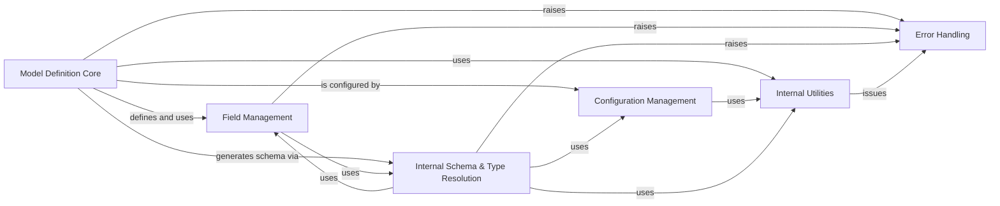

## Component Details

This component overview focuses on the core aspects of Pydantic V2 model definition and management. It encompasses the fundamental processes of creating and structuring Pydantic models and dataclasses, handling individual field properties, managing configuration settings, and resolving complex type hints to generate internal schemas. The system ensures robust model construction, field validation, and error reporting through tightly integrated sub-components.

### Model Definition Core
Handles the fundamental creation, structure, and metaclass operations for Pydantic models and dataclasses, including generic type resolution and signature management.

**Related Classes/Methods**:

- <a href="https://github.com/pydantic/pydantic/blob/master/pydantic/main.py#L121-L1643" target="_blank" rel="noopener noreferrer">`pydantic.main.BaseModel` (121:1643)</a>
- <a href="https://github.com/pydantic/pydantic/blob/master/pydantic/_internal/_model_construction.py#L79-L331" target="_blank" rel="noopener noreferrer">`pydantic._internal._model_construction.ModelMetaclass` (79:331)</a>
- <a href="https://github.com/pydantic/pydantic/blob/master/pydantic/root_model.py#L35-L157" target="_blank" rel="noopener noreferrer">`pydantic.root_model.RootModel` (35:157)</a>
- <a href="https://github.com/pydantic/pydantic/blob/master/pydantic/dataclasses.py#L99-L319" target="_blank" rel="noopener noreferrer">`pydantic.dataclasses.dataclass` (99:319)</a>
- `pydantic._internal._dataclasses` (full file reference)
- `pydantic._internal._generics` (full file reference)
- `pydantic._internal._signature` (full file reference)
- `pydantic._internal._discriminated_union` (full file reference)
- `pydantic._internal._namespace_utils` (full file reference)
- `pydantic._internal._decorators` (full file reference)

### Field Management
Manages the definition, properties, and internal representation of individual fields within Pydantic models, including metadata, private attributes, and computed fields.

**Related Classes/Methods**:

- <a href="https://github.com/pydantic/pydantic/blob/master/pydantic/fields.py#L100-L736" target="_blank" rel="noopener noreferrer">`pydantic.fields.FieldInfo` (100:736)</a>
- <a href="https://github.com/pydantic/pydantic/blob/master/pydantic/fields.py#L1217-L1221" target="_blank" rel="noopener noreferrer">`pydantic.fields.PrivateAttr` (1217:1221)</a>
- <a href="https://github.com/pydantic/pydantic/blob/master/pydantic/fields.py#L1370-L1370" target="_blank" rel="noopener noreferrer">`pydantic.fields.computed_field` (1370:1370)</a>
- `pydantic._internal._fields` (full file reference)
- `pydantic._internal._repr` (full file reference)

### Configuration Management
Provides mechanisms for defining and applying configuration settings to Pydantic models, influencing their behavior during definition and validation.

**Related Classes/Methods**:

- <a href="https://github.com/pydantic/pydantic/blob/master/pydantic/config.py#L36-L1138" target="_blank" rel="noopener noreferrer">`pydantic.config.ConfigDict` (36:1138)</a>
- <a href="https://github.com/pydantic/pydantic/blob/master/pydantic/config.py#L1146-L1146" target="_blank" rel="noopener noreferrer">`pydantic.config.with_config` (1146:1146)</a>
- <a href="https://github.com/pydantic/pydantic/blob/master/pydantic/_internal/_config.py#L34-L232" target="_blank" rel="noopener noreferrer">`pydantic._internal._config.ConfigWrapper` (34:232)</a>

### Internal Schema & Type Resolution
Responsible for the low-level generation of core schemas and the resolution of complex Python type hints, crucial for Pydantic's understanding of model structure and validation.

**Related Classes/Methods**:

- <a href="https://github.com/pydantic/pydantic/blob/master/pydantic/_internal/_generate_schema.py#L312-L2333" target="_blank" rel="noopener noreferrer">`pydantic._internal._generate_schema.GenerateSchema` (312:2333)</a>
- `pydantic._internal._core_metadata` (full file reference)
- `pydantic._internal._forward_ref` (full file reference)
- `pydantic._internal._typing_extra` (full file reference)
- `pydantic._internal._schema_gather` (full file reference)
- <a href="https://github.com/pydantic/pydantic/blob/master/pydantic/json_schema.py#L216-L2373" target="_blank" rel="noopener noreferrer">`pydantic.json_schema.GenerateJsonSchema` (216:2373)</a>
- `pydantic._internal._schema_generation_shared` (full file reference)

### Internal Utilities
A collection of general-purpose utility functions and classes used internally across the Pydantic library to support various operations, including common data manipulations and internal helpers.

**Related Classes/Methods**:

- `pydantic._internal._utils` (full file reference)
- `pydantic._internal._core_utils` (full file reference)
- `pydantic._internal._mock_val_ser` (full file reference)

### Error Handling
Defines the base for all Pydantic-specific errors and warnings, providing a consistent structure for reporting validation failures, deprecation notices, and other issues encountered during model processing.

**Related Classes/Methods**:

- <a href="https://github.com/pydantic/pydantic/blob/master/pydantic/errors.py#L82-L98" target="_blank" rel="noopener noreferrer">`pydantic.errors.PydanticErrorMixin` (82:98)</a>
- <a href="https://github.com/pydantic/pydantic/blob/master/pydantic/warnings.py#L18-L49" target="_blank" rel="noopener noreferrer">`pydantic.warnings.PydanticDeprecationWarning` (18:49)</a>
- `pydantic.version` (full file reference)

### [FAQ](https://github.com/CodeBoarding/GeneratedOnBoardings/tree/main?tab=readme-ov-file#faq)