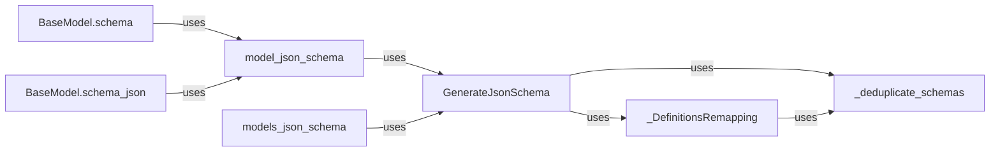

## Component Details

The Schema Generation and Export component is responsible for generating JSON schemas from Pydantic models. It leverages the `GenerateJsonSchema` class to handle schema generation, including handling different schema types, managing definitions, and resolving references. The component also includes functionalities for deduplicating schemas and remapping definitions to ensure consistency and efficiency. The generated schemas can be accessed through the `BaseModel.schema` and `BaseModel.schema_json` methods, providing a standardized way to export model schemas in JSON format.

### GenerateJsonSchema
This class is responsible for generating JSON schemas from Pydantic models and core schemas. It handles various schema types, including primitive types, containers, and complex structures like models and dataclasses. It also manages definitions and references to avoid duplication and circular dependencies.

**Related Classes/Methods**:

- <a href="https://github.com/pydantic/pydantic/blob/master/pydantic/json_schema.py#L216-L2373" target="_blank" rel="noopener noreferrer">`pydantic.json_schema.GenerateJsonSchema` (216:2373)</a>

### _DefinitionsRemapping
This class is used to remap definitions within a JSON schema. It helps in deduplicating schemas and resolving references to definitions, ensuring that the generated schema is consistent and efficient.

**Related Classes/Methods**:

- <a href="https://github.com/pydantic/pydantic/blob/master/pydantic/json_schema.py#L136-L213" target="_blank" rel="noopener noreferrer">`pydantic.json_schema._DefinitionsRemapping` (136:213)</a>

### model_json_schema
This function generates a JSON schema for a given Pydantic model. It uses the `GenerateJsonSchema` class to create the schema and handles any necessary preprocessing or postprocessing steps.

**Related Classes/Methods**:

- <a href="https://github.com/pydantic/pydantic/blob/master/pydantic/json_schema.py#L2379-L2413" target="_blank" rel="noopener noreferrer">`pydantic.json_schema.model_json_schema` (2379:2413)</a>

### models_json_schema
This function generates a JSON schema for a list of Pydantic models. It leverages the `GenerateJsonSchema` class to generate the schema definitions for all models.

**Related Classes/Methods**:

- <a href="https://github.com/pydantic/pydantic/blob/master/pydantic/json_schema.py#L2416-L2461" target="_blank" rel="noopener noreferrer">`pydantic.json_schema.models_json_schema` (2416:2461)</a>

### BaseModel.schema
This method, available on Pydantic's `BaseModel`, provides access to the generated JSON schema for the model. It internally calls `model_json_schema` to generate the schema.

**Related Classes/Methods**:

- <a href="https://github.com/pydantic/pydantic/blob/master/pydantic/main.py#L1531-L1539" target="_blank" rel="noopener noreferrer">`pydantic.main.BaseModel.schema` (1531:1539)</a>
- <a href="https://github.com/pydantic/pydantic/blob/master/pydantic/v1/main.py#L666-L672" target="_blank" rel="noopener noreferrer">`pydantic.v1.main.BaseModel.schema` (666:672)</a>

### BaseModel.schema_json
This method, available on Pydantic's `BaseModel`, returns the JSON schema for the model as a JSON string. It internally calls `model_json_schema` to generate the schema.

**Related Classes/Methods**:

- <a href="https://github.com/pydantic/pydantic/blob/master/pydantic/main.py#L1546-L1562" target="_blank" rel="noopener noreferrer">`pydantic.main.BaseModel.schema_json` (1546:1562)</a>
- <a href="https://github.com/pydantic/pydantic/blob/master/pydantic/v1/main.py#L675-L682" target="_blank" rel="noopener noreferrer">`pydantic.v1.main.BaseModel.schema_json` (675:682)</a>

### _deduplicate_schemas
This function deduplicates schemas by creating a hashable representation of each schema and using it to identify duplicates. This ensures that the generated JSON schema is as compact as possible.

**Related Classes/Methods**:

- <a href="https://github.com/pydantic/pydantic/blob/master/pydantic/json_schema.py#L2472-L2473" target="_blank" rel="noopener noreferrer">`pydantic.json_schema._deduplicate_schemas` (2472:2473)</a>