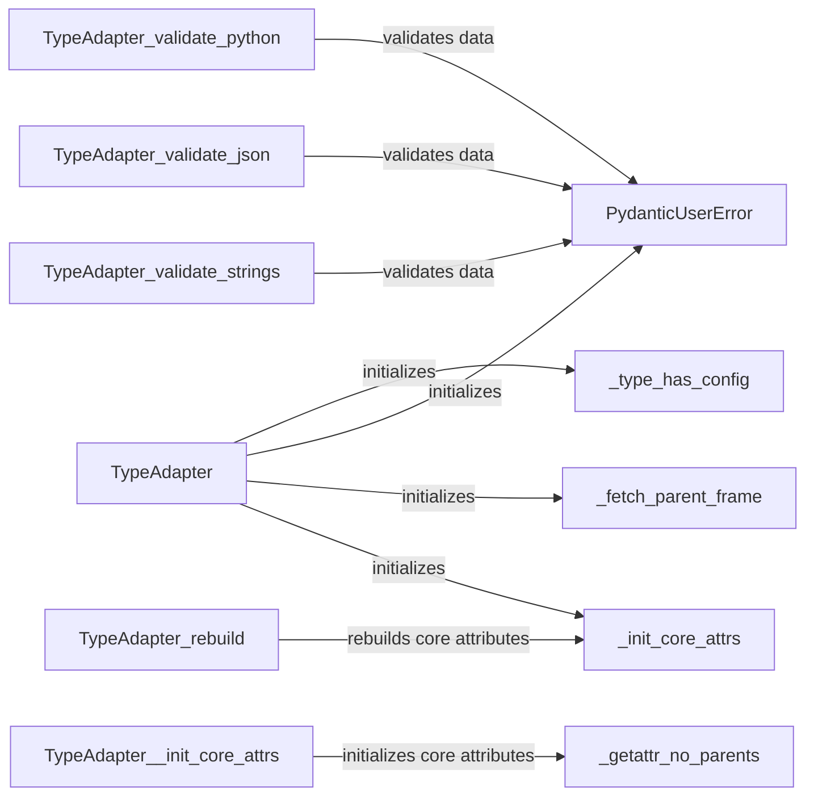

## Component Details

The Type Adaptation and Conversion component in Pydantic provides the core functionality for adapting Python types to Pydantic models and vice versa. It revolves around the `TypeAdapter` class, which handles validation, serialization, and deserialization. This component bridges the gap between Pydantic models and external data sources or formats, ensuring data consistency and type safety. It leverages helper functions for configuration and error handling.

### TypeAdapter
The TypeAdapter class is the central component responsible for adapting Python types to pydantic's internal representation and vice versa. It handles validation, serialization, and deserialization of data. It uses `_init_core_attrs` to initialize core attributes and interacts with other modules for validation and error handling. It also provides methods for validating Python objects, JSON strings, and regular strings against a specified type.

**Related Classes/Methods**:

- <a href="https://github.com/pydantic/pydantic/blob/master/pydantic/type_adapter.py#L69-L727" target="_blank" rel="noopener noreferrer">`pydantic.type_adapter.TypeAdapter` (69:727)</a>
- <a href="https://github.com/pydantic/pydantic/blob/master/pydantic/type_adapter.py#L173-L180" target="_blank" rel="noopener noreferrer">`pydantic.type_adapter.TypeAdapter.__init__` (173:180)</a>
- <a href="https://github.com/pydantic/pydantic/blob/master/pydantic/type_adapter.py#L246-L316" target="_blank" rel="noopener noreferrer">`pydantic.type_adapter.TypeAdapter._init_core_attrs` (246:316)</a>
- <a href="https://github.com/pydantic/pydantic/blob/master/pydantic/type_adapter.py#L335-L379" target="_blank" rel="noopener noreferrer">`pydantic.type_adapter.TypeAdapter.rebuild` (335:379)</a>
- <a href="https://github.com/pydantic/pydantic/blob/master/pydantic/type_adapter.py#L381-L429" target="_blank" rel="noopener noreferrer">`pydantic.type_adapter.TypeAdapter.validate_python` (381:429)</a>
- <a href="https://github.com/pydantic/pydantic/blob/master/pydantic/type_adapter.py#L431-L475" target="_blank" rel="noopener noreferrer">`pydantic.type_adapter.TypeAdapter.validate_json` (431:475)</a>
- <a href="https://github.com/pydantic/pydantic/blob/master/pydantic/type_adapter.py#L477-L518" target="_blank" rel="noopener noreferrer">`pydantic.type_adapter.TypeAdapter.validate_strings` (477:518)</a>

### PydanticUserError
The PydanticUserError class represents errors raised due to incorrect usage of pydantic. It is used by TypeAdapter to signal validation errors or other issues related to user-provided data or types during the validation process.

**Related Classes/Methods**:

- <a href="https://github.com/pydantic/pydantic/blob/master/pydantic/errors.py#L101-L102" target="_blank" rel="noopener noreferrer">`pydantic.errors.PydanticUserError` (101:102)</a>

### _type_has_config
The `_type_has_config` function checks if a given type has a `Config` attribute. This is used during the initialization of `TypeAdapter` to determine if the type has custom configuration options, influencing how the type is adapted.

**Related Classes/Methods**:

- <a href="https://github.com/pydantic/pydantic/blob/master/pydantic/type_adapter.py#L58-L65" target="_blank" rel="noopener noreferrer">`pydantic.type_adapter._type_has_config` (58:65)</a>

### _fetch_parent_frame
The `_fetch_parent_frame` function retrieves a parent frame from the call stack. This is likely used for debugging or error reporting purposes within the `TypeAdapter` initialization, providing context for potential issues.

**Related Classes/Methods**:

- `pydantic.type_adapter._fetch_parent_frame` (full file reference)

### _getattr_no_parents
The `_getattr_no_parents` function is used to get an attribute of an object without traversing its parent classes. This is used in `_init_core_attrs` to access attributes of the type being adapted, allowing direct access to the type's attributes.

**Related Classes/Methods**:

- <a href="https://github.com/pydantic/pydantic/blob/master/pydantic/type_adapter.py#L43-L55" target="_blank" rel="noopener noreferrer">`pydantic.type_adapter._getattr_no_parents` (43:55)</a>