```mermaid
graph LR
    Model_Definition_and_Management["Model Definition and Management"]
    Data_Validation_Engine["Data Validation Engine"]
    Schema_Generation_and_Export["Schema Generation and Export"]
    Type_Adaptation_and_Conversion["Type Adaptation and Conversion"]
    Functional_Validation_and_Serialization["Functional Validation and Serialization"]
    Data_Types_and_Constraints["Data Types and Constraints"]
    Configuration_Management_System["Configuration Management System"]
    Error_Reporting_and_Handling["Error Reporting and Handling"]
    Model_Definition_and_Management -- "defines and manages" --> Data_Validation_Engine
    Data_Validation_Engine -- "uses for validation" --> Data_Types_and_Constraints
    Schema_Generation_and_Export -- "generates schemas for" --> Model_Definition_and_Management
    Type_Adaptation_and_Conversion -- "validates and serializes" --> Model_Definition_and_Management
    Functional_Validation_and_Serialization -- "can be used to validate" --> Data_Validation_Engine
    Data_Types_and_Constraints -- "are used in" --> Model_Definition_and_Management
    Configuration_Management_System -- "configures" --> Model_Definition_and_Management
    Error_Reporting_and_Handling -- "handles errors from" --> Data_Validation_Engine
    Model_Definition_and_Management -- "uses" --> Configuration_Management_System
    Schema_Generation_and_Export -- "uses" --> Data_Types_and_Constraints
    Type_Adaptation_and_Conversion -- "uses" --> Data_Types_and_Constraints
    Data_Validation_Engine -- "uses" --> Error_Reporting_and_Handling
    Schema_Generation_and_Export -- "uses" --> Configuration_Management_System
    click Model_Definition_and_Management href "https://github.com/CodeBoarding/GeneratedOnBoardings/blob/main/pydantic/Model Definition and Management.md" "Details"
    click Data_Validation_Engine href "https://github.com/CodeBoarding/GeneratedOnBoardings/blob/main/pydantic/Data Validation Engine.md" "Details"
    click Schema_Generation_and_Export href "https://github.com/CodeBoarding/GeneratedOnBoardings/blob/main/pydantic/Schema Generation and Export.md" "Details"
    click Type_Adaptation_and_Conversion href "https://github.com/CodeBoarding/GeneratedOnBoardings/blob/main/pydantic/Type Adaptation and Conversion.md" "Details"
    click Functional_Validation_and_Serialization href "https://github.com/CodeBoarding/GeneratedOnBoardings/blob/main/pydantic/Functional Validation and Serialization.md" "Details"
    click Data_Types_and_Constraints href "https://github.com/CodeBoarding/GeneratedOnBoardings/blob/main/pydantic/Data Types and Constraints.md" "Details"
    click Configuration_Management_System href "https://github.com/CodeBoarding/GeneratedOnBoardings/blob/main/pydantic/Configuration Management System.md" "Details"
    click Error_Reporting_and_Handling href "https://github.com/CodeBoarding/GeneratedOnBoardings/blob/main/pydantic/Error Reporting and Handling.md" "Details"
```

## Component Details

Pydantic is a data validation and settings management library using Python type annotations. It provides a way to define data structures as classes, validate the types of input data, and serialize data to various formats. The core flow involves defining models, validating data against those models, and handling any validation errors. Pydantic leverages Python's type hinting system to provide a concise and intuitive way to define data structures and their expected types. It also supports features like data conversion, custom validation, and schema generation.

### Model Definition and Management
This component is responsible for defining and managing data models using the `BaseModel` class. It handles model creation, field definition, configuration, and instance management. It provides the foundation for data structures and their behavior within the Pydantic ecosystem.

**Related Classes/Methods**:

- <a href="https://github.com/pydantic/pydantic/blob/master/pydantic/main.py#L121-L1643" target="_blank" rel="noopener noreferrer">`pydantic.main.BaseModel` (121:1643)</a>
- `pydantic.main.ModelMetaclass` (full file reference)
- <a href="https://github.com/pydantic/pydantic/blob/master/pydantic/fields.py#L784-L821" target="_blank" rel="noopener noreferrer">`pydantic.fields.Field` (784:821)</a>
- `pydantic.fields.ModelField` (full file reference)
- `pydantic.config.BaseConfig` (full file reference)
- <a href="https://github.com/pydantic/pydantic/blob/master/pydantic/_internal/_model_construction.py#L79-L331" target="_blank" rel="noopener noreferrer">`pydantic._internal._model_construction.ModelMetaclass` (79:331)</a>

### Data Validation Engine
This component focuses on validating data against the defined models. It uses `pydantic_core` for the actual validation and includes validator functions, error handling, and mechanisms for customizing validation behavior. It ensures that data conforms to the specified types and constraints.

**Related Classes/Methods**:

- `pydantic.main.validate_model` (full file reference)
- `pydantic.fields.ModelField.validate` (full file reference)
- `pydantic.error_wrappers.ValidationError` (full file reference)
- `pydantic._internal._validators` (full file reference)

### Schema Generation and Export
This component is responsible for generating schemas (JSON Schema, Core Schema) from Pydantic models. It includes classes and functions for traversing models, extracting field information, and constructing schema representations. It allows exporting models in standard schema formats.

**Related Classes/Methods**:

- `pydantic.schema.model_schema` (full file reference)
- `pydantic.schema.field_schema` (full file reference)
- <a href="https://github.com/pydantic/pydantic/blob/master/pydantic/json_schema.py#L216-L2373" target="_blank" rel="noopener noreferrer">`pydantic.json_schema.GenerateJsonSchema` (216:2373)</a>
- <a href="https://github.com/pydantic/pydantic/blob/master/pydantic/_internal/_generate_schema.py#L312-L2333" target="_blank" rel="noopener noreferrer">`pydantic._internal._generate_schema.GenerateSchema` (312:2333)</a>

### Type Adaptation and Conversion
This component provides functionality to adapt Python types to Pydantic models and vice versa. It's centered around the `TypeAdapter` class and handles validation and serialization between different types. It bridges the gap between Pydantic models and external data sources or formats.

**Related Classes/Methods**:

- <a href="https://github.com/pydantic/pydantic/blob/master/pydantic/type_adapter.py#L69-L727" target="_blank" rel="noopener noreferrer">`pydantic.type_adapter.TypeAdapter` (69:727)</a>
- <a href="https://github.com/pydantic/pydantic/blob/master/pydantic/type_adapter.py#L381-L429" target="_blank" rel="noopener noreferrer">`pydantic.type_adapter.TypeAdapter.validate_python` (381:429)</a>
- <a href="https://github.com/pydantic/pydantic/blob/master/pydantic/type_adapter.py#L431-L475" target="_blank" rel="noopener noreferrer">`pydantic.type_adapter.TypeAdapter.validate_json` (431:475)</a>

### Functional Validation and Serialization
This component provides functional utilities such as serializers and validators that can be attached to fields. It allows customization of the validation and serialization process using functions, enabling flexible data transformation and validation logic.

**Related Classes/Methods**:

- <a href="https://github.com/pydantic/pydantic/blob/master/pydantic/functional_validators.py#L88-L151" target="_blank" rel="noopener noreferrer">`pydantic.functional_validators.BeforeValidator` (88:151)</a>
- <a href="https://github.com/pydantic/pydantic/blob/master/pydantic/functional_validators.py#L27-L84" target="_blank" rel="noopener noreferrer">`pydantic.functional_validators.AfterValidator` (27:84)</a>
- <a href="https://github.com/pydantic/pydantic/blob/master/pydantic/functional_serializers.py#L19-L85" target="_blank" rel="noopener noreferrer">`pydantic.functional_serializers.PlainSerializer` (19:85)</a>

### Data Types and Constraints
This component defines various data types with constraints, such as strings, numbers, and URLs. It includes classes for constrained types (e.g., `constr`, `conint`) and network-related types (e.g., `EmailStr`, `AnyUrl`). It provides pre-built types for common data formats and validation rules.

**Related Classes/Methods**:

- <a href="https://github.com/pydantic/pydantic/blob/master/pydantic/types.py#L749-L828" target="_blank" rel="noopener noreferrer">`pydantic.types.constr` (749:828)</a>
- <a href="https://github.com/pydantic/pydantic/blob/master/pydantic/types.py#L151-L235" target="_blank" rel="noopener noreferrer">`pydantic.types.conint` (151:235)</a>
- `pydantic.networks.EmailStr` (full file reference)
- <a href="https://github.com/pydantic/pydantic/blob/master/pydantic/networks.py#L534-L552" target="_blank" rel="noopener noreferrer">`pydantic.networks.AnyUrl` (534:552)</a>

### Configuration Management System
This component handles configuration settings for Pydantic models. It includes classes for defining configuration options and mechanisms for inheriting and overriding settings. It allows customizing model behavior and validation rules through configuration.

**Related Classes/Methods**:

- `pydantic.config.BaseConfig` (full file reference)
- <a href="https://github.com/pydantic/pydantic/blob/master/pydantic/_internal/_config.py#L34-L232" target="_blank" rel="noopener noreferrer">`pydantic._internal._config.ConfigWrapper` (34:232)</a>
- <a href="https://github.com/pydantic/pydantic/blob/master/pydantic/_internal/_config.py#L310-L328" target="_blank" rel="noopener noreferrer">`pydantic._internal._config.prepare_config` (310:328)</a>

### Error Reporting and Handling
This component defines the error hierarchy and provides classes for representing validation errors. It includes classes for different types of errors, such as `ValidationError`, `TypeError`, and `ValueError`. It provides detailed error messages to help users identify and fix data validation issues.

**Related Classes/Methods**:

- `pydantic.errors.ValidationError` (full file reference)
- `pydantic.errors.PydanticTypeError` (full file reference)
- `pydantic.errors.PydanticValueError` (full file reference)
- `pydantic.error_wrappers.ErrorWrapper` (full file reference)