```mermaid
graph LR
    Pydantic_V2_Model_Definition_Management["Pydantic V2 Model Definition & Management"]
    Pydantic_V2_Core_Schema_Generation["Pydantic V2 Core Schema Generation"]
    Pydantic_V2_Data_Validation_Serialization["Pydantic V2 Data Validation & Serialization"]
    Pydantic_V2_JSON_Schema_Export["Pydantic V2 JSON Schema Export"]
    Pydantic_V2_Built_in_Types_Utilities["Pydantic V2 Built-in Types & Utilities"]
    Pydantic_V1_Compatibility_Layer["Pydantic V1 Compatibility Layer"]
    Pydantic_V2_Model_Definition_Management -- "defines and manages" --> Pydantic_V2_Core_Schema_Generation
    Pydantic_V2_Core_Schema_Generation -- "generates schemas for" --> Pydantic_V2_Data_Validation_Serialization
    Pydantic_V2_Data_Validation_Serialization -- "utilizes schemas from" --> Pydantic_V2_Core_Schema_Generation
    Pydantic_V2_Model_Definition_Management -- "provides data structures for" --> Pydantic_V2_JSON_Schema_Export
    Pydantic_V2_Data_Validation_Serialization -- "provides validation/serialization logic for" --> Pydantic_V2_JSON_Schema_Export
    Pydantic_V2_Built_in_Types_Utilities -- "provides types and utilities to" --> Pydantic_V2_Model_Definition_Management
    Pydantic_V2_Built_in_Types_Utilities -- "provides types and utilities to" --> Pydantic_V2_Core_Schema_Generation
    Pydantic_V2_Built_in_Types_Utilities -- "provides types and utilities to" --> Pydantic_V2_Data_Validation_Serialization
    Pydantic_V1_Compatibility_Layer -- "offers backward compatibility for" --> Pydantic_V2_Model_Definition_Management
    click Pydantic_V2_Model_Definition_Management href "https://github.com/CodeBoarding/GeneratedOnBoardings/blob/main/pydantic/Pydantic V2 Model Definition & Management.md" "Details"
    click Pydantic_V2_Core_Schema_Generation href "https://github.com/CodeBoarding/GeneratedOnBoardings/blob/main/pydantic/Pydantic V2 Core Schema Generation.md" "Details"
    click Pydantic_V2_Data_Validation_Serialization href "https://github.com/CodeBoarding/GeneratedOnBoardings/blob/main/pydantic/Pydantic V2 Data Validation & Serialization.md" "Details"
    click Pydantic_V2_JSON_Schema_Export href "https://github.com/CodeBoarding/GeneratedOnBoardings/blob/main/pydantic/Pydantic V2 JSON Schema Export.md" "Details"
    click Pydantic_V2_Built_in_Types_Utilities href "https://github.com/CodeBoarding/GeneratedOnBoardings/blob/main/pydantic/Pydantic V2 Built-in Types & Utilities.md" "Details"
    click Pydantic_V1_Compatibility_Layer href "https://github.com/CodeBoarding/GeneratedOnBoardings/blob/main/pydantic/Pydantic V1 Compatibility Layer.md" "Details"
```

## Component Details

This architecture analysis of Pydantic outlines the core components responsible for its robust data validation, serialization, and model definition capabilities. It highlights the distinct responsibilities of V2's model management, schema generation, validation/serialization engine, and JSON schema export, alongside a dedicated component for built-in types and utilities. A separate compatibility layer ensures seamless migration and backward support for Pydantic V1 functionalities.

### Pydantic V2 Model Definition & Management
This component handles the core aspects of defining and managing Pydantic V2 models and dataclasses, including metaclass operations, field handling, configuration, and generic type resolution.

**Related Classes/Methods**:

- <a href="https://github.com/pydantic/pydantic/blob/master/pydantic/main.py#L121-L1643" target="_blank" rel="noopener noreferrer">`pydantic.main.BaseModel` (121:1643)</a>
- <a href="https://github.com/pydantic/pydantic/blob/master/pydantic/_internal/_model_construction.py#L79-L331" target="_blank" rel="noopener noreferrer">`pydantic._internal._model_construction.ModelMetaclass` (79:331)</a>
- <a href="https://github.com/pydantic/pydantic/blob/master/pydantic/fields.py#L100-L736" target="_blank" rel="noopener noreferrer">`pydantic.fields.FieldInfo` (100:736)</a>
- <a href="https://github.com/pydantic/pydantic/blob/master/pydantic/config.py#L36-L1138" target="_blank" rel="noopener noreferrer">`pydantic.config.ConfigDict` (36:1138)</a>
- <a href="https://github.com/pydantic/pydantic/blob/master/pydantic/_internal/_config.py#L34-L232" target="_blank" rel="noopener noreferrer">`pydantic._internal._config.ConfigWrapper` (34:232)</a>
- `pydantic._internal._generics` (full file reference)
- `pydantic._internal._fields` (full file reference)
- <a href="https://github.com/pydantic/pydantic/blob/master/pydantic/root_model.py#L35-L157" target="_blank" rel="noopener noreferrer">`pydantic.root_model.RootModel` (35:157)</a>
- <a href="https://github.com/pydantic/pydantic/blob/master/pydantic/dataclasses.py#L99-L319" target="_blank" rel="noopener noreferrer">`pydantic.dataclasses.dataclass` (99:319)</a>
- <a href="https://github.com/pydantic/pydantic/blob/master/pydantic/fields.py#L1217-L1221" target="_blank" rel="noopener noreferrer">`pydantic.fields.PrivateAttr` (1217:1221)</a>
- <a href="https://github.com/pydantic/pydantic/blob/master/pydantic/fields.py#L1370-L1370" target="_blank" rel="noopener noreferrer">`pydantic.fields.computed_field` (1370:1370)</a>
- <a href="https://github.com/pydantic/pydantic/blob/master/pydantic/config.py#L1146-L1146" target="_blank" rel="noopener noreferrer">`pydantic.config.with_config` (1146:1146)</a>
- `pydantic._internal._dataclasses` (full file reference)
- `pydantic._internal._signature` (full file reference)
- `pydantic._internal._discriminated_union` (full file reference)
- `pydantic._internal._repr` (full file reference)
- `pydantic._internal._namespace_utils` (full file reference)
- `pydantic._internal._decorators` (full file reference)
- `pydantic._internal._typing_extra` (full file reference)
- `pydantic._internal._mock_val_ser` (full file reference)
- `pydantic._internal._schema_gather` (full file reference)
- `pydantic._internal._utils` (full file reference)
- `pydantic._internal._core_utils` (full file reference)

### Pydantic V2 Core Schema Generation
This component is responsible for translating Python types and Pydantic model definitions into the low-level pydantic-core schemas. This is a crucial intermediate step for validation and serialization, handling various type conversions, forward references, and decorator applications.

**Related Classes/Methods**:

- <a href="https://github.com/pydantic/pydantic/blob/master/pydantic/_internal/_generate_schema.py#L312-L2333" target="_blank" rel="noopener noreferrer">`pydantic._internal._generate_schema.GenerateSchema` (312:2333)</a>
- `pydantic._internal._core_utils` (full file reference)
- `pydantic._internal._schema_gather` (full file reference)
- <a href="https://github.com/pydantic/pydantic/blob/master/pydantic/annotated_handlers.py#L66-L122" target="_blank" rel="noopener noreferrer">`pydantic.annotated_handlers.GetCoreSchemaHandler` (66:122)</a>
- <a href="https://github.com/pydantic/pydantic/blob/master/pydantic/_internal/_config.py#L235-L258" target="_blank" rel="noopener noreferrer">`pydantic._internal._config.ConfigWrapperStack` (235:258)</a>
- `pydantic._internal._decorators` (full file reference)
- `pydantic._internal._fields` (full file reference)
- `pydantic._internal._generics` (full file reference)
- `pydantic._internal._namespace_utils` (full file reference)
- `pydantic._internal._typing_extra` (full file reference)
- <a href="https://github.com/pydantic/pydantic/blob/master/pydantic/errors.py#L145-L153" target="_blank" rel="noopener noreferrer">`pydantic.errors.PydanticSchemaGenerationError` (145:153)</a>
- <a href="https://github.com/pydantic/pydantic/blob/master/pydantic/errors.py#L105-L131" target="_blank" rel="noopener noreferrer">`pydantic.errors.PydanticUndefinedAnnotation` (105:131)</a>

### Pydantic V2 Data Validation & Serialization
This component handles the actual validation and serialization of data using the generated pydantic-core schemas. It provides flexible interfaces like TypeAdapter for various Python types and integrates functional validators and serializers for custom logic.

**Related Classes/Methods**:

- <a href="https://github.com/pydantic/pydantic/blob/master/pydantic/type_adapter.py#L69-L727" target="_blank" rel="noopener noreferrer">`pydantic.type_adapter.TypeAdapter` (69:727)</a>
- <a href="https://github.com/pydantic/pydantic/blob/master/pydantic/functional_validators.py#L27-L84" target="_blank" rel="noopener noreferrer">`pydantic.functional_validators.AfterValidator` (27:84)</a>
- <a href="https://github.com/pydantic/pydantic/blob/master/pydantic/functional_validators.py#L88-L151" target="_blank" rel="noopener noreferrer">`pydantic.functional_validators.BeforeValidator` (88:151)</a>
- <a href="https://github.com/pydantic/pydantic/blob/master/pydantic/functional_validators.py#L155-L247" target="_blank" rel="noopener noreferrer">`pydantic.functional_validators.PlainValidator` (155:247)</a>
- <a href="https://github.com/pydantic/pydantic/blob/master/pydantic/functional_validators.py#L251-L322" target="_blank" rel="noopener noreferrer">`pydantic.functional_validators.WrapValidator` (251:322)</a>
- <a href="https://github.com/pydantic/pydantic/blob/master/pydantic/functional_validators.py#L372-L379" target="_blank" rel="noopener noreferrer">`pydantic.functional_validators.field_validator` (372:379)</a>
- <a href="https://github.com/pydantic/pydantic/blob/master/pydantic/functional_validators.py#L639-L644" target="_blank" rel="noopener noreferrer">`pydantic.functional_validators.model_validator` (639:644)</a>
- <a href="https://github.com/pydantic/pydantic/blob/master/pydantic/functional_serializers.py#L19-L85" target="_blank" rel="noopener noreferrer">`pydantic.functional_serializers.PlainSerializer` (19:85)</a>
- <a href="https://github.com/pydantic/pydantic/blob/master/pydantic/functional_serializers.py#L89-L188" target="_blank" rel="noopener noreferrer">`pydantic.functional_serializers.WrapSerializer` (89:188)</a>
- <a href="https://github.com/pydantic/pydantic/blob/master/pydantic/functional_serializers.py#L208-L216" target="_blank" rel="noopener noreferrer">`pydantic.functional_serializers.field_serializer` (208:216)</a>
- <a href="https://github.com/pydantic/pydantic/blob/master/pydantic/functional_serializers.py#L328-L328" target="_blank" rel="noopener noreferrer">`pydantic.functional_serializers.model_serializer` (328:328)</a>
- <a href="https://github.com/pydantic/pydantic/blob/master/pydantic/_internal/_validate_call.py#L49-L140" target="_blank" rel="noopener noreferrer">`pydantic._internal._validate_call.ValidateCallWrapper` (49:140)</a>
- `pydantic._internal._validators` (full file reference)
- <a href="https://github.com/pydantic/pydantic/blob/master/pydantic/plugin/_schema_validator.py#L22-L51" target="_blank" rel="noopener noreferrer">`pydantic.plugin._schema_validator.create_schema_validator` (22:51)</a>
- `pydantic_core.SchemaValidator` (full file reference)
- `pydantic_core.SchemaSerializer` (full file reference)

### Pydantic V2 JSON Schema Export
This component is dedicated to generating OpenAPI/JSON schemas from Pydantic's internal core schemas. It manages schema definitions, references, and handles specific annotations that influence the generated JSON schema structure.

**Related Classes/Methods**:

- <a href="https://github.com/pydantic/pydantic/blob/master/pydantic/json_schema.py#L216-L2373" target="_blank" rel="noopener noreferrer">`pydantic.json_schema.GenerateJsonSchema` (216:2373)</a>
- <a href="https://github.com/pydantic/pydantic/blob/master/pydantic/json_schema.py#L136-L213" target="_blank" rel="noopener noreferrer">`pydantic.json_schema._DefinitionsRemapping` (136:213)</a>
- <a href="https://github.com/pydantic/pydantic/blob/master/pydantic/json_schema.py#L2486-L2517" target="_blank" rel="noopener noreferrer">`pydantic.json_schema.WithJsonSchema` (2486:2517)</a>
- <a href="https://github.com/pydantic/pydantic/blob/master/pydantic/json_schema.py#L2520-L2591" target="_blank" rel="noopener noreferrer">`pydantic.json_schema.Examples` (2520:2591)</a>
- <a href="https://github.com/pydantic/pydantic/blob/master/pydantic/json_schema.py#L1150-L1173" target="_blank" rel="noopener noreferrer">`pydantic.json_schema.SkipJsonSchema` (1150:1173)</a>
- <a href="https://github.com/pydantic/pydantic/blob/master/pydantic/json_schema.py#L2379-L2413" target="_blank" rel="noopener noreferrer">`pydantic.json_schema.model_json_schema` (2379:2413)</a>
- <a href="https://github.com/pydantic/pydantic/blob/master/pydantic/json_schema.py#L2416-L2461" target="_blank" rel="noopener noreferrer">`pydantic.json_schema.models_json_schema` (2416:2461)</a>
- <a href="https://github.com/pydantic/pydantic/blob/master/pydantic/json_schema.py#L50-L50" target="_blank" rel="noopener noreferrer">`pydantic.json_schema.DEFAULT_REF_TEMPLATE` (50:50)</a>
- <a href="https://github.com/pydantic/pydantic/blob/master/pydantic/annotated_handlers.py#L24-L63" target="_blank" rel="noopener noreferrer">`pydantic.annotated_handlers.GetJsonSchemaHandler` (24:63)</a>

### Pydantic V2 Built-in Types & Utilities
This component provides a rich set of pre-defined Pydantic types (e.g., constrained types, secrets, network types, colors) and general utility functions, including error handling, migration tools, and MyPy integration.

**Related Classes/Methods**:

- <a href="https://github.com/pydantic/pydantic/blob/master/pydantic/types.py#L151-L235" target="_blank" rel="noopener noreferrer">`pydantic.types.conint` (151:235)</a>
- <a href="https://github.com/pydantic/pydantic/blob/master/pydantic/types.py#L411-L497" target="_blank" rel="noopener noreferrer">`pydantic.types.confloat` (411:497)</a>
- <a href="https://github.com/pydantic/pydantic/blob/master/pydantic/types.py#L663-L683" target="_blank" rel="noopener noreferrer">`pydantic.types.conbytes` (663:683)</a>
- <a href="https://github.com/pydantic/pydantic/blob/master/pydantic/types.py#L694-L746" target="_blank" rel="noopener noreferrer">`pydantic.types.StringConstraints` (694:746)</a>
- <a href="https://github.com/pydantic/pydantic/blob/master/pydantic/types.py#L749-L828" target="_blank" rel="noopener noreferrer">`pydantic.types.constr` (749:828)</a>
- <a href="https://github.com/pydantic/pydantic/blob/master/pydantic/types.py#L874-L903" target="_blank" rel="noopener noreferrer">`pydantic.types.conlist` (874:903)</a>
- <a href="https://github.com/pydantic/pydantic/blob/master/pydantic/types.py#L1041-L1132" target="_blank" rel="noopener noreferrer">`pydantic.types.condecimal` (1041:1132)</a>
- <a href="https://github.com/pydantic/pydantic/blob/master/pydantic/types.py#L1139-L1180" target="_blank" rel="noopener noreferrer">`pydantic.types.UuidVersion` (1139:1180)</a>
- <a href="https://github.com/pydantic/pydantic/blob/master/pydantic/types.py#L1286-L1341" target="_blank" rel="noopener noreferrer">`pydantic.types.PathType` (1286:1341)</a>
- <a href="https://github.com/pydantic/pydantic/blob/master/pydantic/types.py#L1541-L1566" target="_blank" rel="noopener noreferrer">`pydantic.types._SecretBase` (1541:1566)</a>
- <a href="https://github.com/pydantic/pydantic/blob/master/pydantic/types.py#L1576-L1733" target="_blank" rel="noopener noreferrer">`pydantic.types.Secret` (1576:1733)</a>
- <a href="https://github.com/pydantic/pydantic/blob/master/pydantic/types.py#L1806-L1870" target="_blank" rel="noopener noreferrer">`pydantic.types.SecretStr` (1806:1870)</a>
- <a href="https://github.com/pydantic/pydantic/blob/master/pydantic/types.py#L1873-L1903" target="_blank" rel="noopener noreferrer">`pydantic.types.SecretBytes` (1873:1903)</a>
- <a href="https://github.com/pydantic/pydantic/blob/master/pydantic/types.py#L1924-L2024" target="_blank" rel="noopener noreferrer">`pydantic.types.PaymentCardNumber` (1924:2024)</a>
- <a href="https://github.com/pydantic/pydantic/blob/master/pydantic/types.py#L2030-L2187" target="_blank" rel="noopener noreferrer">`pydantic.types.ByteSize` (2030:2187)</a>
- <a href="https://github.com/pydantic/pydantic/blob/master/pydantic/types.py#L2242-L2266" target="_blank" rel="noopener noreferrer">`pydantic.types.condate` (2242:2266)</a>
- <a href="https://github.com/pydantic/pydantic/blob/master/pydantic/types.py#L2477-L2572" target="_blank" rel="noopener noreferrer">`pydantic.types.EncodedBytes` (2477:2572)</a>
- <a href="https://github.com/pydantic/pydantic/blob/master/pydantic/types.py#L2576-L2671" target="_blank" rel="noopener noreferrer">`pydantic.types.EncodedStr` (2576:2671)</a>
- <a href="https://github.com/pydantic/pydantic/blob/master/pydantic/types.py#L2980-L3126" target="_blank" rel="noopener noreferrer">`pydantic.types.Discriminator` (2980:3126)</a>
- <a href="https://github.com/pydantic/pydantic/blob/master/pydantic/types.py#L2895-L2976" target="_blank" rel="noopener noreferrer">`pydantic.types.Tag` (2895:2976)</a>
- <a href="https://github.com/pydantic/pydantic/blob/master/pydantic/types.py#L2130-L2167" target="_blank" rel="noopener noreferrer">`pydantic.types.JsonValue` (2130:2167)</a>
- <a href="https://github.com/pydantic/pydantic/blob/master/pydantic/types.py#L2170-L2182" target="_blank" rel="noopener noreferrer">`pydantic.types.OnErrorOmit` (2170:2182)</a>
- <a href="https://github.com/pydantic/pydantic/blob/master/pydantic/types.py#L3256-L3285" target="_blank" rel="noopener noreferrer">`pydantic.types.FailFast` (3256:3285)</a>
- `pydantic.networks` (full file reference)
- `pydantic.color` (full file reference)
- `pydantic.warnings` (full file reference)
- `pydantic.errors` (full file reference)
- `pydantic.alias_generators` (full file reference)
- `pydantic._migration` (full file reference)
- `pydantic.mypy` (full file reference)
- `pydantic.experimental.pipeline` (full file reference)

### Pydantic V1 Compatibility Layer
This component provides the complete Pydantic V1 API, including its distinct model definition, validation, serialization, type handling, and utility functions. It exists primarily for backward compatibility and to aid in the migration of existing V1 codebases to Pydantic V2.

**Related Classes/Methods**:

- <a href="https://github.com/pydantic/pydantic/blob/master/pydantic/v1/main.py#L316-L922" target="_blank" rel="noopener noreferrer">`pydantic.v1.main.BaseModel` (316:922)</a>
- <a href="https://github.com/pydantic/pydantic/blob/master/pydantic/v1/class_validators.py#L52-L104" target="_blank" rel="noopener noreferrer">`pydantic.v1.class_validators.validator` (52:104)</a>
- <a href="https://github.com/pydantic/pydantic/blob/master/pydantic/v1/class_validators.py#L108-L109" target="_blank" rel="noopener noreferrer">`pydantic.v1.class_validators.root_validator` (108:109)</a>
- `pydantic.v1.generics` (full file reference)
- `pydantic.v1.types` (full file reference)
- `pydantic.v1.networks` (full file reference)
- `pydantic.v1.json` (full file reference)
- `pydantic.v1.error_wrappers` (full file reference)
- `pydantic.v1.tools` (full file reference)
- `pydantic.v1.typing` (full file reference)
- `pydantic.v1.errors` (full file reference)
- `pydantic.v1.mypy` (full file reference)
- `pydantic.v1.dataclasses` (full file reference)
- `pydantic.v1.decorator` (full file reference)
- <a href="https://github.com/pydantic/pydantic/blob/master/pydantic/v1/schema.py#L109-L159" target="_blank" rel="noopener noreferrer">`pydantic.v1.schema` (109:159)</a>
- `pydantic.v1.fields` (full file reference)
- `pydantic.v1.validators` (full file reference)
- `pydantic.v1.config` (full file reference)
- `pydantic.v1.parse` (full file reference)
- `pydantic.v1.env_settings` (full file reference)
- `pydantic.v1.datetime_parse` (full file reference)
- `pydantic.v1.annotated_types` (full file reference)
- `pydantic.v1.utils` (full file reference)

### [FAQ](https://github.com/CodeBoarding/GeneratedOnBoardings/tree/main?tab=readme-ov-file#faq)