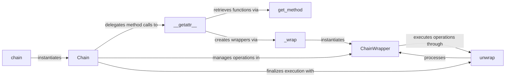

## Details

The `pydash` chaining subsystem provides a fluent API for applying a sequence of utility functions to a value. The core of this subsystem revolves around the `Chain` class, which holds the current value and manages a queue of operations. The `chain` factory function serves as the entry point, initializing a new `Chain` instance. Operations are dynamically resolved via `Chain.__getattr__`, which retrieves the appropriate `pydash` function using `get_method`. These functions are then wrapped by `_wrap` into `ChainWrapper` instances. Each `ChainWrapper` encapsulates a `pydash` function and its arguments, allowing for lazy execution. The `unwrap` method, primarily within `ChainWrapper`, triggers the execution of these accumulated operations, ultimately yielding the final computed result.

### Chain
The central component that orchestrates the sequential execution of chained methods. It holds the current value and manages the queue of operations.

**Related Classes/Methods**:

- <a href="https://github.com/dgilland/pydash/blob/develop/src/pydash/chaining/chaining.py#L181-L235" target="_blank" rel="noopener noreferrer">`pydash.chaining.chaining.Chain`:181-235</a>

### ChainWrapper
An adapter class that wraps individual `pydash` utility functions, making them compatible and callable within the `Chain`'s execution context. It stores the method, arguments, and keyword arguments for a specific operation.

**Related Classes/Methods**:

- <a href="https://github.com/dgilland/pydash/blob/develop/src/pydash/chaining/chaining.py#L112-L165" target="_blank" rel="noopener noreferrer">`pydash.chaining.chaining.ChainWrapper`:112-165</a>

### chain
The primary factory function that initializes and returns a new `Chain` instance, serving as the entry point for starting a fluent chain of operations.

**Related Classes/Methods**:

- <a href="https://github.com/dgilland/pydash/blob/develop/src/pydash/chaining/chaining.py#L181-L235" target="_blank" rel="noopener noreferrer">`pydash.chaining.chaining.chain`:181-235</a>

### __getattr__
A dynamic method implemented on the `Chain` object that intercepts attribute access. It enables the fluent API by dynamically resolving method calls to `pydash` utility functions, retrieving them via `get_method` and wrapping them with `_wrap`.

**Related Classes/Methods**:

- <a href="https://github.com/dgilland/pydash/blob/develop/src/pydash/chaining/chaining.py#L198-L207" target="_blank" rel="noopener noreferrer">`pydash.chaining.chaining.Chain.__getattr__`:198-207</a>

### unwrap
A method of `ChainWrapper` that triggers the sequential execution of all accumulated operations within the `Chain` and returns the final computed result. It recursively unwraps nested `ChainWrapper` instances.

**Related Classes/Methods**:

- <a href="https://github.com/dgilland/pydash/blob/develop/src/pydash/chaining/chaining.py#L128-L152" target="_blank" rel="noopener noreferrer">`pydash.chaining.chaining.ChainWrapper.unwrap`:128-152</a>

### _wrap
A helper method of the `Chain` class responsible for creating `ChainWrapper` instances. It ensures that `pydash` functions are correctly prepared and encapsulated for inclusion in the chain.

**Related Classes/Methods**:

- <a href="https://github.com/dgilland/pydash/blob/develop/src/pydash/chaining/chaining.py#L178-L179" target="_blank" rel="noopener noreferrer">`pydash.chaining.chaining.Chain._wrap`:178-179</a>

### get_method
A utility function that retrieves the actual `pydash` core function based on its name, which is then wrapped for chaining. It handles aliasing for methods ending with an underscore.

**Related Classes/Methods**:

- <a href="https://github.com/dgilland/pydash/blob/develop/src/pydash/chaining/all_funcs.py#L16-L41" target="_blank" rel="noopener noreferrer">`pydash.chaining.all_funcs.get_method`:16-41</a>

### [FAQ](https://github.com/CodeBoarding/GeneratedOnBoardings/tree/main?tab=readme-ov-file#faq)