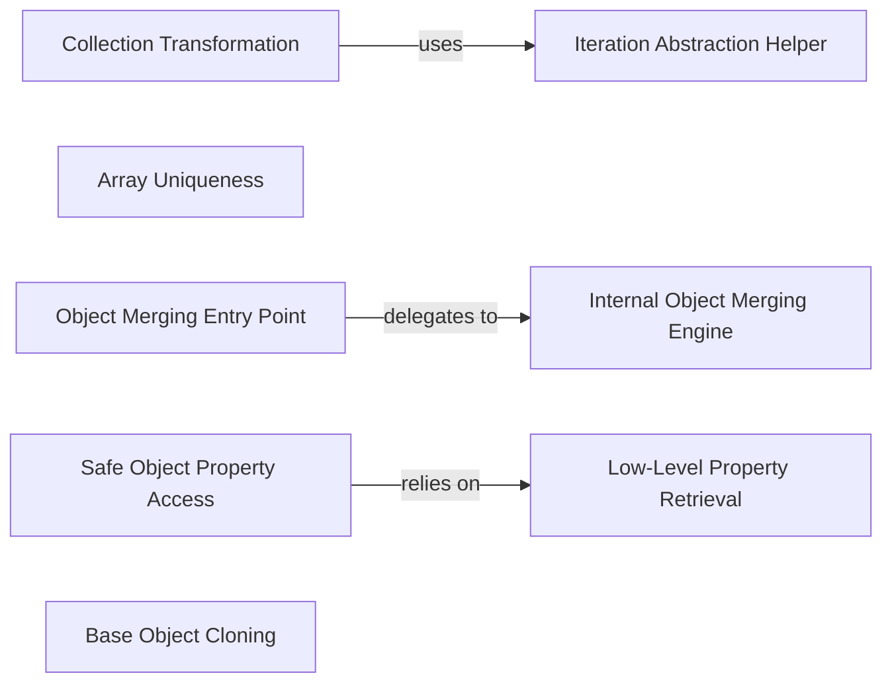

## Details

The `Core Data Manipulation` subsystem in `pydash` is responsible for providing a robust set of utilities for transforming, filtering, grouping, and managing various data structures like collections, arrays, and objects. It embodies the project's functional programming and modular design principles.

### Collection Transformation
The primary function for applying a transformation function to each element of a collection (list, dictionary, set, etc.) and returning a new collection with the results. It serves as a high-level facade for collection mapping.

**Related Classes/Methods**:

- <a href="https://github.com/dgilland/pydash/blob/develop/src/pydash/collections.py#L1005-L1039" target="_blank" rel="noopener noreferrer">`src.pydash.collections.map_`:1005-1039</a>

### Array Uniqueness
Implements the core logic for filtering out duplicate values from an array based on a custom iteratee function, ensuring that only unique elements (as determined by the iteratee) are retained.

**Related Classes/Methods**:

- <a href="https://github.com/dgilland/pydash/blob/develop/src/pydash/arrays.py#L2258-L2282" target="_blank" rel="noopener noreferrer">`src.pydash.arrays.uniq_by`:2258-2282</a>

### Object Merging Entry Point
Provides a customizable entry point for deeply merging properties from one or more source objects into a destination object. It allows for a customizer function to define how values are merged when conflicts occur.

**Related Classes/Methods**:

- <a href="https://github.com/dgilland/pydash/blob/develop/src/pydash/objects.py#L1436-L1488" target="_blank" rel="noopener noreferrer">`src.pydash.objects.merge_with`:1436-1488</a>

### Safe Object Property Access
Safely retrieves a value from a nested path within an object or array. It prevents errors by providing a default value if the path does not exist, making data retrieval robust.

**Related Classes/Methods**:

- <a href="https://github.com/dgilland/pydash/blob/develop/src/pydash/objects.py#L808-L875" target="_blank" rel="noopener noreferrer">`src.pydash.objects.get`:808-875</a>

### Base Object Cloning
A foundational method for creating copies of objects and arrays. It supports both shallow and deep cloning, serving as a primitive for immutable data operations within the library.

**Related Classes/Methods**:

- <a href="https://github.com/dgilland/pydash/blob/develop/src/pydash/objects.py#L2599-L2633" target="_blank" rel="noopener noreferrer">`src.pydash.objects.base_clone`:2599-2633</a>

### Iteration Abstraction Helper
Abstracts the application of iteratee functions across various data structures. This helper standardizes how functions are applied during iteration, promoting code reuse and consistency in collection and array operations.

**Related Classes/Methods**:

- <a href="https://github.com/dgilland/pydash/blob/develop/src/pydash/helpers.py#L113-L128" target="_blank" rel="noopener noreferrer">`src.pydash.helpers.iteriteratee`:113-128</a>

### Low-Level Property Retrieval
A low-level helper function that provides the core mechanism for robustly retrieving values from nested data structures (objects and arrays) given a path. It is a fundamental building block for higher-level property access functions.

**Related Classes/Methods**:

- <a href="https://github.com/dgilland/pydash/blob/develop/src/pydash/helpers.py#L145-L175" target="_blank" rel="noopener noreferrer">`src.pydash.helpers.base_get`:145-175</a>

### Internal Object Merging Engine
The recursive engine that drives the deep merging process for objects. It handles the traversal of nested structures and applies the merging logic, often invoked by `merge_with`.

**Related Classes/Methods**:

- <a href="https://github.com/dgilland/pydash/blob/develop/src/pydash/objects.py#L1491-L1517" target="_blank" rel="noopener noreferrer">`src.pydash.objects._merge_with`:1491-1517</a>

### [FAQ](https://github.com/CodeBoarding/GeneratedOnBoardings/tree/main?tab=readme-ov-file#faq)