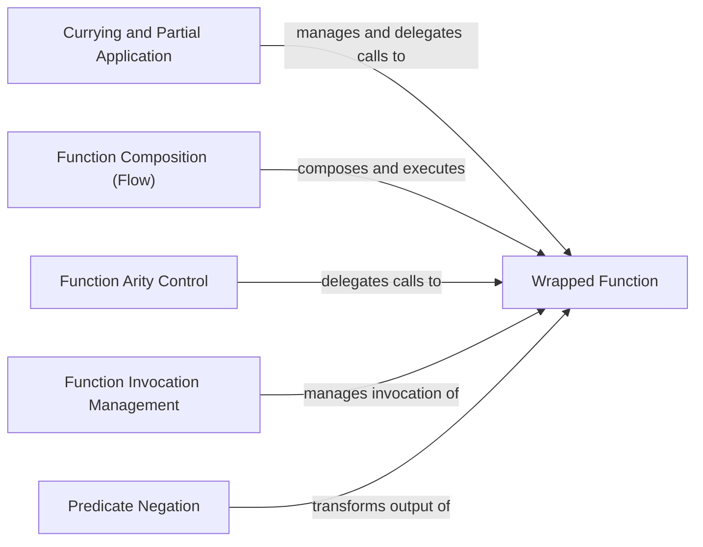

## Details

The `pydash.functions` subsystem is a functional programming utility layer designed to provide a rich set of higher-order functions for transforming and managing function execution. At its core, the subsystem operates on a conceptual "Wrapped Function," which represents any user-provided callable. Components like `Currying and Partial Application` and `Function Composition (Flow)` manipulate the arguments or sequence of execution for these Wrapped Functions, returning new functions with altered behavior. `Function Arity Control` enforces specific argument counts, while `Function Invocation Management` governs the timing and frequency of Wrapped Function calls. Finally, `Predicate Negation` modifies the boolean output of a Wrapped Function. This architecture ensures that the subsystem acts as a versatile toolkit for functional composition and control, with all operations ultimately targeting and modifying the behavior of external, user-defined functions.

### Currying and Partial Application
Provides mechanisms to transform functions by pre-filling arguments (partial application) or by allowing arguments to be supplied one at a time (currying). This component includes both the underlying classes and the convenience factory functions for creating curried or partially applied functions.

**Related Classes/Methods**:

- <a href="https://github.com/dgilland/pydash/blob/develop/src/pydash/functions.py#L786-L814" target="_blank" rel="noopener noreferrer">`pydash.functions.Curry`:786-814</a>
- <a href="https://github.com/dgilland/pydash/blob/develop/src/pydash/functions.py#L1298-L1324" target="_blank" rel="noopener noreferrer">`pydash.functions.Partial`:1298-1324</a>
- <a href="https://github.com/dgilland/pydash/blob/develop/src/pydash/functions.py#L786-L814" target="_blank" rel="noopener noreferrer">`pydash.functions.curry`:786-814</a>
- <a href="https://github.com/dgilland/pydash/blob/develop/src/pydash/functions.py#L847-L874" target="_blank" rel="noopener noreferrer">`pydash.functions.curry_right`:847-874</a>
- <a href="https://github.com/dgilland/pydash/blob/develop/src/pydash/functions.py#L1298-L1324" target="_blank" rel="noopener noreferrer">`pydash.functions.partial`:1298-1324</a>
- <a href="https://github.com/dgilland/pydash/blob/develop/src/pydash/functions.py#L1327-L1348" target="_blank" rel="noopener noreferrer">`pydash.functions.partial_right`:1327-1348</a>
- <a href="https://github.com/dgilland/pydash/blob/develop/src/pydash/functions.py#L1441-L1461" target="_blank" rel="noopener noreferrer">`pydash.functions.wrap`:1441-1461</a>

### Function Composition (Flow)
Enables chaining multiple functions together, where the output of one function becomes the input of the next, supporting both left-to-right (`flow`) and right-to-left (`flow_right`) composition.

**Related Classes/Methods**:

- <a href="https://github.com/dgilland/pydash/blob/develop/src/pydash/functions.py#L1024-L1053" target="_blank" rel="noopener noreferrer">`pydash.functions.Flow`:1024-1053</a>
- <a href="https://github.com/dgilland/pydash/blob/develop/src/pydash/functions.py#L1024-L1053" target="_blank" rel="noopener noreferrer">`pydash.functions.flow`:1024-1053</a>
- <a href="https://github.com/dgilland/pydash/blob/develop/src/pydash/functions.py#L1091-L1123" target="_blank" rel="noopener noreferrer">`pydash.functions.flow_right`:1091-1123</a>

### Function Arity Control
Restricts the number of arguments a function can accept, ensuring functions are called with a specific number of arguments, such as a single argument (`unary`) or a fixed number (`ary`).

**Related Classes/Methods**:

- <a href="https://github.com/dgilland/pydash/blob/develop/src/pydash/functions.py#L673-L696" target="_blank" rel="noopener noreferrer">`pydash.functions.Ary`:673-696</a>
- <a href="https://github.com/dgilland/pydash/blob/develop/src/pydash/functions.py#L673-L696" target="_blank" rel="noopener noreferrer">`pydash.functions.ary`:673-696</a>
- <a href="https://github.com/dgilland/pydash/blob/develop/src/pydash/functions.py#L1417-L1438" target="_blank" rel="noopener noreferrer">`pydash.functions.unary`:1417-1438</a>

### Function Invocation Management
Provides higher-order functions to control when and how often a function is invoked. This includes delaying execution (`debounce`), limiting call frequency (`throttle`), ensuring single execution (`once`), or executing only after/before a certain number of calls (`after`, `before`).

**Related Classes/Methods**:

- <a href="https://github.com/dgilland/pydash/blob/develop/src/pydash/functions.py#L642-L670" target="_blank" rel="noopener noreferrer">`pydash.functions.After`:642-670</a>
- <a href="https://github.com/dgilland/pydash/blob/develop/src/pydash/functions.py#L699-L727" target="_blank" rel="noopener noreferrer">`pydash.functions.Before`:699-727</a>
- <a href="https://github.com/dgilland/pydash/blob/develop/src/pydash/functions.py#L1201-L1222" target="_blank" rel="noopener noreferrer">`pydash.functions.Once`:1201-1222</a>
- <a href="https://github.com/dgilland/pydash/blob/develop/src/pydash/functions.py#L877-L895" target="_blank" rel="noopener noreferrer">`pydash.functions.Debounce`:877-895</a>
- <a href="https://github.com/dgilland/pydash/blob/develop/src/pydash/functions.py#L1399-L1414" target="_blank" rel="noopener noreferrer">`pydash.functions.Throttle`:1399-1414</a>
- <a href="https://github.com/dgilland/pydash/blob/develop/src/pydash/functions.py#L642-L670" target="_blank" rel="noopener noreferrer">`pydash.functions.after`:642-670</a>
- <a href="https://github.com/dgilland/pydash/blob/develop/src/pydash/functions.py#L699-L727" target="_blank" rel="noopener noreferrer">`pydash.functions.before`:699-727</a>
- <a href="https://github.com/dgilland/pydash/blob/develop/src/pydash/functions.py#L1201-L1222" target="_blank" rel="noopener noreferrer">`pydash.functions.once`:1201-1222</a>
- <a href="https://github.com/dgilland/pydash/blob/develop/src/pydash/functions.py#L877-L895" target="_blank" rel="noopener noreferrer">`pydash.functions.debounce`:877-895</a>
- <a href="https://github.com/dgilland/pydash/blob/develop/src/pydash/functions.py#L1399-L1414" target="_blank" rel="noopener noreferrer">`pydash.functions.throttle`:1399-1414</a>

### Predicate Negation
Inverts the boolean result of a predicate function, providing a simple way to create inverse conditions without modifying the original function's logic.

**Related Classes/Methods**:

- <a href="https://github.com/dgilland/pydash/blob/develop/src/pydash/functions.py#L1177-L1198" target="_blank" rel="noopener noreferrer">`pydash.functions.Negate`:1177-1198</a>
- <a href="https://github.com/dgilland/pydash/blob/develop/src/pydash/functions.py#L1177-L1198" target="_blank" rel="noopener noreferrer">`pydash.functions.negate`:1177-1198</a>

### Wrapped Function
This is a conceptual component representing the user-provided function that is being transformed, composed, or managed by the functional primitives. It is the ultimate target of all operations within this subsystem. As a conceptual entity, it does not have a specific source code reference within the `pydash` library itself.

**Related Classes/Methods**: _None_

### [FAQ](https://github.com/CodeBoarding/GeneratedOnBoardings/tree/main?tab=readme-ov-file#faq)