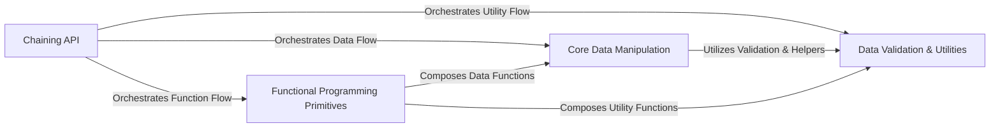

## Details

The `pydash` library is designed as a comprehensive Python utility library, heavily influenced by functional programming paradigms. Its architecture is modular, centered around distinct functional components that provide specialized data manipulation, object management, functional programming primitives, type validation, and string/numerical operations. The `Chaining API` acts as a central facade, offering a fluent and composable interface that orchestrates calls to these underlying utility modules. This design promotes reusability, readability, and a clear separation of concerns, allowing users to chain complex data transformations efficiently while maintaining a clean and intuitive API.

### Chaining API [[Expand]](./Chaining_API.md)
The primary entry point and facade for the `pydash` library, enabling fluent, chained operations on data. It acts as the orchestrator, routing calls to the appropriate underlying utility functions.

**Related Classes/Methods**:

- <a href="https://github.com/dgilland/pydash/blob/develop/src/pydash/chaining/chaining.py" target="_blank" rel="noopener noreferrer">`src/pydash/chaining/chaining.py`</a>
- <a href="https://github.com/dgilland/pydash/blob/develop/src/pydash/chaining/all_funcs.py" target="_blank" rel="noopener noreferrer">`src/pydash/chaining/all_funcs.py`</a>

### Core Data Manipulation [[Expand]](./Core_Data_Manipulation.md)
Provides a comprehensive set of functions for transforming, filtering, grouping, and managing various data structures, including collections, arrays, and objects, along with their properties.

**Related Classes/Methods**:

- <a href="https://github.com/dgilland/pydash/blob/develop/src/pydash/collections.py" target="_blank" rel="noopener noreferrer">`src/pydash/collections.py`</a>
- <a href="https://github.com/dgilland/pydash/blob/develop/src/pydash/arrays.py" target="_blank" rel="noopener noreferrer">`src/pydash/arrays.py`</a>
- <a href="https://github.com/dgilland/pydash/blob/develop/src/pydash/objects.py" target="_blank" rel="noopener noreferrer">`src/pydash/objects.py`</a>
- <a href="https://github.com/dgilland/pydash/blob/develop/src/pydash/helpers.py" target="_blank" rel="noopener noreferrer">`src/pydash/helpers.py`</a>

### Functional Programming Primitives [[Expand]](./Functional_Programming_Primitives.md)
Offers higher-order functions and constructs that enable a functional programming style, such as function composition, currying, and partial application.

**Related Classes/Methods**:

- <a href="https://github.com/dgilland/pydash/blob/develop/src/pydash/functions.py" target="_blank" rel="noopener noreferrer">`src/pydash/functions.py`</a>

### Data Validation & Utilities
Contains functions for validating data types, checking values against conditions, performing string manipulations, numerical computations, and providing general-purpose helpers.

**Related Classes/Methods**:

- <a href="https://github.com/dgilland/pydash/blob/develop/src/pydash/predicates.py" target="_blank" rel="noopener noreferrer">`src/pydash/predicates.py`</a>
- <a href="https://github.com/dgilland/pydash/blob/develop/src/pydash/strings.py" target="_blank" rel="noopener noreferrer">`src/pydash/strings.py`</a>
- <a href="https://github.com/dgilland/pydash/blob/develop/src/pydash/numerical.py" target="_blank" rel="noopener noreferrer">`src/pydash/numerical.py`</a>
- <a href="https://github.com/dgilland/pydash/blob/develop/src/pydash/utilities.py" target="_blank" rel="noopener noreferrer">`src/pydash/utilities.py`</a>

### [FAQ](https://github.com/CodeBoarding/GeneratedOnBoardings/tree/main?tab=readme-ov-file#faq)