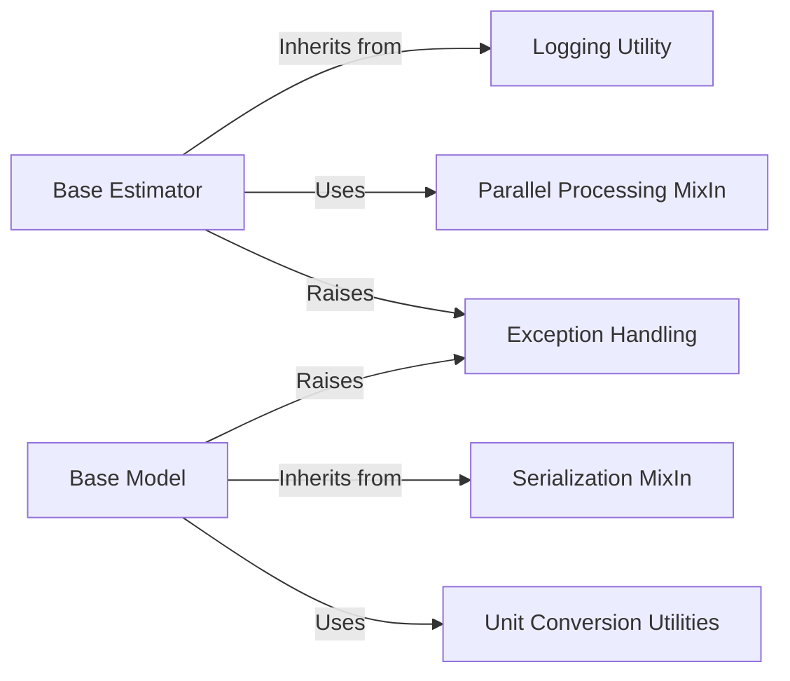

## Details

The `Core Infrastructure` component in PyEMMA serves as the foundational layer, providing essential low-level utilities and defining abstract base classes that ensure consistency, extensibility, and reusability across the entire library. This component is fundamental because it underpins almost all other components, providing the basic building blocks and enforcing architectural patterns like consistent APIs and serialization.

### Base Estimator
This abstract base class (`pyemma._base.estimator.Estimator`) provides a standardized interface for all estimation algorithms within PyEMMA. It ensures that all estimators adhere to a common structure, facilitating consistent usage and integration with other parts of the library. It also integrates with scikit-learn's `BaseEstimator` for compatibility.

**Related Classes/Methods**:

- <a href="https://github.com/markovmodel/pyemma/blob/devel/pyemma/_base/estimator.py#L384-L520" target="_blank" rel="noopener noreferrer">`pyemma._base.estimator.Estimator` (384:520)</a>

### Base Model
Represented by `pyemma._base.model.Model`, this abstract base class defines the common interface and core functionalities for all statistical models in PyEMMA, such as Markov State Models (MSMs) and Hidden Markov State Models (HMSMs). It ensures that models can be consistently created, manipulated, and analyzed.

**Related Classes/Methods**:

- <a href="https://github.com/markovmodel/pyemma/blob/devel/pyemma/_base/model.py#L28-L127" target="_blank" rel="noopener noreferrer">`pyemma._base.model.Model` (28:127)</a>

### Serialization MixIn
The `pyemma._base.serialization.serialization.SerializableMixIn` class provides the capability for PyEMMA objects to be serialized (saved) to and deserialized (loaded) from persistent storage. This is crucial for saving trained models, intermediate results, and configurations, enabling reproducibility and long-term storage of scientific workflows.

**Related Classes/Methods**:

- <a href="https://github.com/markovmodel/pyemma/blob/devel/pyemma/_base/serialization/serialization.py#L128-L480" target="_blank" rel="noopener noreferrer">`pyemma._base.serialization.serialization.SerializableMixIn` (128:480)</a>

### Logging Utility
The `pyemma._base.loggable.Loggable` class (or mixin) provides standardized logging functionalities across various PyEMMA components. This allows developers and users to track the execution flow, debug issues, and monitor the progress of computationally intensive tasks.

**Related Classes/Methods**:

- <a href="https://github.com/markovmodel/pyemma/blob/devel/pyemma/_base/loggable.py#L30-L85" target="_blank" rel="noopener noreferrer">`pyemma._base.loggable.Loggable` (30:85)</a>

### Unit Conversion Utilities
Located in `pyemma.util.units`, this component offers utilities for handling and converting various physical units, particularly time units, which are frequently encountered in molecular dynamics simulations. It ensures consistency and correctness in numerical calculations involving different units.

**Related Classes/Methods**:

- <a href="https://github.com/markovmodel/pyemma/blob/devel/pyemma/util/units.py#L1-L1" target="_blank" rel="noopener noreferrer">`pyemma.util.units` (1:1)</a>

### Exception Handling
The `pyemma.util.exceptions` module defines custom exception classes specific to PyEMMA. This allows for more granular and informative error handling, improving the robustness of the library and providing clearer feedback to users when issues arise.

**Related Classes/Methods**:

- <a href="https://github.com/markovmodel/pyemma/blob/devel/pyemma/util/exceptions.py#L1-L1" target="_blank" rel="noopener noreferrer">`pyemma.util.exceptions` (1:1)</a>

### Parallel Processing MixIn
The `pyemma._base.parallel.NJobsMixIn` provides functionality for managing the number of parallel jobs. This mixin can be incorporated into estimators and other computationally intensive components to leverage multi-core processors or distributed computing environments, significantly improving performance.

**Related Classes/Methods**:

- <a href="https://github.com/markovmodel/pyemma/blob/devel/pyemma/_base/parallel.py#L40-L72" target="_blank" rel="noopener noreferrer">`pyemma._base.parallel.NJobsMixIn` (40:72)</a>

### [FAQ](https://github.com/CodeBoarding/GeneratedOnBoardings/tree/main?tab=readme-ov-file#faq)