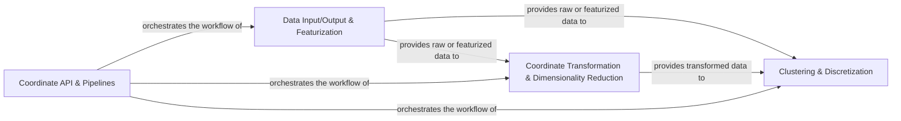

## Details

The Data Preprocessing component in PyEMMA is a crucial part of the molecular dynamics data analysis pipeline. It encompasses the entire process from raw data ingestion to the preparation of discrete trajectories suitable for Markov State Model (MSM) estimation. This component is fundamental to PyEMMA's architecture due to the high-dimensionality and complexity of molecular dynamics data, requiring specialized techniques for feature extraction, dimensionality reduction, and discretization.

### Data Input/Output & Featurization
This sub-component is responsible for reading various molecular dynamics data formats (e.g., HDF5, NumPy, CSV) and extracting physically meaningful features from raw trajectory coordinates. It acts as the initial data access layer, providing a standardized way to load and prepare data for subsequent processing.

**Related Classes/Methods**:

- <a href="https://github.com/markovmodel/pyemma/blob/devel/pyemma/coordinates/data/_base/datasource.py#L29-L607" target="_blank" rel="noopener noreferrer">`pyemma.coordinates.data._base.datasource.DataSource` (29:607)</a>
- <a href="https://github.com/markovmodel/pyemma/blob/devel/pyemma/coordinates/data/feature_reader.py#L38-L218" target="_blank" rel="noopener noreferrer">`pyemma.coordinates.data.feature_reader.FeatureReader` (38:218)</a>
- <a href="https://github.com/markovmodel/pyemma/blob/devel/pyemma/coordinates/data/featurization/featurizer.py#L40-L934" target="_blank" rel="noopener noreferrer">`pyemma.coordinates.data.featurization.featurizer.MDFeaturizer` (40:934)</a>
- <a href="https://github.com/markovmodel/pyemma/blob/devel/pyemma/coordinates/data/h5_reader.py#L10-L181" target="_blank" rel="noopener noreferrer">`pyemma.coordinates.data.h5_reader.H5Reader` (10:181)</a>
- <a href="https://github.com/markovmodel/pyemma/blob/devel/pyemma/coordinates/data/numpy_filereader.py#L36-L110" target="_blank" rel="noopener noreferrer">`pyemma.coordinates.data.numpy_filereader.NumPyFileReader` (36:110)</a>
- <a href="https://github.com/markovmodel/pyemma/blob/devel/pyemma/coordinates/data/py_csv_reader.py#L162-L396" target="_blank" rel="noopener noreferrer">`pyemma.coordinates.data.py_csv_reader.PyCSVReader` (162:396)</a>

### Coordinate Transformation & Dimensionality Reduction
This sub-component implements algorithms to reduce the dimensionality of the featurized data while preserving essential dynamic information. This is critical for handling the high-dimensional nature of molecular dynamics data and for identifying slow collective variables.

**Related Classes/Methods**:

- <a href="https://github.com/markovmodel/pyemma/blob/devel/pyemma/coordinates/data/_base/transformer.py#L207-L225" target="_blank" rel="noopener noreferrer">`pyemma.coordinates.data._base.transformer.StreamingEstimationTransformer` (207:225)</a>
- <a href="https://github.com/markovmodel/pyemma/blob/devel/pyemma/coordinates/transform/pca.py#L55-L264" target="_blank" rel="noopener noreferrer">`pyemma.coordinates.transform.pca.PCA` (55:264)</a>
- <a href="https://github.com/markovmodel/pyemma/blob/devel/pyemma/coordinates/transform/tica.py#L37-L244" target="_blank" rel="noopener noreferrer">`pyemma.coordinates.transform.tica.TICA` (37:244)</a>
- <a href="https://github.com/markovmodel/pyemma/blob/devel/pyemma/coordinates/transform/vamp.py#L369-L1005" target="_blank" rel="noopener noreferrer">`pyemma.coordinates.transform.vamp.VAMP` (369:1005)</a>
- <a href="https://github.com/markovmodel/pyemma/blob/devel/pyemma/coordinates/estimation/covariance.py#L35-L341" target="_blank" rel="noopener noreferrer">`pyemma.coordinates.estimation.covariance.LaggedCovariance` (35:341)</a>

### Clustering & Discretization
This sub-component provides various clustering algorithms to discretize the continuous trajectory data (either raw features or transformed data) into a finite number of discrete states. This step is a prerequisite for constructing Markov State Models, as MSMs operate on discrete state spaces.

**Related Classes/Methods**:

- <a href="https://github.com/markovmodel/pyemma/blob/devel/pyemma/coordinates/clustering/interface.py#L43-L301" target="_blank" rel="noopener noreferrer">`pyemma.coordinates.clustering.interface.AbstractClustering` (43:301)</a>
- <a href="https://github.com/markovmodel/pyemma/blob/devel/pyemma/coordinates/clustering/kmeans.py#L47-L337" target="_blank" rel="noopener noreferrer">`pyemma.coordinates.clustering.kmeans.KmeansClustering` (47:337)</a>
- <a href="https://github.com/markovmodel/pyemma/blob/devel/pyemma/coordinates/clustering/regspace.py#L39-L186" target="_blank" rel="noopener noreferrer">`pyemma.coordinates.clustering.regspace.RegularSpaceClustering` (39:186)</a>
- <a href="https://github.com/markovmodel/pyemma/blob/devel/pyemma/coordinates/clustering/uniform_time.py#L32-L105" target="_blank" rel="noopener noreferrer">`pyemma.coordinates.clustering.uniform_time.UniformTimeClustering` (32:105)</a>

### Coordinate API & Pipelines
This component provides a high-level, user-friendly API and a pipeline mechanism to orchestrate the entire data preprocessing workflow. It allows users to chain together featurization, transformation, and clustering steps in a flexible and efficient manner, abstracting away the underlying complexities.

**Related Classes/Methods**:

- <a href="https://github.com/markovmodel/pyemma/blob/devel/pyemma/coordinates/api.py#L1-L1" target="_blank" rel="noopener noreferrer">`pyemma.coordinates.api` (1:1)</a>
- <a href="https://github.com/markovmodel/pyemma/blob/devel/pyemma/coordinates/pipelines.py#L34-L158" target="_blank" rel="noopener noreferrer">`pyemma.coordinates.pipelines.Pipeline` (34:158)</a>
- <a href="https://github.com/markovmodel/pyemma/blob/devel/pyemma/coordinates/pipelines.py#L161-L256" target="_blank" rel="noopener noreferrer">`pyemma.coordinates.pipelines.Discretizer` (161:256)</a>

### [FAQ](https://github.com/CodeBoarding/GeneratedOnBoardings/tree/main?tab=readme-ov-file#faq)