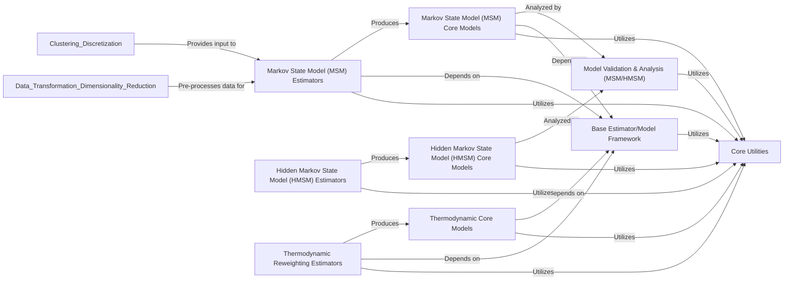

## Details

The `Modeling & Analysis Frameworks` component in PyEMMA serves as the computational backbone for deriving kinetic and thermodynamic insights from molecular dynamics data. It embodies the "Core Algorithms Layer" and "Model Types" architectural patterns, providing robust implementations for Markov State Models (MSMs), Hidden Markov State Models (HMSMs), and various thermodynamic reweighting methods.

### Markov State Model (MSM) Estimators
This component implements the algorithms responsible for constructing and fitting Markov State Models from discrete trajectory data. It includes various estimation techniques, such as maximum likelihood and Bayesian approaches, to determine the transition probabilities and stationary distributions of the system's states.

**Related Classes/Methods**:

- <a href="https://github.com/markovmodel/pyemma/blob/devel/pyemma/msm/estimators/maximum_likelihood_msm.py#L30-L327" target="_blank" rel="noopener noreferrer">`pyemma.msm.estimators.maximum_likelihood_msm.MaximumLikelihoodMSM` (30:327)</a>
- <a href="https://github.com/markovmodel/pyemma/blob/devel/pyemma/msm/estimators/bayesian_msm.py#L30-L223" target="_blank" rel="noopener noreferrer">`pyemma.msm.estimators.bayesian_msm.BayesianMSM` (30:223)</a>

### Hidden Markov State Model (HMSM) Estimators
This component provides specialized algorithms for estimating Hidden Markov State Models. HMSMs are used when the observed states do not directly correspond to the true underlying (hidden) states of the system, offering a more nuanced kinetic analysis.

**Related Classes/Methods**:

- <a href="https://github.com/markovmodel/pyemma/blob/devel/pyemma/msm/estimators/maximum_likelihood_hmsm.py#L36-L689" target="_blank" rel="noopener noreferrer">`pyemma.msm.estimators.maximum_likelihood_hmsm.MaximumLikelihoodHMSM` (36:689)</a>
- <a href="https://github.com/markovmodel/pyemma/blob/devel/pyemma/msm/estimators/bayesian_hmsm.py#L35-L362" target="_blank" rel="noopener noreferrer">`pyemma.msm.estimators.bayesian_hmsm.BayesianHMSM` (35:362)</a>

### Markov State Model (MSM) Core Models
This component defines the data structures and provides the analytical methods for interacting with and extracting information from an estimated Markov State Model. This includes calculating implied timescales, eigenvectors, and performing reactive flux analyses.

**Related Classes/Methods**:

- <a href="https://github.com/markovmodel/pyemma/blob/devel/pyemma/msm/models/msm.py#L44-L1148" target="_blank" rel="noopener noreferrer">`pyemma.msm.models.msm.MSM` (44:1148)</a>
- <a href="https://github.com/markovmodel/pyemma/blob/devel/pyemma/msm/models/msm_sampled.py#L24-L44" target="_blank" rel="noopener noreferrer">`pyemma.msm.models.msm_sampled.SampledMSM` (24:44)</a>

### Hidden Markov State Model (HMSM) Core Models
Similar to MSM Core Models, this component defines the structures and analytical tools for working with estimated Hidden Markov State Models, allowing for the interpretation of hidden state dynamics and their observable consequences.

**Related Classes/Methods**:

- <a href="https://github.com/markovmodel/pyemma/blob/devel/pyemma/msm/models/hmsm.py#L37-L472" target="_blank" rel="noopener noreferrer">`pyemma.msm.models.hmsm.HMSM` (37:472)</a>
- <a href="https://github.com/markovmodel/pyemma/blob/devel/pyemma/msm/models/hmsm_sampled.py#L33-L76" target="_blank" rel="noopener noreferrer">`pyemma.msm.models.hmsm_sampled.SampledHMSM` (33:76)</a>

### Thermodynamic Reweighting Estimators
This component implements a suite of advanced algorithms for calculating free energies and other thermodynamic properties from molecular simulations, particularly from multiple-state or replica exchange simulations. Key methods include WHAM, MBAR, DTRAM, and TRAM.

**Related Classes/Methods**:

- <a href="https://github.com/markovmodel/pyemma/blob/devel/pyemma/thermo/estimators/WHAM_estimator.py#L33-L194" target="_blank" rel="noopener noreferrer">`pyemma.thermo.estimators.WHAM_estimator.WHAM` (33:194)</a>
- <a href="https://github.com/markovmodel/pyemma/blob/devel/pyemma/thermo/estimators/MBAR_estimator.py#L33-L190" target="_blank" rel="noopener noreferrer">`pyemma.thermo.estimators.MBAR_estimator.MBAR` (33:190)</a>
- <a href="https://github.com/markovmodel/pyemma/blob/devel/pyemma/thermo/estimators/DTRAM_estimator.py#L38-L296" target="_blank" rel="noopener noreferrer">`pyemma.thermo.estimators.DTRAM_estimator.DTRAM` (38:296)</a>
- <a href="https://github.com/markovmodel/pyemma/blob/devel/pyemma/thermo/estimators/TRAM_estimator.py#L48-L523" target="_blank" rel="noopener noreferrer">`pyemma.thermo.estimators.TRAM_estimator.TRAM` (48:523)</a>

### Thermodynamic Core Models
This component defines the data structures and provides methods for analyzing the results of thermodynamic reweighting calculations. This includes accessing stationary distributions, free energy profiles, and other thermodynamic observables.

**Related Classes/Methods**:

- <a href="https://github.com/markovmodel/pyemma/blob/devel/pyemma/thermo/models/multi_therm.py#L27-L118" target="_blank" rel="noopener noreferrer">`pyemma.thermo.models.multi_therm.MultiThermModel` (27:118)</a>
- <a href="https://github.com/markovmodel/pyemma/blob/devel/pyemma/thermo/models/stationary.py#L34-L172" target="_blank" rel="noopener noreferrer">`pyemma.thermo.models.stationary.StationaryModel` (34:172)</a>
- <a href="https://github.com/markovmodel/pyemma/blob/devel/pyemma/thermo/models/memm.py#L135-L173" target="_blank" rel="noopener noreferrer">`pyemma.thermo.models.memm.MEMM` (135:173)</a>

### Model Validation & Analysis (MSM/HMSM)
This component provides tools to assess the statistical validity and robustness of estimated kinetic models. It includes functionalities for Chapman-Kolmogorov tests, implied timescale calculations, Principal Components Analysis of Conformational dynamics (PCCA), and reactive flux calculations.

**Related Classes/Methods**:

- <a href="https://github.com/markovmodel/pyemma/blob/devel/pyemma/msm/estimators/implied_timescales.py#L99-L601" target="_blank" rel="noopener noreferrer">`pyemma.msm.estimators.implied_timescales.ImpliedTimescales` (99:601)</a>
- <a href="https://github.com/markovmodel/pyemma/blob/devel/pyemma/msm/estimators/lagged_model_validators.py#L37-L327" target="_blank" rel="noopener noreferrer">`pyemma.msm.estimators.lagged_model_validators.LaggedModelValidator` (37:327)</a>
- <a href="https://github.com/markovmodel/pyemma/blob/devel/pyemma/msm/models/pcca.py#L5-L57" target="_blank" rel="noopener noreferrer">`pyemma.msm.models.pcca.PCCA` (5:57)</a>
- <a href="https://github.com/markovmodel/pyemma/blob/devel/pyemma/msm/models/reactive_flux.py#L28-L160" target="_blank" rel="noopener noreferrer">`pyemma.msm.models.reactive_flux.ReactiveFlux` (28:160)</a>

### Base Estimator/Model Framework
This foundational component provides abstract base classes (`Estimator`, `Model`) and common interfaces that all specific kinetic and thermodynamic estimators and models inherit from. It enforces a consistent API, handles serialization, and facilitates the modular extension of the framework.

**Related Classes/Methods**:

- <a href="https://github.com/markovmodel/pyemma/blob/devel/pyemma/_base/estimator.py#L384-L520" target="_blank" rel="noopener noreferrer">`pyemma._base.estimator.Estimator` (384:520)</a>
- <a href="https://github.com/markovmodel/pyemma/blob/devel/pyemma/_base/model.py#L28-L127" target="_blank" rel="noopener noreferrer">`pyemma._base.model.Model` (28:127)</a>
- <a href="https://github.com/markovmodel/pyemma/blob/devel/pyemma/_base/serialization/serialization.py#L128-L480" target="_blank" rel="noopener noreferrer">`pyemma._base.serialization.serialization.SerializableMixIn` (128:480)</a>

### Core Utilities
This component comprises a collection of general-purpose utility functions and classes that are widely used across the modeling and analysis frameworks. This includes functionalities for parallel processing, logging, error handling, and unit conversions.

**Related Classes/Methods**:

- <a href="https://github.com/markovmodel/pyemma/blob/devel/pyemma/_base/parallel.py#L40-L72" target="_blank" rel="noopener noreferrer">`pyemma._base.parallel.NJobsMixIn` (40:72)</a>
- <a href="https://github.com/markovmodel/pyemma/blob/devel/pyemma/_base/loggable.py#L30-L85" target="_blank" rel="noopener noreferrer">`pyemma._base.loggable.Loggable` (30:85)</a>
- <a href="https://github.com/markovmodel/pyemma/blob/devel/pyemma/util/units.py#L27-L154" target="_blank" rel="noopener noreferrer">`pyemma.util.units.TimeUnit` (27:154)</a>

### [FAQ](https://github.com/CodeBoarding/GeneratedOnBoardings/tree/main?tab=readme-ov-file#faq)