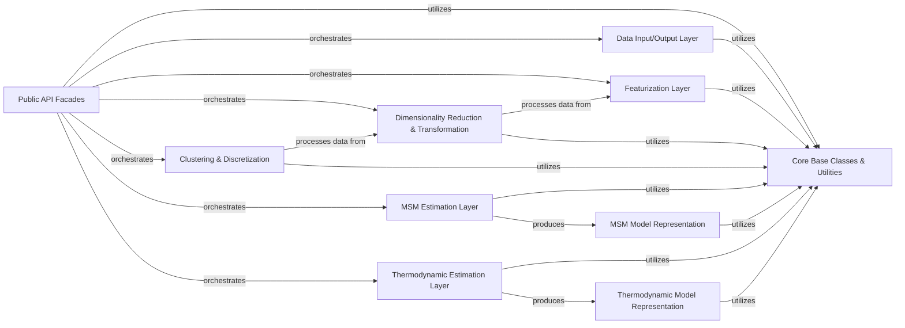

## Details

The `Public API` in PyEMMA serves as the high-level, user-facing interface, designed to abstract the intricate details of data preprocessing, model estimation, and analysis. It provides a simplified, cohesive set of functions and classes that orchestrate complex scientific computing workflows, enabling users to perform molecular dynamics data analysis and statistical thermodynamics without needing deep knowledge of the underlying implementations. This component adheres to the Facade architectural pattern, offering a streamlined entry point to PyEMMA's powerful capabilities.

### Public API Facades
These modules (`pyemma.coordinates.api`, `pyemma.msm.api`, `pyemma.thermo.api`) are the primary entry points for users. They provide high-level functions that orchestrate the entire workflow, from data loading and preprocessing to model estimation and analysis.

**Related Classes/Methods**:

- <a href="https://github.com/markovmodel/pyemma/blob/devel/pyemma/coordinates/api.py#L1-L1" target="_blank" rel="noopener noreferrer">`pyemma.coordinates.api` (1:1)</a>
- <a href="https://github.com/markovmodel/pyemma/blob/devel/pyemma/msm/api.py#L1-L1" target="_blank" rel="noopener noreferrer">`pyemma.msm.api` (1:1)</a>
- <a href="https://github.com/markovmodel/pyemma/blob/devel/pyemma/thermo/api.py#L1-L1" target="_blank" rel="noopener noreferrer">`pyemma.thermo.api` (1:1)</a>

### Data Input/Output Layer
Responsible for handling the loading and management of molecular dynamics trajectory data from various sources (e.g., HDF5, NumPy, CSV files). It provides the foundational data structures and iterators for subsequent processing steps.

**Related Classes/Methods**:

- <a href="https://github.com/markovmodel/pyemma/blob/devel/pyemma/coordinates/data/_base/datasource.py#L1-L1" target="_blank" rel="noopener noreferrer">`pyemma.coordinates.data._base.datasource` (1:1)</a>
- <a href="https://github.com/markovmodel/pyemma/blob/devel/pyemma/coordinates/data/feature_reader.py#L1-L1" target="_blank" rel="noopener noreferrer">`pyemma.coordinates.data.feature_reader` (1:1)</a>
- <a href="https://github.com/markovmodel/pyemma/blob/devel/pyemma/coordinates/data/h5_reader.py#L1-L1" target="_blank" rel="noopener noreferrer">`pyemma.coordinates.data.h5_reader` (1:1)</a>
- <a href="https://github.com/markovmodel/pyemma/blob/devel/pyemma/coordinates/data/numpy_filereader.py#L1-L1" target="_blank" rel="noopener noreferrer">`pyemma.coordinates.data.numpy_filereader` (1:1)</a>
- <a href="https://github.com/markovmodel/pyemma/blob/devel/pyemma/coordinates/data/py_csv_reader.py#L1-L1" target="_blank" rel="noopener noreferrer">`pyemma.coordinates.data.py_csv_reader` (1:1)</a>

### Featurization Layer
This component extracts relevant molecular features (e.g., distances, angles, torsions) from raw trajectory data, transforming it into a more suitable representation for analysis.

**Related Classes/Methods**:

- <a href="https://github.com/markovmodel/pyemma/blob/devel/pyemma/coordinates/data/featurization/featurizer.py#L1-L1" target="_blank" rel="noopener noreferrer">`pyemma.coordinates.data.featurization.featurizer` (1:1)</a>
- <a href="https://github.com/markovmodel/pyemma/blob/devel/pyemma/coordinates/data/featurization/_base.py#L25-L56" target="_blank" rel="noopener noreferrer">`pyemma.coordinates.data.featurization._base.Feature` (25:56)</a>

### Dimensionality Reduction & Transformation
Implements algorithms like TICA (Time-lagged Independent Component Analysis) and PCA (Principal Component Analysis) to reduce the dimensionality of the featurized data, identifying slow collective variables or principal components.

**Related Classes/Methods**:

- <a href="https://github.com/markovmodel/pyemma/blob/devel/pyemma/coordinates/transform/tica.py#L1-L1" target="_blank" rel="noopener noreferrer">`pyemma.coordinates.transform.tica` (1:1)</a>
- <a href="https://github.com/markovmodel/pyemma/blob/devel/pyemma/coordinates/transform/pca.py#L1-L1" target="_blank" rel="noopener noreferrer">`pyemma.coordinates.transform.pca` (1:1)</a>
- <a href="https://github.com/markovmodel/pyemma/blob/devel/pyemma/coordinates/transform/vamp.py#L1-L1" target="_blank" rel="noopener noreferrer">`pyemma.coordinates.transform.vamp` (1:1)</a>

### Clustering & Discretization
Groups high-dimensional data points into a finite number of discrete states, which is a crucial step for building Markov State Models. This includes algorithms like k-means and regular space clustering.

**Related Classes/Methods**:

- <a href="https://github.com/markovmodel/pyemma/blob/devel/pyemma/coordinates/clustering/interface.py#L1-L1" target="_blank" rel="noopener noreferrer">`pyemma.coordinates.clustering.interface` (1:1)</a>
- <a href="https://github.com/markovmodel/pyemma/blob/devel/pyemma/coordinates/clustering/kmeans.py#L1-L1" target="_blank" rel="noopener noreferrer">`pyemma.coordinates.clustering.kmeans` (1:1)</a>
- <a href="https://github.com/markovmodel/pyemma/blob/devel/pyemma/coordinates/clustering/regspace.py#L1-L1" target="_blank" rel="noopener noreferrer">`pyemma.coordinates.clustering.regspace` (1:1)</a>

### MSM Estimation Layer
Contains the algorithms for estimating Markov State Models (MSMs) from discretized trajectory data, including maximum likelihood and Bayesian approaches.

**Related Classes/Methods**:

- <a href="https://github.com/markovmodel/pyemma/blob/devel/pyemma/msm/estimators/maximum_likelihood_msm.py#L1-L1" target="_blank" rel="noopener noreferrer">`pyemma.msm.estimators.maximum_likelihood_msm` (1:1)</a>
- <a href="https://github.com/markovmodel/pyemma/blob/devel/pyemma/msm/estimators/bayesian_msm.py#L1-L1" target="_blank" rel="noopener noreferrer">`pyemma.msm.estimators.bayesian_msm` (1:1)</a>

### MSM Model Representation
Defines the data structures and methods for representing estimated Markov State Models, allowing for analysis of their properties (e.g., implied timescales, metastable states, reaction pathways).

**Related Classes/Methods**:

- <a href="https://github.com/markovmodel/pyemma/blob/devel/pyemma/msm/models/msm.py#L1-L1" target="_blank" rel="noopener noreferrer">`pyemma.msm.models.msm` (1:1)</a>
- <a href="https://github.com/markovmodel/pyemma/blob/devel/pyemma/msm/models/hmsm.py#L1-L1" target="_blank" rel="noopener noreferrer">`pyemma.msm.models.hmsm` (1:1)</a>

### Thermodynamic Estimation Layer
Provides estimators for thermodynamic properties, such as free energies, using methods like DTRAM, MBAR, TRAM, and WHAM.

**Related Classes/Methods**:

- <a href="https://github.com/markovmodel/pyemma/blob/devel/pyemma/thermo/estimators/DTRAM_estimator.py#L1-L1" target="_blank" rel="noopener noreferrer">`pyemma.thermo.estimators.DTRAM_estimator` (1:1)</a>
- <a href="https://github.com/markovmodel/pyemma/blob/devel/pyemma/thermo/estimators/MBAR_estimator.py#L1-L1" target="_blank" rel="noopener noreferrer">`pyemma.thermo.estimators.MBAR_estimator` (1:1)</a>
- <a href="https://github.com/markovmodel/pyemma/blob/devel/pyemma/thermo/estimators/TRAM_estimator.py#L1-L1" target="_blank" rel="noopener noreferrer">`pyemma.thermo.estimators.TRAM_estimator` (1:1)</a>
- <a href="https://github.com/markovmodel/pyemma/blob/devel/pyemma/thermo/estimators/WHAM_estimator.py#L1-L1" target="_blank" rel="noopener noreferrer">`pyemma.thermo.estimators.WHAM_estimator` (1:1)</a>

### Thermodynamic Model Representation
Encapsulates the results of thermodynamic estimations, providing a structured way to access and analyze calculated thermodynamic quantities.

**Related Classes/Methods**:

- <a href="https://github.com/markovmodel/pyemma/blob/devel/pyemma/thermo/models/multi_therm.py#L1-L1" target="_blank" rel="noopener noreferrer">`pyemma.thermo.models.multi_therm` (1:1)</a>
- <a href="https://github.com/markovmodel/pyemma/blob/devel/pyemma/thermo/models/memm.py#L1-L1" target="_blank" rel="noopener noreferrer">`pyemma.thermo.models.memm` (1:1)</a>

### Core Base Classes & Utilities
A foundational layer providing common functionalities and abstract interfaces (e.g., `Estimator`, `Model`, `SerializableMixIn`) that are inherited and utilized across various components, ensuring consistency and reusability.

**Related Classes/Methods**:

- <a href="https://github.com/markovmodel/pyemma/blob/devel/pyemma/_base/estimator.py#L1-L1" target="_blank" rel="noopener noreferrer">`pyemma._base.estimator` (1:1)</a>
- <a href="https://github.com/markovmodel/pyemma/blob/devel/pyemma/_base/model.py#L1-L1" target="_blank" rel="noopener noreferrer">`pyemma._base.model` (1:1)</a>
- <a href="https://github.com/markovmodel/pyemma/blob/devel/pyemma/_base/serialization/serialization.py#L1-L1" target="_blank" rel="noopener noreferrer">`pyemma._base.serialization.serialization` (1:1)</a>
- <a href="https://github.com/markovmodel/pyemma/blob/devel/pyemma/util/units.py#L1-L1" target="_blank" rel="noopener noreferrer">`pyemma.util.units` (1:1)</a>

### [FAQ](https://github.com/CodeBoarding/GeneratedOnBoardings/tree/main?tab=readme-ov-file#faq)