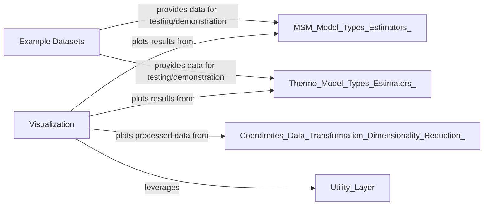

## Details

Component overview for Support & Visualization in pyemma.

### Example Datasets
This component serves as a dedicated repository for readily available example datasets. These datasets, including synthetic data from various potentials (e.g., double-well) and real-world-like folding models, are crucial for tutorials, testing, and demonstrating the capabilities of `pyemma`. It acts as a specialized "Data Access Layer" for illustrative purposes.

**Related Classes/Methods**:

- <a href="https://github.com/markovmodel/pyemma/blob/devel/pyemma/datasets/api.py" target="_blank" rel="noopener noreferrer">`pyemma/datasets/api.py`</a>
- <a href="https://github.com/markovmodel/pyemma/blob/devel/pyemma/datasets/double_well_discrete.py" target="_blank" rel="noopener noreferrer">`pyemma/datasets/double_well_discrete.py`</a>
- <a href="https://github.com/markovmodel/pyemma/blob/devel/pyemma/datasets/double_well_thermo.py" target="_blank" rel="noopener noreferrer">`pyemma/datasets/double_well_thermo.py`</a>
- <a href="https://github.com/markovmodel/pyemma/blob/devel/pyemma/datasets/potentials.py" target="_blank" rel="noopener noreferrer">`pyemma/datasets/potentials.py`</a>

### Visualization [[Expand]](./Visualization.md)
This component provides a comprehensive suite of plotting functionalities designed to visualize various aspects of molecular dynamics data analysis. It enables users to effectively interpret and present complex results, including free energy landscapes, Markov state model networks, implied timescales, and convergence diagnostics for thermodynamic calculations. This component directly embodies the "Visualization Layer" architectural pattern.

**Related Classes/Methods**:

- <a href="https://github.com/markovmodel/pyemma/blob/devel/pyemma/plots/markovtests.py" target="_blank" rel="noopener noreferrer">`pyemma/plots/markovtests.py`</a>
- <a href="https://github.com/markovmodel/pyemma/blob/devel/pyemma/plots/networks.py" target="_blank" rel="noopener noreferrer">`pyemma/plots/networks.py`</a>
- <a href="https://github.com/markovmodel/pyemma/blob/devel/pyemma/plots/plots1d.py" target="_blank" rel="noopener noreferrer">`pyemma/plots/plots1d.py`</a>
- <a href="https://github.com/markovmodel/pyemma/blob/devel/pyemma/plots/plots2d.py" target="_blank" rel="noopener noreferrer">`pyemma/plots/plots2d.py`</a>
- <a href="https://github.com/markovmodel/pyemma/blob/devel/pyemma/plots/thermoplots.py" target="_blank" rel="noopener noreferrer">`pyemma/plots/thermoplots.py`</a>
- <a href="https://github.com/markovmodel/pyemma/blob/devel/pyemma/plots/timescales.py" target="_blank" rel="noopener noreferrer">`pyemma/plots/timescales.py`</a>

### [FAQ](https://github.com/CodeBoarding/GeneratedOnBoardings/tree/main?tab=readme-ov-file#faq)