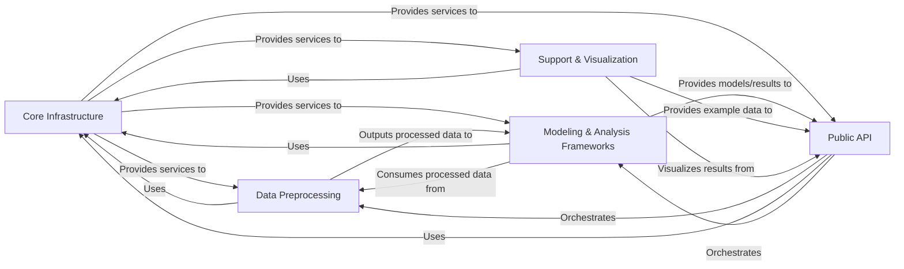

## Details

The `pyemma` project, a scientific computing library for molecular dynamics data analysis, exhibits a well-structured layered architecture with clear separation of concerns. The core functionality is built upon a robust foundation of utilities and base components, followed by distinct layers for data preprocessing, core modeling, and a user-friendly API. Visualization and example datasets provide essential support for usability and demonstration.

### Core Infrastructure [[Expand]](./Core_Infrastructure.md)
This foundational layer provides essential low-level utilities (e.g., data type validation, linear algebra, file I/O, logging, configuration) and defines abstract base classes and interfaces for estimators, models, and serialization. It ensures consistency, extensibility, and reusability across the entire library.

**Related Classes/Methods**:

- `pyemma.util` (1:1)
- `pyemma._base` (1:1)

### Data Preprocessing [[Expand]](./Data_Preprocessing.md)
This component is responsible for the entire data preparation pipeline. It handles reading various molecular dynamics data formats, extracting physically meaningful features (e.g., distances, angles), performing dimensionality reduction (e.g., PCA, TICA, VAMP), and discretizing continuous trajectories into discrete states through clustering algorithms.

**Related Classes/Methods**:

- `pyemma.coordinates.data` (1:1)
- `pyemma.coordinates.transform` (1:1)
- `pyemma.coordinates.clustering` (1:1)

### Modeling & Analysis Frameworks [[Expand]](./Modeling_Analysis_Frameworks.md)
This core scientific component implements the algorithms for estimating and analyzing kinetic models and thermodynamic properties. It includes functionalities for Markov State Models (MSMs), Hidden Markov State Models (HMSMs), and various thermodynamic reweighting methods (e.g., WHAM, MBAR, DTRAM, TRAM), providing the computational backbone for kinetic and thermodynamic insights.

**Related Classes/Methods**:

- `pyemma.msm` (1:1)
- `pyemma.thermo` (1:1)

### Public API [[Expand]](./Public_API.md)
This layer serves as the primary user-facing interface, abstracting the complexities of the underlying data preprocessing and modeling components. It provides high-level functions and classes that orchestrate workflows, allowing users to easily load data, preprocess it, estimate models, and perform analyses without deep knowledge of the internal implementations.

**Related Classes/Methods**:

- <a href="https://github.com/markovmodel/pyemma/blob/devel/pyemma/coordinates/api.py#L1-L1" target="_blank" rel="noopener noreferrer">`pyemma.coordinates.api` (1:1)</a>
- <a href="https://github.com/markovmodel/pyemma/blob/devel/pyemma/msm/api.py#L1-L1" target="_blank" rel="noopener noreferrer">`pyemma.msm.api` (1:1)</a>
- <a href="https://github.com/markovmodel/pyemma/blob/devel/pyemma/thermo/api.py#L1-L1" target="_blank" rel="noopener noreferrer">`pyemma.thermo.api` (1:1)</a>

### Support & Visualization [[Expand]](./Support_Visualization.md)
This component enhances usability by providing readily available example datasets for tutorials and testing, and offers comprehensive plotting functionalities. It enables users to visualize various aspects of molecular dynamics data analysis, including free energy landscapes, Markov state model networks, and implied timescales, aiding in interpretation and presentation of results.

**Related Classes/Methods**:

- `pyemma.datasets` (1:1)
- `pyemma.plots` (1:1)

### [FAQ](https://github.com/CodeBoarding/GeneratedOnBoardings/tree/main?tab=readme-ov-file#faq)