```mermaid
graph LR
    pyflakes_api_check["pyflakes.api.check"]
    pyflakes_checker_Checker["pyflakes.checker.Checker"]
    pyflakes_checker_handleNode["pyflakes.checker.handleNode"]
    pyflakes_checker_handleNodeLoad["pyflakes.checker.handleNodeLoad"]
    pyflakes_checker_handleNodeStore["pyflakes.checker.handleNodeStore"]
    pyflakes_checker_addBinding["pyflakes.checker.addBinding"]
    pyflakes_checker_scope["pyflakes.checker.scope"]
    pyflakes_checker_checkDeadScopes["pyflakes.checker.checkDeadScopes"]
    pyflakes_api_check -- "initiates" --> pyflakes_checker_Checker
    pyflakes_checker_Checker -- "dispatches to" --> pyflakes_checker_handleNode
    pyflakes_checker_Checker -- "calls" --> pyflakes_checker_checkDeadScopes
    pyflakes_checker_handleNode -- "dispatches to" --> pyflakes_checker_handleNodeLoad
    pyflakes_checker_handleNode -- "dispatches to" --> pyflakes_checker_handleNodeStore
    pyflakes_checker_handleNodeLoad -- "queries" --> pyflakes_checker_scope
    pyflakes_checker_handleNodeStore -- "calls" --> pyflakes_checker_addBinding
    pyflakes_checker_addBinding -- "modifies" --> pyflakes_checker_scope
    pyflakes_checker_scope -- "provides data to" --> pyflakes_checker_handleNodeLoad
    pyflakes_checker_checkDeadScopes -- "queries" --> pyflakes_checker_scope
```

## Details

The `AST Generation & Analysis Engine` forms a cohesive pipeline and visitor-based system. `pyflakes.api.check` serves as the initial orchestrator, handing off control to `pyflakes.checker.Checker`. The `Checker` then performs the core AST traversal, leveraging `pyflakes.checker.handleNode` for dynamic dispatch to specialized handlers like `pyflakes.checker.handleNodeLoad` and `pyflakes.checker.handleNodeStore`. These handlers, in turn, interact with `pyflakes.checker.scope` (via `pyflakes.checker.addBinding` for modifications and direct queries for lookups) to maintain and query the symbol table. Finally, `pyflakes.checker.checkDeadScopes` performs a post-traversal cleanup and analysis on the completed scopes. All analysis components report their findings to the `pyflakes.reporter.Reporter` component, which is external to this engine but crucial for outputting results.

### pyflakes.api.check
The primary entry point for the static analysis process. It is responsible for taking raw source code, parsing it into an AST, and initiating the analysis by the `Checker`. It acts as the orchestrator for the entire analysis pipeline.

**Related Classes/Methods**:

- <a href="https://github.com/PyCQA/pyflakes/blob/main/pyflakes/api.py#L18-L51" target="_blank" rel="noopener noreferrer">`pyflakes.api.check`:18-51</a>

### pyflakes.checker.Checker
The central component of the analysis engine. It implements the core of the "Visitor Pattern" for traversing the AST. It manages the overall analysis state, dispatches AST nodes to specific handler methods, and accumulates detected issues.

**Related Classes/Methods**:

- <a href="https://github.com/PyCQA/pyflakes/blob/main/pyflakes/checker.py#L710-L2223" target="_blank" rel="noopener noreferrer">`pyflakes.checker.Checker`:710-2223</a>

### pyflakes.checker.handleNode
A key method within the `Checker` that serves as the dynamic dispatch mechanism for AST nodes. It determines the type of the current AST node and calls the appropriate, specialized handler method (e.g., `handleNodeLoad`, `handleNodeStore`) to process it.

**Related Classes/Methods**:

- <a href="https://github.com/PyCQA/pyflakes/blob/main/pyflakes/checker.py#L1257-L1277" target="_blank" rel="noopener noreferrer">`pyflakes.checker.handleNode`:1257-1277</a>

### pyflakes.checker.handleNodeLoad
A specialized handler method that analyzes AST nodes representing the *loading* or access of variables and names. Its primary responsibility is to verify that the accessed name has been previously defined within the current or accessible lexical scopes.

**Related Classes/Methods**:

- <a href="https://github.com/PyCQA/pyflakes/blob/main/pyflakes/checker.py#L1048-L1130" target="_blank" rel="noopener noreferrer">`pyflakes.checker.handleNodeLoad`:1048-1130</a>

### pyflakes.checker.handleNodeStore
A specialized handler method that analyzes AST nodes representing the *storing* or assignment of values to variables and names. It manages the creation and updating of variable bindings within the current scope and identifies potential issues like redefinitions.

**Related Classes/Methods**:

- <a href="https://github.com/PyCQA/pyflakes/blob/main/pyflakes/checker.py#L1132-L1172" target="_blank" rel="noopener noreferrer">`pyflakes.checker.handleNodeStore`:1132-1172</a>

### pyflakes.checker.addBinding
A utility method used by the `Checker` to manage the symbol table. It is responsible for adding new variable bindings or updating existing ones within the current lexical scope, ensuring accurate tracking of defined names.

**Related Classes/Methods**:

- <a href="https://github.com/PyCQA/pyflakes/blob/main/pyflakes/checker.py#L963-L1020" target="_blank" rel="noopener noreferrer">`pyflakes.checker.addBinding`:963-1020</a>

### pyflakes.checker.scope
Represents a lexical scope (e.g., module, function, class) within the analyzed code. This component maintains the state of defined variables, imports, and their visibility, which is crucial for performing checks related to name resolution and usage.

**Related Classes/Methods**:

- <a href="https://github.com/PyCQA/pyflakes/blob/main/pyflakes/checker.py" target="_blank" rel="noopener noreferrer">`pyflakes.checker.scope`</a>

### pyflakes.checker.checkDeadScopes
A post-traversal analysis method that executes after the main AST traversal for a given scope is complete. It is specifically designed to identify issues that can only be determined globally within a scope, such as unused variables or imports.

**Related Classes/Methods**:

- <a href="https://github.com/PyCQA/pyflakes/blob/main/pyflakes/checker.py#L832-L900" target="_blank" rel="noopener noreferrer">`pyflakes.checker.checkDeadScopes`:832-900</a>

### [FAQ](https://github.com/CodeBoarding/GeneratedOnBoardings/tree/main?tab=readme-ov-file#faq)