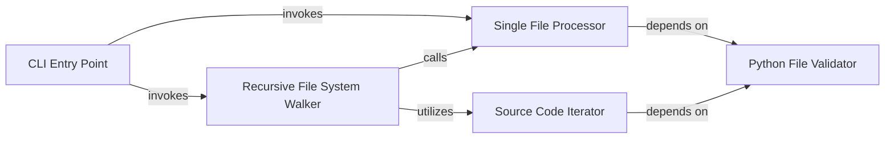

## Details

The `CLI & File System Orchestrator` subsystem in Pyflakes serves as the initial interaction point, managing command-line input, navigating the file system, and preparing source code for static analysis. It embodies the "CLI Interface" and "File System Orchestrator" patterns, ensuring that the correct files are identified and passed to the core analysis pipeline.

### CLI Entry Point
The primary entry point for the Pyflakes application. It parses command-line arguments, displays version information, handles system signals for graceful exit, and orchestrates the overall analysis workflow by determining whether to process individual files or recursively scan directories. This component embodies the "CLI Interface" pattern.

**Related Classes/Methods**:

- <a href="https://github.com/PyCQA/pyflakes/blob/main/pyflakes/api.py#L166-L185" target="_blank" rel="noopener noreferrer">`pyflakes.api.main`:166-185</a>

### Recursive File System Walker
Manages the recursive traversal of specified directories. It identifies potential Python source files within these directories and delegates their processing to the `Single File Processor`. This component is central to the "File System Orchestrator" aspect, ensuring all relevant files are found.

**Related Classes/Methods**:

- <a href="https://github.com/PyCQA/pyflakes/blob/main/pyflakes/api.py#L115-L128" target="_blank" rel="noopener noreferrer">`pyflakes.api.checkRecursive`:115-128</a>

### Single File Processor
Reads the content of a single specified file. It validates if the file is a Python source file using the `Python File Validator` and, if so, prepares its content for the core static analysis engine (`pyflakes.api.check`). This component acts as a "Source Code Reader" and a crucial bridge to the main analysis pipeline.

**Related Classes/Methods**:

- <a href="https://github.com/PyCQA/pyflakes/blob/main/pyflakes/api.py#L54-L71" target="_blank" rel="noopener noreferrer">`pyflakes.api.checkPath`:54-71</a>

### Python File Validator
A utility component responsible for determining if a given file path represents a Python source file. It typically performs checks based on file extensions and potentially examines the file's content (e.g., for shebang lines). This component supports the "File System Orchestrator" by ensuring only relevant files are considered for analysis.

**Related Classes/Methods**:

- <a href="https://github.com/PyCQA/pyflakes/blob/main/pyflakes/api.py#L74-L93" target="_blank" rel="noopener noreferrer">`pyflakes.api.isPythonFile`:74-93</a>

### Source Code Iterator
An internal iterator that works in conjunction with the `Recursive File System Walker`. It iterates through files in a given directory (or list of files) and yields the source code content of identified Python files. It leverages the `Python File Validator` to filter for appropriate files. This component is integral to the "Source Code Reader" and "File System Orchestrator" functionality.

**Related Classes/Methods**:

- <a href="https://github.com/PyCQA/pyflakes/blob/main/pyflakes/api.py#L96-L112" target="_blank" rel="noopener noreferrer">`pyflakes.api.iterSourceCode`:96-112</a>

### [FAQ](https://github.com/CodeBoarding/GeneratedOnBoardings/tree/main?tab=readme-ov-file#faq)