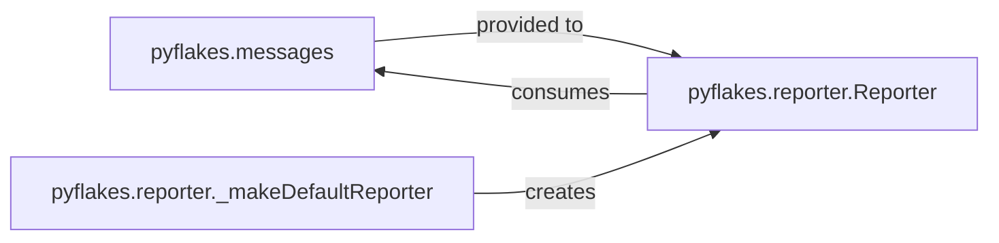

## Details

The Issue Reporting & Messaging subsystem is crucial for communicating the results of the static analysis to the user. It encapsulates the definition of detected issues and the mechanisms for their consistent formatting and presentation.

### pyflakes.messages
This component defines the various types of diagnostic messages (e.g., UnusedImport, UndefinedName) that Pyflakes can generate. Each class within this module encapsulates the specific details of an issue, including its unique identifier and format string. It serves as the foundational data model for all reportable issues.

**Related Classes/Methods**:

- <a href="https://github.com/PyCQA/pyflakes/blob/main/pyflakes/messages.py" target="_blank" rel="noopener noreferrer">`pyflakes.messages`</a>

### pyflakes.reporter.Reporter
This is the core component responsible for formatting and presenting detected issues to the user. It acts as the output sink for the static analysis results, defining the interface for how messages are displayed (e.g., to standard output or standard error).

**Related Classes/Methods**:

- <a href="https://github.com/PyCQA/pyflakes/blob/main/pyflakes/reporter.py#L9-L85" target="_blank" rel="noopener noreferrer">`pyflakes.reporter.Reporter`:9-85</a>

### pyflakes.reporter._makeDefaultReporter
This is a factory function that provides a standardized way to create a default instance of the pyflakes.reporter.Reporter. This ensures consistent setup and configuration of the reporting mechanism across the application, particularly for the command-line interface.

**Related Classes/Methods**:

- <a href="https://github.com/PyCQA/pyflakes/blob/main/pyflakes/reporter.py#L88-L92" target="_blank" rel="noopener noreferrer">`pyflakes.reporter._makeDefaultReporter`:88-92</a>

### [FAQ](https://github.com/CodeBoarding/GeneratedOnBoardings/tree/main?tab=readme-ov-file#faq)