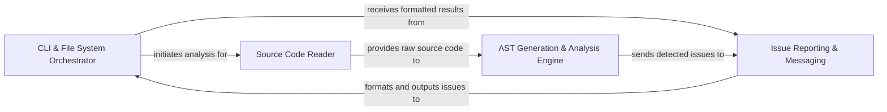

## Details

The Pyflakes architecture is a streamlined static analysis pipeline, designed for efficiency and modularity. The CLI & File System Orchestrator (pyflakes/api.py) serves as the user-facing interface, managing input and output, and coordinating the analysis process. It delegates the task of reading source files to the Source Code Reader (pyflakes/api.py). The heart of the system is the AST Generation & Analysis Engine (pyflakes/api.py, pyflakes/checker.py), which transforms source code into an Abstract Syntax Tree and applies various checks to identify code quality issues. All findings are then channeled to the Issue Reporting & Messaging component (pyflakes/reporter.py, pyflakes/messages.py), which standardizes and presents the results. This clear, sequential flow makes Pyflakes highly effective as a static analysis tool, with distinct components that facilitate easy understanding and visual representation in a flow diagram.

### CLI & File System Orchestrator [[Expand]](./CLI_File_System_Orchestrator.md)
The entry point for Pyflakes, handling command-line arguments, file system traversal, and orchestrating the overall analysis workflow. It manages user interaction and output display.

**Related Classes/Methods**:

- <a href="https://github.com/PyCQA/pyflakes/blob/main/pyflakes/api.py#L166-L185" target="_blank" rel="noopener noreferrer">`pyflakes.api.main`:166-185</a>
- <a href="https://github.com/PyCQA/pyflakes/blob/main/pyflakes/api.py#L115-L128" target="_blank" rel="noopener noreferrer">`pyflakes.api.checkRecursive`:115-128</a>
- <a href="https://github.com/PyCQA/pyflakes/blob/main/pyflakes/api.py#L54-L71" target="_blank" rel="noopener noreferrer">`pyflakes.api.checkPath`:54-71</a>
- <a href="https://github.com/PyCQA/pyflakes/blob/main/pyflakes/api.py#L74-L93" target="_blank" rel="noopener noreferrer">`pyflakes.api.isPythonFile`:74-93</a>

### Source Code Reader
Responsible for abstracting the file reading process, providing raw Python source code content to the analysis engine.

**Related Classes/Methods**:

- <a href="https://github.com/PyCQA/pyflakes/blob/main/pyflakes/api.py#L96-L112" target="_blank" rel="noopener noreferrer">`pyflakes.api.iterSourceCode`:96-112</a>

### AST Generation & Analysis Engine [[Expand]](./AST_Generation_Analysis_Engine.md)
The core static analysis component. It parses raw source code into an Abstract Syntax Tree (AST) and traverses it to identify potential code issues using a visitor pattern.

**Related Classes/Methods**:

- <a href="https://github.com/PyCQA/pyflakes/blob/main/pyflakes/api.py#L18-L51" target="_blank" rel="noopener noreferrer">`pyflakes.api.check`:18-51</a>
- <a href="https://github.com/PyCQA/pyflakes/blob/main/pyflakes/checker.py#L1-L100" target="_blank" rel="noopener noreferrer">`pyflakes.checker.Checker.__init__`:1-100</a>
- <a href="https://github.com/PyCQA/pyflakes/blob/main/pyflakes/checker.py#L1257-L1277" target="_blank" rel="noopener noreferrer">`pyflakes.checker.handleNode`:1257-1277</a>
- <a href="https://github.com/PyCQA/pyflakes/blob/main/pyflakes/checker.py#L1048-L1130" target="_blank" rel="noopener noreferrer">`pyflakes.checker.handleNodeLoad`:1048-1130</a>
- <a href="https://github.com/PyCQA/pyflakes/blob/main/pyflakes/checker.py#L1132-L1172" target="_blank" rel="noopener noreferrer">`pyflakes.checker.handleNodeStore`:1132-1172</a>
- <a href="https://github.com/PyCQA/pyflakes/blob/main/pyflakes/checker.py#L963-L1020" target="_blank" rel="noopener noreferrer">`pyflakes.checker.addBinding`:963-1020</a>
- <a href="https://github.com/PyCQA/pyflakes/blob/main/pyflakes/checker.py#L832-L900" target="_blank" rel="noopener noreferrer">`pyflakes.checker.checkDeadScopes`:832-900</a>
- <a href="https://github.com/PyCQA/pyflakes/blob/main/pyflakes/checker.py" target="_blank" rel="noopener noreferrer">`pyflakes.checker.scope`</a>

### Issue Reporting & Messaging [[Expand]](./Issue_Reporting_Messaging.md)
Defines the structure of detected issues and handles their formatting and presentation to the user. It ensures consistent messaging.

**Related Classes/Methods**:

- <a href="https://github.com/PyCQA/pyflakes/blob/main/pyflakes/reporter.py#L9-L85" target="_blank" rel="noopener noreferrer">`pyflakes.reporter.Reporter`:9-85</a>
- <a href="https://github.com/PyCQA/pyflakes/blob/main/pyflakes/reporter.py#L88-L92" target="_blank" rel="noopener noreferrer">`pyflakes.reporter._makeDefaultReporter`:88-92</a>
- <a href="https://github.com/PyCQA/pyflakes/blob/main/pyflakes/messages.py#L1-L100" target="_blank" rel="noopener noreferrer">`pyflakes.messages`:1-100</a>

### [FAQ](https://github.com/CodeBoarding/GeneratedOnBoardings/tree/main?tab=readme-ov-file#faq)