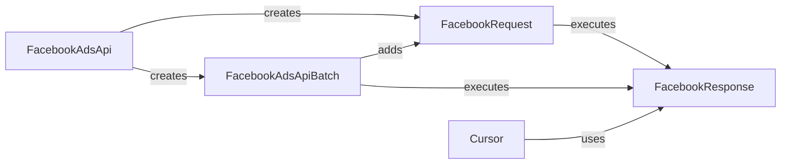

## Component Details

The API Request Management subsystem is responsible for handling communication with the Facebook Marketing API. It provides a structured way to create, execute, and manage API requests, including support for batch operations and pagination. The core components work together to abstract the complexities of the API, offering a simplified interface for developers to interact with various API endpoints and retrieve data efficiently.

### FacebookAdsApi
The FacebookAdsApi class serves as the primary entry point for interacting with the Facebook Ads API. It initializes the API context with access token and app secret, and provides methods for creating and executing API requests. It also supports creating batch requests for improved efficiency.
- **Related Classes/Methods**: `facebook_business.api.FacebookAdsApi`

### FacebookRequest
The FacebookRequest class represents a single API request to the Facebook Marketing API. It encapsulates the request parameters, fields, and files, and provides methods for building the request payload and executing the request. It returns a FacebookResponse object containing the API response data.
- **Related Classes/Methods**: `facebook_business.api.FacebookRequest`

### FacebookResponse
The FacebookResponse class represents the response received from a Facebook API request. It provides methods for checking the success or failure of the request, accessing the response data, and handling errors. It parses the JSON response from the API and provides access to the data and error details.
- **Related Classes/Methods**: `facebook_business.api.FacebookResponse`

### FacebookAdsApiBatch
The FacebookAdsApiBatch class represents a batch of API requests that can be executed together in a single API call. It allows adding multiple FacebookRequest objects to the batch and executing them as a single unit, improving efficiency by reducing the number of HTTP requests. It returns a list of FacebookResponse objects, one for each request in the batch.
- **Related Classes/Methods**: `facebook_business.api.FacebookAdsApiBatch`

### Cursor
The Cursor class handles pagination of API responses. It allows iterating through multiple pages of results returned by the Facebook Marketing API. It fetches the next page of data from the API and provides an iterator interface for accessing the results, simplifying the process of retrieving large datasets.
- **Related Classes/Methods**: `facebook_business.api.Cursor`
