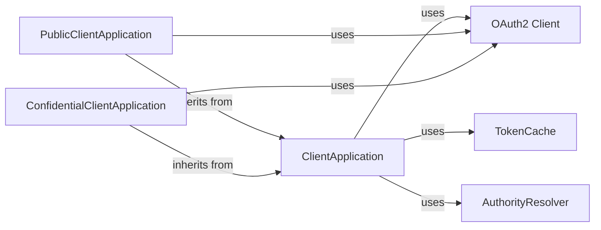

## Component Details

The Authentication Flow Engine orchestrates the acquisition of tokens using various authentication flows supported by MSAL. It manages the interaction between different components like ClientApplication, OAuth2 Client, Token Cache, and Authority Resolver to execute these flows, acquire tokens, and handle the complexities of the authentication process. The engine supports flows like authorization code flow, device flow, username/password flow, and refresh token flow, ensuring a consistent and secure authentication experience.

### ClientApplication
Abstract base class that manages common token acquisition logic, including authority management, telemetry, account finding, and silent token acquisition. It orchestrates the overall authentication process and serves as the foundation for PublicClientApplication and ConfidentialClientApplication.
- **Related Classes/Methods**: `msal.application.ClientApplication`

### PublicClientApplication
Represents a client application running on a device or desktop. It provides methods for interactive authentication and device flow authentication, inheriting from ClientApplication and implementing specific flows tailored for public clients.
- **Related Classes/Methods**: `msal.application.PublicClientApplication`

### ConfidentialClientApplication
Represents a client application running on a server. It provides methods for acquiring tokens using client credentials and on-behalf-of flows. Inheriting from ClientApplication, it implements flows specific to confidential clients.
- **Related Classes/Methods**: `msal.application.ConfidentialClientApplication`

### OAuth2 Client
Handles low-level OAuth 2.0 protocol interactions. It provides methods for building authorization request URIs, obtaining tokens by various grant types, and managing token requests and responses. It interacts with the authentication server to exchange credentials for tokens.
- **Related Classes/Methods**: `msal.oauth2cli.oauth2.Client`

### TokenCache
Persists and retrieves tokens, refresh tokens, and other authentication data. It ensures tokens are reused when possible and handles token expiration. It interacts with ClientApplication to store and retrieve tokens.
- **Related Classes/Methods**: `msal.token_cache`

### AuthorityResolver
Resolves the authority URL and validates the authority configuration. It ensures the application is communicating with a trusted authority. It interacts with ClientApplication to validate the authority.
- **Related Classes/Methods**: `msal.authority`
