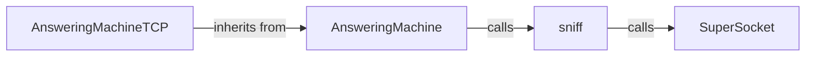

## Component Details

The AutomationEngine in Scapy enables automated network interaction by capturing, filtering, and responding to packets based on predefined rules. It uses the AnsweringMachine class as a base for creating specialized answering machines like AnsweringMachineTCP for TCP-specific handling. The process involves sniffing network traffic using the sniff function, which internally utilizes SuperSocket for low-level packet capture. AnsweringMachine then processes these captured packets and generates appropriate responses, effectively simulating network services or performing automated network testing.

### AnsweringMachine
The base class for creating answering machines. It handles packet sniffing, filtering, and response generation. It defines the core logic for capturing packets, applying filters, and generating responses based on predefined rules.
- **Related Classes/Methods**: `scapy.scapy.ansmachine.AnsweringMachine`

### sniff
A function from scapy.sendrecv module that captures network packets based on specified filters and parameters. It provides the primary mechanism for capturing network traffic and feeding it to the AnsweringMachine for processing.
- **Related Classes/Methods**: `scapy.scapy.sendrecv.sniff`

### SuperSocket
A class that provides low-level packet capturing functionality. The sniff method of SuperSocket is responsible for the low-level packet capturing. It provides the underlying socket-level functionality for capturing raw network packets.
- **Related Classes/Methods**: `scapy.scapy.supersocket.SuperSocket`

### AnsweringMachineTCP
A subclass of AnsweringMachine tailored for TCP-specific answering logic. It extends the base class to provide specialized handling for TCP packets, including connection tracking and state management.
- **Related Classes/Methods**: `scapy.scapy.ansmachine.AnsweringMachineTCP`
