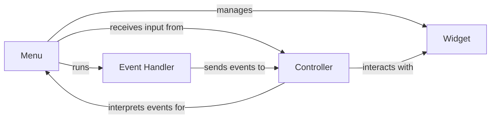

## Component Details

The input handling system in pygame-menu is responsible for capturing and processing user input events, such as keyboard presses, mouse clicks, and joystick movements, and translating them into actions within the menu. It provides a unified interface for handling input across different platforms and devices, ensuring consistent menu behavior. The system relies on pygame events and the Controller class to map raw input to menu actions, which then trigger corresponding updates to the menu's state and widget interactions.

### Menu
The Menu component is the central hub that manages the menu's state, handles events, updates widgets, and draws the menu. It contains the mainloop, which is the entry point for menu interaction. It receives input events from the Controller and updates the widgets accordingly.
- **Related Classes/Methods**: `pygame_menu.menu.Menu`

### Widget
The Widget component is the base class for all interactive elements within the menu. It handles mouseover events and provides a base for other widgets. It receives events from the Menu and updates its state accordingly.
- **Related Classes/Methods**: `pygame_menu.widgets.core.widget.Widget`

### Controller
The Controller component interprets raw Pygame events and determines if they match specific actions (e.g., apply, back, move up, move down). It provides a layer of abstraction between the raw input and the menu logic. It sends actions to the Menu.
- **Related Classes/Methods**: `pygame_menu.controls.Controller`

### Event Handler
The Event Handler component is responsible for processing raw Pygame events and passing them to the Controller. It filters events and determines which ones are relevant to the menu.
- **Related Classes/Methods**: `pygame_menu.menu.Menu.mainloop`, `pygame.event`
