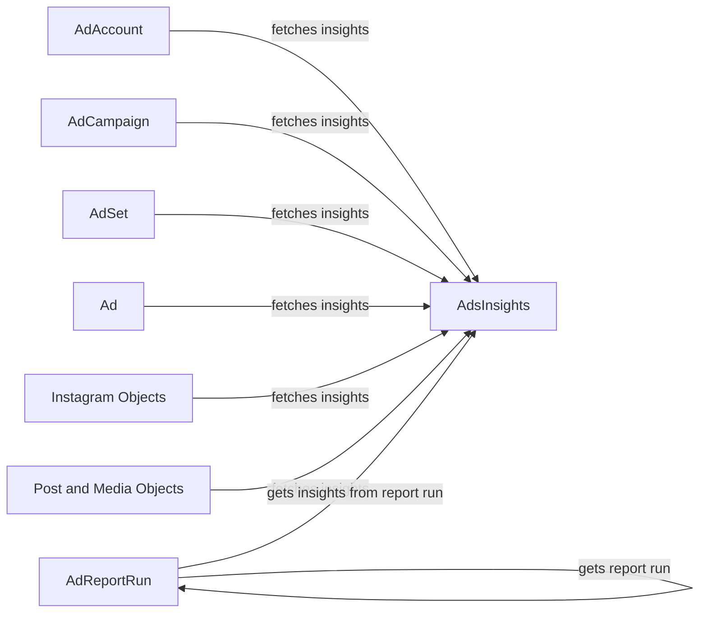

## Component Details

The Insights and Reporting component provides a way to retrieve and analyze performance data from Facebook Ads. It revolves around fetching insights from various ad objects like AdAccounts, Campaigns, AdSets, and Ads, as well as Instagram-related objects. The core functionality involves constructing insights queries, retrieving the data, and formatting the results for analysis. AdReportRun enables asynchronous reporting for large datasets.

### AdAccount
Represents an Ad Account and provides methods to retrieve insights data associated with the account. It serves as a starting point for gathering insights at the account level.
- **Related Classes/Methods**: `facebook_business.adobjects.adaccount.AdAccount`

### AdCampaign
Represents an Ad Campaign and provides methods to retrieve insights data associated with the campaign. It allows for analyzing the performance of specific campaigns.
- **Related Classes/Methods**: `facebook_business.adobjects.campaign.Campaign`

### AdSet
Represents an Ad Set and provides methods to retrieve insights data associated with the ad set. It enables the analysis of performance at the ad set level.
- **Related Classes/Methods**: `facebook_business.adobjects.adset.AdSet`

### Ad
Represents an Ad and provides methods to retrieve insights data associated with the ad. It allows for analyzing the performance of individual ads.
- **Related Classes/Methods**: `facebook_business.adobjects.ad.Ad`

### AdsInsights
Represents the insights data retrieved for an ad object. It encapsulates the metrics and dimensions of the performance data, providing a structured way to access the insights.
- **Related Classes/Methods**: `facebook_business.adobjects.adsinsights.AdsInsights`

### AdReportRun
Represents an Ad Report Run. It allows creating, getting and fetching insights from asynchronous reports, useful for handling large datasets and complex queries.
- **Related Classes/Methods**: `facebook_business.adobjects.adreportrun.AdReportRun`

### Instagram Objects
Represents Instagram objects like IGMedia, IGUser, and Stories. These components provide methods to retrieve insights data associated with their respective Instagram entities, enabling analysis of Instagram-specific performance.
- **Related Classes/Methods**: `facebook_business.adobjects.igmediaforigonlyapi.IGMediaForIGOnlyAPI`, `facebook_business.adobjects.iguserforigonlyapi.IGUserForIGOnlyAPI`, `facebook_business.adobjects.igmedia.IGMedia`, `facebook_business.adobjects.stories.Stories`

### Post and Media Objects
Represents Facebook Post, Photo, AdVideo and PagePostExperiment objects. These components provide methods to retrieve insights data associated with their respective entities, enabling analysis of performance.
- **Related Classes/Methods**: `facebook_business.adobjects.post.Post`, `facebook_business.adobjects.photo.Photo`, `facebook_business.adobjects.advideo.AdVideo`, `facebook_business.adobjects.pagepostexperiment.PagePostExperiment`
