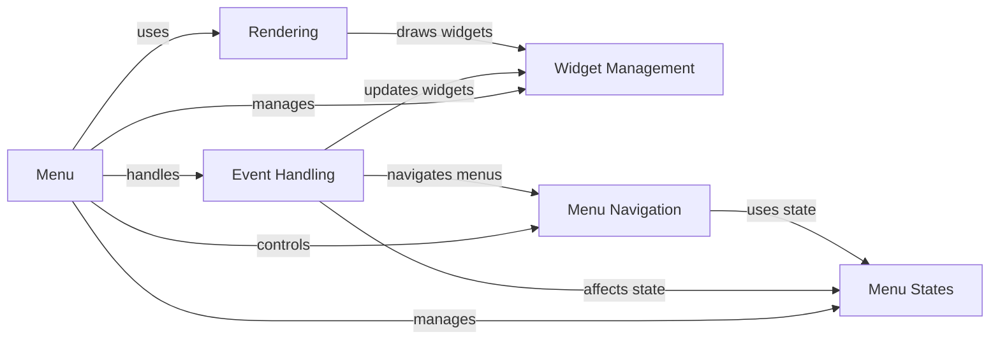

## Component Details

The Menu Manager orchestrates the creation, management, and display of menus within the Pygame application. It encompasses functionalities for widget handling, event processing, rendering, menu navigation, and state management. The core component, `Menu`, serves as the central hub, coordinating interactions between various sub-components to deliver a cohesive menu experience. User input events are captured and dispatched to relevant widgets, while the menu's visual representation is rendered based on the configured theme and style. Navigation between menus and submenus is facilitated through a menu stack, enabling seamless transitions and hierarchical menu structures.

### Menu
The core class representing a menu. It manages widgets, submenus, event handling, and rendering. It also handles menu states and transitions, serving as the central point of interaction for all menu-related operations.
- **Related Classes/Methods**: `pygame_menu.menu.Menu`

### Widget Management
This component provides methods for adding, removing, selecting, and manipulating widgets within the menu. It includes managing widget focus, order, and visibility, allowing for dynamic modification of the menu's content.
- **Related Classes/Methods**: `pygame_menu.menu.Menu:select_widget`, `pygame_menu.menu.Menu:unselect_widget`, `pygame_menu.menu.Menu:remove_widget`, `pygame_menu.menu.Menu:move_widget_index`, `pygame_menu.menu.Menu:get_widgets`, `pygame_menu.menu.Menu:clear`

### Event Handling
This component handles user input events, such as keyboard presses, mouse clicks, and joystick movements. It dispatches events to the appropriate widgets and triggers corresponding actions, enabling user interaction with the menu.
- **Related Classes/Methods**: `pygame_menu.menu.Menu:update`, `pygame_menu.menu.Menu:get_input_data`, `pygame_menu.menu.Menu:_handle_joy_event`, `pygame_menu.menu.Menu:_up`, `pygame_menu.menu.Menu:_down`, `pygame_menu.menu.Menu:_left`, `pygame_menu.menu.Menu:_right`, `pygame_menu.menu.Menu:_on_key_press`, `pygame_menu.menu.Menu:_on_mouse_motion`, `pygame_menu.menu.Menu:_on_mouse_click`

### Rendering
This component is responsible for drawing the menu and its widgets on the screen. It handles different themes and styles, ensuring the menu is visually appealing and consistent with the application's overall design.
- **Related Classes/Methods**: `pygame_menu.menu.Menu:render`, `pygame_menu.menu.Menu:draw`, `pygame_menu.menu.Menu:_draw_focus_widget`

### Menu Navigation
This component provides methods for opening, closing, and navigating between menus and submenus. It manages the menu stack and transitions, allowing users to move seamlessly between different menu levels.
- **Related Classes/Methods**: `pygame_menu.menu.Menu:_open`, `pygame_menu.menu.Menu:_close`, `pygame_menu.menu.Menu:close`, `pygame_menu.menu.Menu:_back`, `pygame_menu.menu.Menu:open_menu`, `pygame_menu.menu.Menu:get_current`

### Menu States
This component manages the different states of the menu, such as opening, closing, and active. It also handles transitions between states, ensuring the menu behaves correctly in different situations.
- **Related Classes/Methods**: `pygame_menu.menu.Menu:enable`, `pygame_menu.menu.Menu:disable`, `pygame_menu.menu.Menu:is_enabled`, `pygame_menu.menu.Menu:is_disabled`, `pygame_menu.menu.Menu:get_status`
