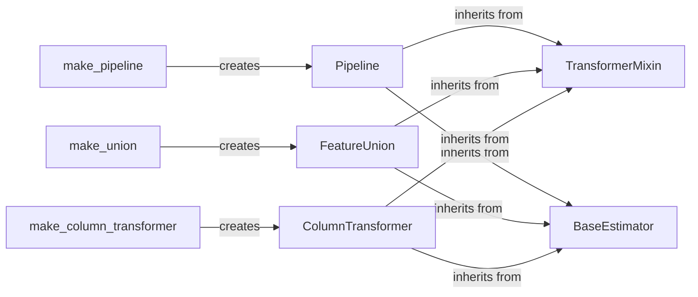

## Component Details

The Model Deployment and Pipelines component in scikit-learn streamlines the process of building and deploying machine learning models by providing tools to chain multiple transformers and a final estimator into a single pipeline. This simplifies the workflow, enhances reproducibility, and makes model deployment easier. The core idea is to create a sequence of operations that can be applied to data in a consistent and automated manner, from preprocessing to prediction.

### Pipeline
The Pipeline class is a core component that chains together a sequence of transformers and a final estimator. It sequentially applies transformations to the input data and then uses the final estimator to make predictions. It simplifies the workflow of applying a series of preprocessing steps followed by a model.
- **Related Classes/Methods**: `sklearn.pipeline.Pipeline`, `sklearn.pipeline.make_pipeline`

### FeatureUnion
The FeatureUnion class concatenates the results of multiple transformer objects. This is useful for combining different feature extraction methods into a single transformer, allowing for the creation of more complex and informative feature sets.
- **Related Classes/Methods**: `sklearn.pipeline.FeatureUnion`, `sklearn.pipeline.make_union`

### ColumnTransformer
The ColumnTransformer class applies different transformers to different columns of the input data. This is useful for applying different preprocessing steps to different features based on their type or characteristics.
- **Related Classes/Methods**: `sklearn.compose._column_transformer.ColumnTransformer`, `sklearn.compose._column_transformer.make_column_transformer`

### TransformerMixin
The TransformerMixin class provides a mixin for all transformers in scikit-learn, offering default implementations for methods like `fit_transform`. It promotes code reuse and consistency across different transformer implementations.
- **Related Classes/Methods**: `sklearn.base.TransformerMixin`

### BaseEstimator
The BaseEstimator class serves as the base class for all estimators in scikit-learn. It provides default implementations for methods like `get_params` and `set_params`, which are essential for model persistence and hyperparameter tuning.
- **Related Classes/Methods**: `sklearn.base.BaseEstimator`
