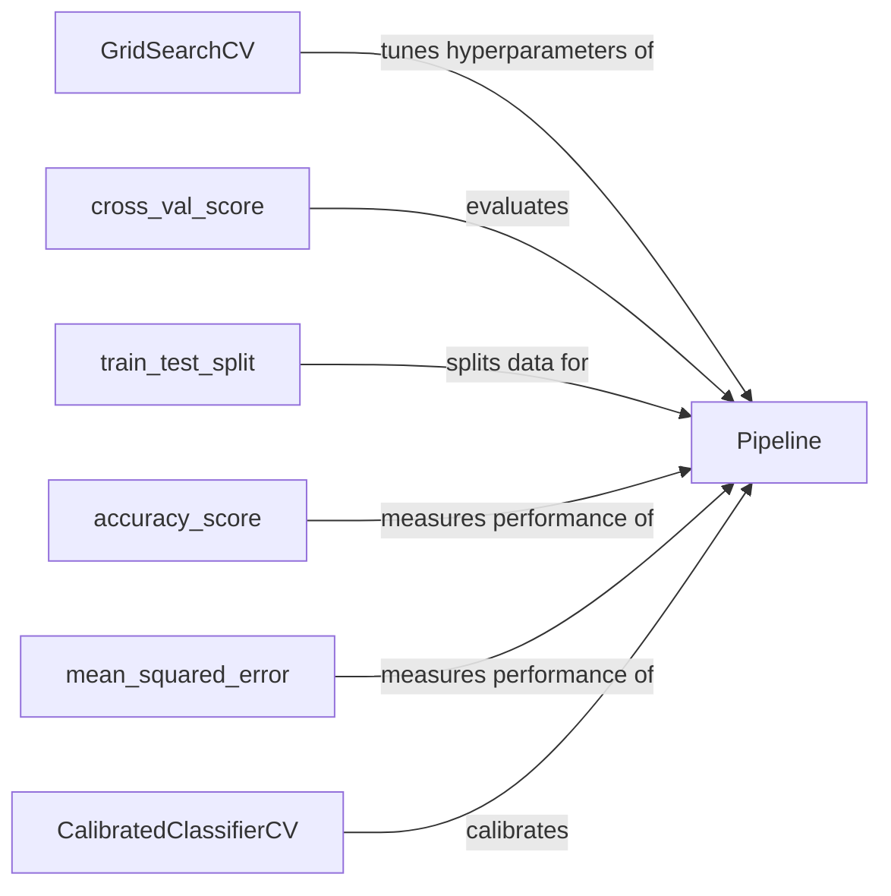

## Component Details

The Model Evaluation and Selection component focuses on assessing the performance of machine learning models and choosing the best one for a given task. It encompasses a suite of tools and metrics for evaluating classification, regression, and clustering models. Key functionalities include cross-validation techniques for robust performance estimation, hyperparameter tuning to optimize model settings, and model selection strategies to identify the top-performing model. This component leverages various scoring metrics and validation methods to ensure the selected model generalizes well to unseen data.

### GridSearchCV
Performs an exhaustive search over a specified hyperparameter grid to find the optimal parameter combination for a given estimator. It uses cross-validation to evaluate each parameter setting and selects the configuration that yields the best performance.
- **Related Classes/Methods**: `sklearn.model_selection._search.GridSearchCV`

### cross_val_score
Evaluates a model's performance using cross-validation. It splits the data into multiple folds, trains the model on a subset of the folds, and evaluates it on the remaining fold. This process is repeated for each fold, and the scores are aggregated to provide a robust estimate of the model's generalization performance.
- **Related Classes/Methods**: `sklearn.model_selection._validation.cross_val_score`

### train_test_split
Splits a dataset into training and testing subsets. This allows for evaluating the model's performance on unseen data, providing an estimate of its generalization ability.
- **Related Classes/Methods**: `sklearn.model_selection._split.train_test_split`

### accuracy_score
Calculates the accuracy score, which measures the proportion of correctly classified instances. It is a common metric for evaluating classification models.
- **Related Classes/Methods**: `sklearn.metrics._classification.accuracy_score`

### mean_squared_error
Calculates the mean squared error, which measures average of the squares of the errors between predicted and actual values. It is a common metric for evaluating regression models.
- **Related Classes/Methods**: `sklearn.metrics._regression.mean_squared_error`

### CalibratedClassifierCV
Calibrates the predicted probabilities of a classifier using cross-validation. This is useful when the classifier's predicted probabilities are not well-aligned with the actual probabilities of the classes.
- **Related Classes/Methods**: `sklearn.calibration.CalibratedClassifierCV`

### Pipeline
Chains together multiple estimators into a single estimator, encapsulating a sequence of preprocessing and modeling steps. This simplifies the model evaluation and selection process by allowing you to treat the entire pipeline as a single unit.
- **Related Classes/Methods**: `sklearn.pipeline.Pipeline`
