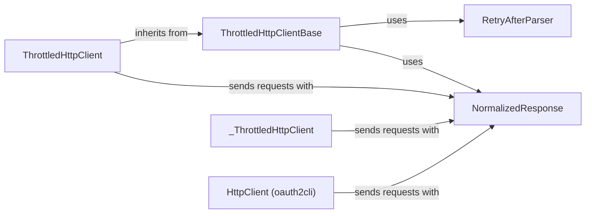

## Component Details

The Network Communication Handler in MSAL Python provides a robust and reliable mechanism for sending HTTP requests to the Microsoft identity platform. It incorporates throttling and retry logic to handle rate limiting and transient errors, ensuring that authentication and authorization requests are completed successfully. The core of this handler is the ThrottledHttpClient, which manages the underlying HTTP connections, retries requests based on Retry-After headers, and normalizes responses for consistent error handling. It also includes specialized clients for managed identity scenarios and a basic HTTP client for OAuth 2.0 flows.

### ThrottledHttpClientBase
Abstract base class defining the interface for throttled HTTP clients. It provides common functionality for handling retry-after headers and managing request retries, setting the foundation for concrete implementations.
- **Related Classes/Methods**: `microsoft-authentication-library-for-python.msal.throttled_http_client.ThrottledHttpClientBase`

### ThrottledHttpClient
Concrete implementation of a throttled HTTP client, inheriting from ThrottledHttpClientBase. It uses the requests library to make HTTP requests and implements retry logic based on Retry-After headers.
- **Related Classes/Methods**: `microsoft-authentication-library-for-python.msal.throttled_http_client.ThrottledHttpClient`

### _ThrottledHttpClient
A specialized throttled HTTP client tailored for managed identity scenarios. It likely incorporates specific logic or configurations optimized for managed identity authentication.
- **Related Classes/Methods**: `microsoft-authentication-library-for-python.msal.managed_identity._ThrottledHttpClient`

### HttpClient (oauth2cli)
A basic HTTP client used within the oauth2cli component for OAuth 2.0 flows. It provides simple GET and POST request functionality.
- **Related Classes/Methods**: `microsoft-authentication-library-for-python.msal.oauth2cli.http.HttpClient`

### RetryAfterParser
Component responsible for parsing the Retry-After header from HTTP responses. It extracts the delay duration to determine how long to wait before retrying a request.
- **Related Classes/Methods**: `microsoft-authentication-library-for-python.msal.throttled_http_client.RetryAfterParser`

### NormalizedResponse
Represents a normalized HTTP response, encapsulating the response data (status code, headers, content). It provides methods for handling response status and errors in a consistent way across different HTTP clients.
- **Related Classes/Methods**: `microsoft-authentication-library-for-python.msal.throttled_http_client.NormalizedResponse`
