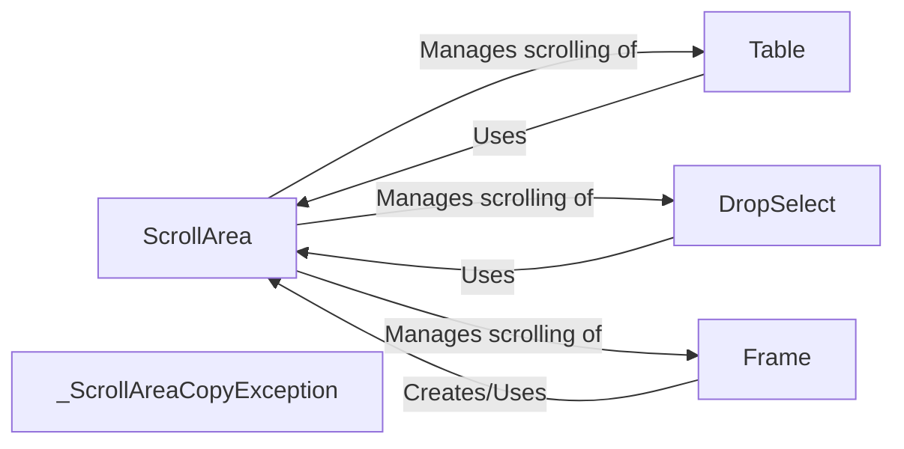

## Component Details

The Scrollable Area component provides a mechanism to display content that exceeds the available screen space by enabling scrolling. It manages the layout and rendering of content within a defined area and handles scrollbar interactions. Widgets like tables, dropdowns, and frames can utilize the Scrollable Area to present large amounts of data or options within a constrained visual space.

### ScrollArea
The core component responsible for managing a scrollable area. It handles drawing the visible portion of the content, managing scrollbar visibility and interaction, and translating mouse events within the scrollable area. It determines when scrollbars are needed and how they respond to user input.
- **Related Classes/Methods**: `pygame_menu._scrollarea.ScrollArea`

### Table
A widget that can be placed inside a ScrollArea to display tabular data that may exceed the visible area. It relies on the ScrollArea to handle the display of content that overflows the allocated space. The Table widget renders the tabular data, while the ScrollArea provides the scrolling functionality.
- **Related Classes/Methods**: `pygame_menu.widgets.widget.table.Table`

### DropSelect
A widget that can be placed inside a ScrollArea to display a dropdown selection list that may exceed the visible area. It uses the ScrollArea to manage the display of a potentially long list of options. The DropSelect widget provides the selection logic and rendering of the list, while the ScrollArea enables scrolling through the options.
- **Related Classes/Methods**: `pygame_menu.widgets.widget.dropselect.DropSelect`

### Frame
A widget that can create and manage a ScrollArea to display its content. It acts as a container for other widgets and uses the ScrollArea to handle content that exceeds the frame's boundaries. The Frame widget manages the layout of its child widgets, and the ScrollArea provides the scrolling functionality when needed.
- **Related Classes/Methods**: `pygame_menu.widgets.widget.frame.Frame`

### _ScrollAreaCopyException
An exception class used specifically for handling errors related to copying ScrollArea objects. This likely indicates a need to prevent or manage the copying of ScrollArea instances due to their internal state or dependencies. It ensures that ScrollArea objects are not inadvertently copied, which could lead to unexpected behavior or data corruption.
- **Related Classes/Methods**: `pygame_menu._scrollarea._ScrollAreaCopyException`
