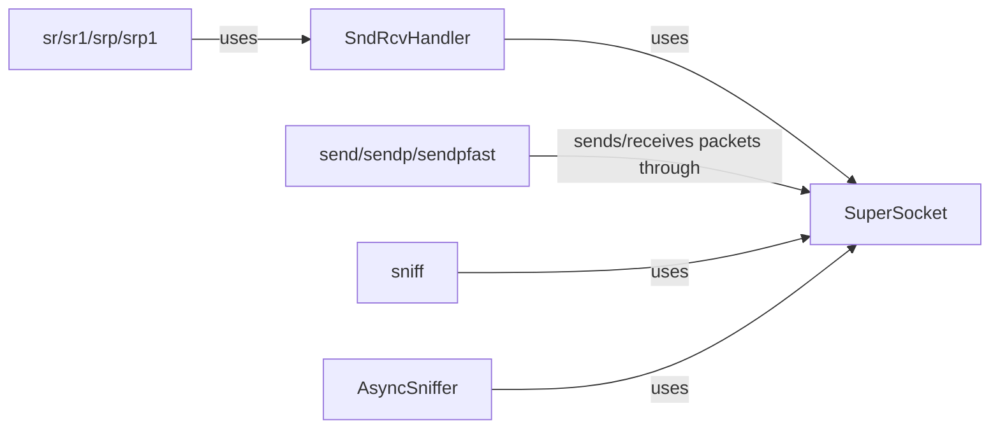

## Component Details

The TrafficHandler component in Scapy is responsible for sending, receiving, and sniffing network packets. It provides a high-level interface for interacting with network sockets, allowing users to craft and manipulate packets at different layers of the network stack. The core functionality revolves around sending packets (L2/L3), capturing network traffic, and facilitating request-response interactions. It relies on the underlying socket implementation provided by the operating system and the packet crafting capabilities of Scapy itself.

### SndRcvHandler
The SndRcvHandler class is responsible for managing the sending and receiving of packets, including handling responses and processing received packets. It encapsulates the logic for sending packets via SuperSocket, receiving responses, and managing the sniffing process to capture relevant traffic.
- **Related Classes/Methods**: `scapy.scapy.sendrecv.SndRcvHandler:__init__`, `scapy.scapy.sendrecv.SndRcvHandler:_stop_sniffer_if_done`, `scapy.scapy.sendrecv.SndRcvHandler:_sndrcv_snd`, `scapy.scapy.sendrecv.SndRcvHandler:_process_packet`, `scapy.scapy.sendrecv.SndRcvHandler:_sndrcv_rcv`

### SuperSocket
The SuperSocket class provides an abstraction layer over raw network sockets, enabling Scapy to send and receive packets at various network layers. It manages the underlying socket operations, offering methods for sending, receiving, and sniffing packets. It serves as the primary interface for interacting with the network interface.
- **Related Classes/Methods**: `scapy.scapy.supersocket.SuperSocket:send`, `scapy.scapy.supersocket.SuperSocket:recv`, `scapy.scapy.supersocket.SuperSocket:sr`, `scapy.scapy.supersocket.SuperSocket:sr1`, `scapy.scapy.supersocket.SuperSocket:sniff`, `scapy.scapy.supersocket.SuperSocket:tshark`, `scapy.scapy.supersocket.SuperSocket:__del__`, `scapy.scapy.supersocket.SuperSocket:__exit__`

### send/sendp/sendpfast
These functions provide different methods for sending packets. `send` transmits packets at layer 3, `sendp` sends packets at layer 2, and `sendpfast` sends packets at layer 2 with optimized performance. They utilize the internal `_send` function, which interacts with SuperSocket to send the packets over the network.
- **Related Classes/Methods**: `scapy.scapy.sendrecv:send`, `scapy.scapy.sendrecv:sendp`, `scapy.scapy.sendrecv:sendpfast`, `scapy.scapy.sendrecv:_send`, `scapy.scapy.sendrecv:__gen_send`

### sr/sr1/srp/srp1
These functions offer synchronous send and receive capabilities. `sr` sends packets and receives multiple responses, `sr1` sends packets and receives only the first response, while `srp` and `srp1` are their layer 2 counterparts. They rely on SndRcvHandler to manage the sending and receiving process, including matching requests with responses.
- **Related Classes/Methods**: `scapy.scapy.sendrecv:sr`, `scapy.scapy.sendrecv:sr1`, `scapy.scapy.sendrecv:srp`, `scapy.scapy.sendrecv:srp1`, `scapy.scapy.sendrecv:__sr_loop`

### sniff
The `sniff` function is used to capture network traffic. It leverages SuperSocket to listen on a specified network interface and capture packets. Filters can be applied to capture only specific types of traffic, enabling targeted analysis of network communications.
- **Related Classes/Methods**: `scapy.scapy.sendrecv:sniff`

### AsyncSniffer
The AsyncSniffer class provides asynchronous packet sniffing capabilities. It allows capturing packets in a separate thread, enabling non-blocking packet capture. It uses SuperSocket for sniffing and provides methods to start and stop the sniffing process, making it suitable for applications requiring continuous monitoring of network traffic.
- **Related Classes/Methods**: `scapy.scapy.sendrecv.AsyncSniffer:_setup_thread`, `scapy.scapy.sendrecv.AsyncSniffer:_run`, `scapy.scapy.sendrecv.AsyncSniffer:start`, `scapy.scapy.sendrecv.AsyncSniffer:stop`
