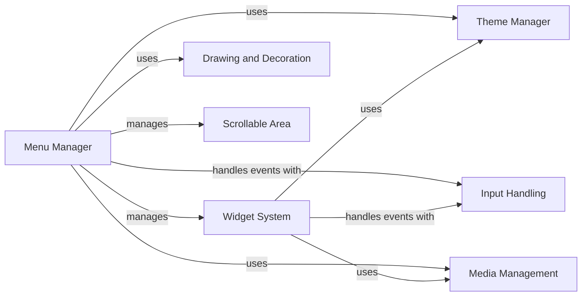

## Component Details

The pygame-menu library provides a comprehensive menu creation and management system for Pygame applications. It offers a modular architecture with components for handling menu structure, widget management, theming, input events, media, and visual decorations. The core flow involves the Menu Manager orchestrating the display and interaction of menus, utilizing widgets for user interaction, themes for styling, and controllers for input handling. The library aims to simplify the process of creating visually appealing and functional menus in Pygame projects.

### Menu Manager
The Menu Manager is the central component responsible for creating, managing, and displaying menus. It handles the overall menu structure, widget placement, event handling, and rendering. It orchestrates the interaction between different components, such as widgets, themes, and input controllers, to provide a cohesive menu experience. It also manages submenus and navigation between them.
- **Related Classes/Methods**: `pygame_menu.menu.Menu`, `pygame_menu.menu._MenuRuntimeErrorConfig`, `pygame_menu.menu._MenuStats`, `pygame_menu.menu._MenuWidgetOverflow`

### Widget System
The Widget System encompasses the creation, management, and behavior of interactive elements within a menu. It includes the Widget Manager, which handles the addition, removal, and updating of widgets, and the Base Widget class, which provides common functionality for all widgets. Specific widget types, such as buttons, labels, and text inputs, inherit from the Base Widget and provide specialized functionality for user interaction.
- **Related Classes/Methods**: `pygame_menu._widgetmanager.WidgetManager`, `pygame_menu.widgets.core.widget.Widget`, `pygame_menu.widgets.core.widget._WidgetNoValue`, `pygame_menu.widgets.core.widget._WidgetCopyException`, `pygame_menu.widgets.widget.button.Button`, `pygame_menu.widgets.widget.label.Label`, `pygame_menu.widgets.widget.textinput.TextInput`, `pygame_menu.widgets.widget.selector.Selector`, `pygame_menu.widgets.widget.image.Image`, `pygame_menu.widgets.widget.frame.Frame`

### Theme Manager
The Theme Manager defines the visual style of the menu, including colors, fonts, and spacing. It allows for customization of the menu's appearance to create different looks and feels. It ensures a consistent visual style across all menus and widgets, providing a unified user experience.
- **Related Classes/Methods**: `pygame_menu.themes.Theme`

### Input Handling
The Input Handling component manages user input events, such as keyboard presses and mouse clicks. It translates these events into actions that can be handled by the menu and its widgets. It provides a unified way to handle user input across different platforms and devices, ensuring consistent menu behavior regardless of the input method.
- **Related Classes/Methods**: `pygame_menu.controls.Controller`

### Media Management
The Media Management component handles images and sounds within the menu. It includes methods for loading, scaling, and manipulating images, as well as loading and playing sound effects. It provides a central point for managing all media assets used in the menu, simplifying the process of incorporating multimedia elements into the menu design.
- **Related Classes/Methods**: `pygame_menu.baseimage.BaseImage`, `pygame_menu.sound.Sound`

### Drawing and Decoration
The Drawing and Decoration component allows for adding graphical decorations to the menu. It includes methods for drawing shapes, lines, and other visual elements, enhancing the visual appeal of the menu. It provides a way to customize the menu's appearance beyond the basic theme settings, allowing for more creative and unique menu designs.
- **Related Classes/Methods**: `pygame_menu._decorator.Decorator`, `pygame_menu._decorator._DecoratorCopyException`

### Scrollable Area
The Scrollable Area component provides a scrollable region for displaying content that exceeds the available space. It manages the layout and rendering of content within the scrollable area, as well as the scrollbars for navigating the content. It allows for displaying large amounts of content within a limited space, making it suitable for menus with many options or lengthy descriptions.
- **Related Classes/Methods**: `pygame_menu._scrollarea.ScrollArea`, `pygame_menu._scrollarea._ScrollAreaCopyException`