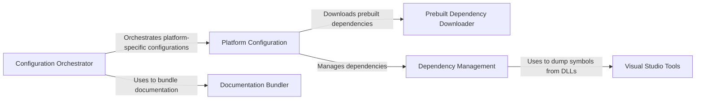

## Component Details

### Configuration Orchestrator
The Configuration Orchestrator serves as the central entry point for the build configuration process. It determines the target operating system and delegates the configuration task to the appropriate platform-specific configuration module. This component ensures that the correct configuration steps are executed based on the detected operating system, abstracting away the platform differences from the rest of the build system.
- **Related Classes/Methods**: `repos.pygame.buildconfig.config`

### Platform Configuration
The Platform Configuration components (Windows, Unix, macOS, MSYS2, and Conan) handle the platform-specific configuration of Pygame. Each component is responsible for detecting dependencies, downloading prebuilt libraries (if necessary), and generating the configuration files required for building Pygame on its respective platform. They encapsulate the unique steps and tools needed for each operating system, ensuring that the build process is tailored to the specific environment.
- **Related Classes/Methods**: `repos.pygame.buildconfig.config_win`, `repos.pygame.buildconfig.config_unix`, `repos.pygame.buildconfig.config_darwin`, `repos.pygame.buildconfig.config_msys2`, `repos.pygame.buildconfig.config_conan`

### Prebuilt Dependency Downloader
The Prebuilt Dependency Downloader components (Windows and MSYS2) are responsible for downloading and extracting prebuilt dependency archives for their respective platforms. These components automate the process of obtaining and installing external libraries, simplifying the build process and reducing the need for manual dependency management. They ensure that the required dependencies are available in the correct locations for the build to proceed.
- **Related Classes/Methods**: `repos.pygame.buildconfig.download_win_prebuilt`, `repos.pygame.buildconfig.download_msys2_prebuilt`

### Dependency Management
The Dependency Management components (DependencyGroup) provide a way to group and manage dependencies. This simplifies the process of adding and configuring multiple dependencies at once. It provides a structured way to handle dependencies and their configurations.
- **Related Classes/Methods**: `repos.pygame.buildconfig.config_win`, `repos.pygame.buildconfig.config_msys2`

### Documentation Bundler
The Documentation Bundler component is responsible for collecting and bundling documentation files into a single, distributable file. This component ensures that the documentation is readily available to users in a convenient format, improving the overall user experience.
- **Related Classes/Methods**: `repos.pygame.buildconfig.bundle_docs`

### Visual Studio Tools
The Visual Studio Tools component provides utilities for working with Visual Studio, such as dumping symbols from DLLs to create .def files. It aids in the creation of import libraries for prebuilt binaries.
- **Related Classes/Methods**: `repos.pygame.buildconfig.vstools`
