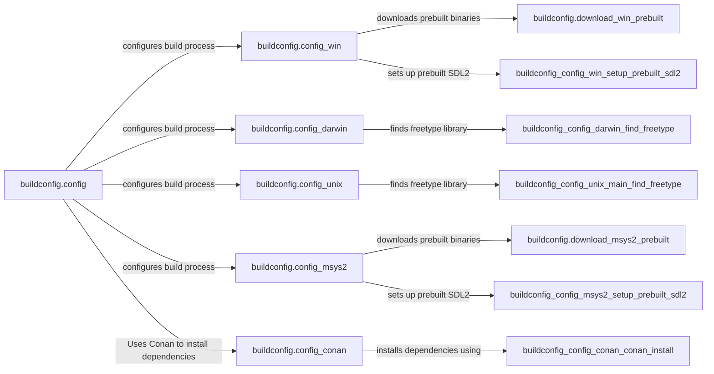

## Component Details

The Build and Configuration Manager is responsible for orchestrating the build process of Pygame across different platforms. It handles dependency management, platform-specific configurations, and downloading prebuilt binaries when necessary. The core component, `buildconfig.config`, acts as the central configuration manager, delegating platform-specific tasks to modules like `config_win`, `config_darwin`, `config_unix`, and `config_msys2`. These platform-specific modules define and manage dependencies, download prebuilt binaries, and set up the build environment for their respective operating systems. The system also integrates with tools like Visual Studio and Conan for dependency management and documentation bundling to ensure a consistent and properly configured library build.

### buildconfig.config
This module serves as the central configuration manager for the build process. It determines the platform, prepares dependencies, and writes the setup file. It interacts with platform-specific configuration modules (e.g., `config_win`, `config_darwin`, `config_unix`) to handle platform-specific dependencies and settings.

**Related Classes/Methods**:

- <a href="https://github.com/pygame/pygame/blob/master/buildconfig/config.py#L157-L247" target="_blank" rel="noopener noreferrer">`buildconfig.config:main` (157:247)</a>
- <a href="https://github.com/pygame/pygame/blob/master/buildconfig/config.py#L29-L33" target="_blank" rel="noopener noreferrer">`buildconfig.config.print_` (29:33)</a>
- <a href="https://github.com/pygame/pygame/blob/master/buildconfig/config.py#L36-L39" target="_blank" rel="noopener noreferrer">`buildconfig.config.is_msys2` (36:39)</a>
- <a href="https://github.com/pygame/pygame/blob/master/buildconfig/config.py#L56-L96" target="_blank" rel="noopener noreferrer">`buildconfig.config.prepdep` (56:96)</a>
- <a href="https://github.com/pygame/pygame/blob/master/buildconfig/config.py#L98-L155" target="_blank" rel="noopener noreferrer">`buildconfig.config.writesetupfile` (98:155)</a>

### buildconfig.config_win
This module configures the build process specifically for Windows. It manages Windows-specific dependencies, including DLLs, and sets up prebuilt SDL2 libraries. It interacts with `buildconfig.config` to provide Windows-specific configuration details and uses `download_win_prebuilt` to download prebuilt binaries.

**Related Classes/Methods**:

- <a href="https://github.com/pygame/pygame/blob/master/buildconfig/config_win.py#L456-L496" target="_blank" rel="noopener noreferrer">`buildconfig.config_win:main` (456:496)</a>
- <a href="https://github.com/pygame/pygame/blob/master/buildconfig/config_win.py#L29-L30" target="_blank" rel="noopener noreferrer">`buildconfig.config_win.get_machine_type` (29:30)</a>
- <a href="https://github.com/pygame/pygame/blob/master/buildconfig/config_win.py#L394-L454" target="_blank" rel="noopener noreferrer">`buildconfig.config_win.setup_prebuilt_sdl2` (394:454)</a>
- <a href="https://github.com/pygame/pygame/blob/master/buildconfig/config_win.py#L368-L392" target="_blank" rel="noopener noreferrer">`buildconfig.config_win.setup` (368:392)</a>
- <a href="https://github.com/pygame/pygame/blob/master/buildconfig/config_win.py#L279-L355" target="_blank" rel="noopener noreferrer">`buildconfig.config_win.DependencyGroup` (279:355)</a>
- <a href="https://github.com/pygame/pygame/blob/master/buildconfig/config_win.py#L32-L172" target="_blank" rel="noopener noreferrer">`buildconfig.config_win.Dependency` (32:172)</a>
- <a href="https://github.com/pygame/pygame/blob/master/buildconfig/config_win.py#L204-L253" target="_blank" rel="noopener noreferrer">`buildconfig.config_win.DependencyDLL` (204:253)</a>
- <a href="https://github.com/pygame/pygame/blob/master/buildconfig/config_win.py#L267-L277" target="_blank" rel="noopener noreferrer">`buildconfig.config_win.DependencyWin` (267:277)</a>
- <a href="https://github.com/pygame/pygame/blob/master/buildconfig/config_win.py#L255-L265" target="_blank" rel="noopener noreferrer">`buildconfig.config_win.DependencyDummy` (255:265)</a>
- <a href="https://github.com/pygame/pygame/blob/master/buildconfig/config_win.py#L357-L366" target="_blank" rel="noopener noreferrer">`buildconfig.config_win._add_sdl2_dll_deps` (357:366)</a>

### buildconfig.config_darwin
This module configures the build process for macOS (Darwin). It defines macOS-specific dependencies and includes functions to locate the freetype library. It interacts with `buildconfig.config` to provide macOS-specific configuration details and uses `macdependencies.install_mac_deps` to install dependencies.

**Related Classes/Methods**:

- <a href="https://github.com/pygame/pygame/blob/master/buildconfig/config_darwin.py#L123-L173" target="_blank" rel="noopener noreferrer">`buildconfig.config_darwin:main` (123:173)</a>
- <a href="https://github.com/pygame/pygame/blob/master/buildconfig/config_darwin.py#L13-L50" target="_blank" rel="noopener noreferrer">`buildconfig.config_darwin.Dependency` (13:50)</a>
- <a href="https://github.com/pygame/pygame/blob/master/buildconfig/config_darwin.py#L101-L117" target="_blank" rel="noopener noreferrer">`buildconfig.config_darwin.find_freetype` (101:117)</a>

### buildconfig.config_unix
This module configures the build process for Unix-like systems. It defines dependencies, including program dependencies, and includes functions to find freetype and manage porttime dependencies. It interacts with `buildconfig.config` to provide Unix-specific configuration details.

**Related Classes/Methods**:

- <a href="https://github.com/pygame/pygame/blob/master/buildconfig/config_unix.py#L139-L276" target="_blank" rel="noopener noreferrer">`buildconfig.config_unix:main` (139:276)</a>
- <a href="https://github.com/pygame/pygame/blob/master/buildconfig/config_unix.py#L72-L104" target="_blank" rel="noopener noreferrer">`buildconfig.config_unix.Dependency` (72:104)</a>
- <a href="https://github.com/pygame/pygame/blob/master/buildconfig/config_unix.py#L22-L70" target="_blank" rel="noopener noreferrer">`buildconfig.config_unix.DependencyProg` (22:70)</a>
- <a href="https://github.com/pygame/pygame/blob/master/buildconfig/config_unix.py#L179-L201" target="_blank" rel="noopener noreferrer">`buildconfig.config_unix.main.get_porttime_dep` (179:201)</a>
- <a href="https://github.com/pygame/pygame/blob/master/buildconfig/config_unix.py#L203-L219" target="_blank" rel="noopener noreferrer">`buildconfig.config_unix.main.find_freetype` (203:219)</a>

### buildconfig.config_msys2
This module configures the build process for MSYS2 environments on Windows. It includes functions for determining the machine type, setting up prebuilt SDL2 libraries, and managing dependencies (including DLLs). It interacts with `buildconfig.config` to provide MSYS2-specific configuration details and uses `download_msys2_prebuilt` to download prebuilt binaries.

**Related Classes/Methods**:

- <a href="https://github.com/pygame/pygame/blob/master/buildconfig/config_msys2.py#L466-L490" target="_blank" rel="noopener noreferrer">`buildconfig.config_msys2:main` (466:490)</a>
- <a href="https://github.com/pygame/pygame/blob/master/buildconfig/config_msys2.py#L32-L33" target="_blank" rel="noopener noreferrer">`buildconfig.config_msys2.get_machine_type` (32:33)</a>
- <a href="https://github.com/pygame/pygame/blob/master/buildconfig/config_msys2.py#L389-L463" target="_blank" rel="noopener noreferrer">`buildconfig.config_msys2.setup_prebuilt_sdl2` (389:463)</a>
- <a href="https://github.com/pygame/pygame/blob/master/buildconfig/config_msys2.py#L296-L369" target="_blank" rel="noopener noreferrer">`buildconfig.config_msys2.DependencyGroup` (296:369)</a>
- <a href="https://github.com/pygame/pygame/blob/master/buildconfig/config_msys2.py#L43-L189" target="_blank" rel="noopener noreferrer">`buildconfig.config_msys2.Dependency` (43:189)</a>
- <a href="https://github.com/pygame/pygame/blob/master/buildconfig/config_msys2.py#L221-L270" target="_blank" rel="noopener noreferrer">`buildconfig.config_msys2.DependencyDLL` (221:270)</a>
- <a href="https://github.com/pygame/pygame/blob/master/buildconfig/config_msys2.py#L284-L294" target="_blank" rel="noopener noreferrer">`buildconfig.config_msys2.DependencyWin` (284:294)</a>
- <a href="https://github.com/pygame/pygame/blob/master/buildconfig/config_msys2.py#L272-L282" target="_blank" rel="noopener noreferrer">`buildconfig.config_msys2.DependencyDummy` (272:282)</a>
- <a href="https://github.com/pygame/pygame/blob/master/buildconfig/config_msys2.py#L371-L386" target="_blank" rel="noopener noreferrer">`buildconfig.config_msys2._add_sdl2_dll_deps` (371:386)</a>

### buildconfig.download_win_prebuilt
This module downloads and places prebuilt binaries for Windows. It includes functions for downloading, unzipping, and copying files. It is used by `config_win` and potentially `config_msys2` to obtain prebuilt dependencies.

**Related Classes/Methods**:

- <a href="https://github.com/pygame/pygame/blob/master/buildconfig/download_win_prebuilt.py#L109-L116" target="_blank" rel="noopener noreferrer">`buildconfig.download_win_prebuilt:download_prebuilts` (109:116)</a>
- <a href="https://github.com/pygame/pygame/blob/master/buildconfig/download_win_prebuilt.py#L164-L244" target="_blank" rel="noopener noreferrer">`buildconfig.download_win_prebuilt:place_downloaded_prebuilts` (164:244)</a>
- <a href="https://github.com/pygame/pygame/blob/master/buildconfig/download_win_prebuilt.py#L246-L249" target="_blank" rel="noopener noreferrer">`buildconfig.download_win_prebuilt:update` (246:249)</a>
- <a href="https://github.com/pygame/pygame/blob/master/buildconfig/download_win_prebuilt.py#L251-L266" target="_blank" rel="noopener noreferrer">`buildconfig.download_win_prebuilt:ask` (251:266)</a>
- <a href="https://github.com/pygame/pygame/blob/master/buildconfig/download_win_prebuilt.py#L268-L276" target="_blank" rel="noopener noreferrer">`buildconfig.download_win_prebuilt:cached` (268:276)</a>
- <a href="https://github.com/pygame/pygame/blob/master/buildconfig/download_win_prebuilt.py#L77-L107" target="_blank" rel="noopener noreferrer">`buildconfig.download_win_prebuilt.get_urls` (77:107)</a>
- <a href="https://github.com/pygame/pygame/blob/master/buildconfig/download_win_prebuilt.py#L7-L75" target="_blank" rel="noopener noreferrer">`buildconfig.download_win_prebuilt.download_sha1_unzip` (7:75)</a>
- <a href="https://github.com/pygame/pygame/blob/master/buildconfig/download_win_prebuilt.py#L135-L162" target="_blank" rel="noopener noreferrer">`buildconfig.download_win_prebuilt.copytree` (135:162)</a>
- <a href="https://github.com/pygame/pygame/blob/master/buildconfig/download_win_prebuilt.py#L181-L182" target="_blank" rel="noopener noreferrer">`buildconfig.download_win_prebuilt.place_downloaded_prebuilts.copy` (181:182)</a>
- <a href="https://github.com/pygame/pygame/blob/master/buildconfig/download_win_prebuilt.py#L118-L131" target="_blank" rel="noopener noreferrer">`buildconfig.download_win_prebuilt.create_ignore_target_fnc` (118:131)</a>

### buildconfig.download_msys2_prebuilt
This module downloads and installs prebuilt MSYS2 packages. It includes functions for updating the environment and installing specific packages using pacman. It is used by `config_msys2` to obtain prebuilt dependencies in the MSYS2 environment.

**Related Classes/Methods**:

- <a href="https://github.com/pygame/pygame/blob/master/buildconfig/download_msys2_prebuilt.py#L93-L102" target="_blank" rel="noopener noreferrer">`buildconfig.download_msys2_prebuilt:install_prebuilts` (93:102)</a>
- <a href="https://github.com/pygame/pygame/blob/master/buildconfig/download_msys2_prebuilt.py#L129-L130" target="_blank" rel="noopener noreferrer">`buildconfig.download_msys2_prebuilt:update` (129:130)</a>
- <a href="https://github.com/pygame/pygame/blob/master/buildconfig/download_msys2_prebuilt.py#L33-L90" target="_blank" rel="noopener noreferrer">`buildconfig.download_msys2_prebuilt.get_packages` (33:90)</a>
- <a href="https://github.com/pygame/pygame/blob/master/buildconfig/download_msys2_prebuilt.py#L14-L30" target="_blank" rel="noopener noreferrer">`buildconfig.download_msys2_prebuilt.install_pacman_package` (14:30)</a>
- <a href="https://github.com/pygame/pygame/blob/master/buildconfig/download_msys2_prebuilt.py#L105-L126" target="_blank" rel="noopener noreferrer">`buildconfig.download_msys2_prebuilt.detect_arch` (105:126)</a>

### buildconfig.config_conan
This module configures the build using Conan, a C++ package manager. It handles the installation of dependencies using Conan and defines a Dependency class.

**Related Classes/Methods**:

- <a href="https://github.com/pygame/pygame/blob/master/buildconfig/config_conan.py#L67-L87" target="_blank" rel="noopener noreferrer">`buildconfig.config_conan:main` (67:87)</a>
- <a href="https://github.com/pygame/pygame/blob/master/buildconfig/config_conan.py#L37-L65" target="_blank" rel="noopener noreferrer">`buildconfig.config_conan.conan_install` (37:65)</a>
- <a href="https://github.com/pygame/pygame/blob/master/buildconfig/config_conan.py#L10-L34" target="_blank" rel="noopener noreferrer">`buildconfig.config_conan.Dependency` (10:34)</a>