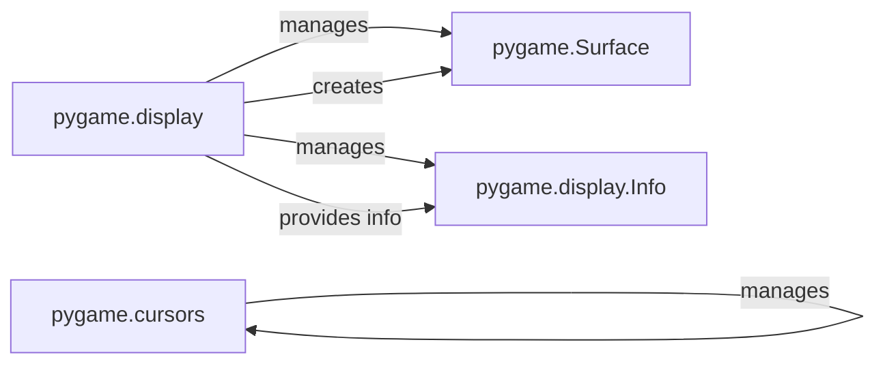

## Component Details

The Display Management subsystem in Pygame is responsible for handling the game window and screen. It initializes the display, sets the display mode, manages window properties like caption and icon, and provides mechanisms for updating the display to reflect changes in the game state. It also manages mouse cursor interactions and full-screen modes, acting as the primary interface between the game and the user's monitor.

### pygame.display
This module provides the core functionality for managing the Pygame display. It handles initialization and quitting of the display, setting the display mode (windowed or fullscreen), managing window properties (caption, icon), controlling gamma, and updating the display. It also provides functions for retrieving information about the display, such as the video driver and window manager information.
- **Related Classes/Methods**: `pygame.src_py.display:init`, `pygame.src_py.display:quit`, `pygame.src_py.display:get_init`, `pygame.src_py.display:set_mode`, `pygame.src_py.display:get_surface`, `pygame.src_py.display:flip`, `pygame.src_py.display:update`, `pygame.src_py.display:get_driver`, `pygame.src_py.display:Info`, `pygame.src_py.display:get_wm_info`, `pygame.src_py.display:set_caption`, `pygame.src_py.display:get_caption`, `pygame.src_py.display:set_icon`, `pygame.src_py.display:iconify`, `pygame.src_py.display:toggle_fullscreen`, `pygame.src_py.display:set_gamma`, `pygame.src_py.display:get_gamma`, `pygame.src_py.display:set_gamma_ramp`, `pygame.src_py.display:get_gamma_ramp`, `pygame.src_py.display:list_modes`, `pygame.src_py.display:mode_ok`, `pygame.src_py.display:gl_get_attribute`, `pygame.src_py.display:gl_set_attribute`, `pygame.src_py.display:get_active`, `pygame.src_py.display:get_mouse_focus`, `pygame.src_py.display:set_palette`, `pygame.src_py.display:get_num_displays`, `pygame.src_py.display:get_window_size`

### pygame.Surface
Represents an image. This is the main way to represent images in pygame. The Surface can be drawn to the screen, and other Surfaces can be drawn onto it. It is created by `pygame.display.set_mode()`
- **Related Classes/Methods**: `pygame.src_py.display.Surface`

### pygame.cursors
This module provides functions for managing the mouse cursor. It allows you to set a custom cursor, get the current cursor, and load cursor data from XBM files. It interacts with the display module to set the cursor on the screen.
- **Related Classes/Methods**: `pygame.src_py.cursors.Cursor:__ne__`, `pygame.src_py.cursors.Cursor:__copy__`, `pygame.src_py.cursors:set_cursor`, `pygame.src_py.cursors:get_cursor`, `pygame.src_py.cursors:load_xbm`

### pygame.display.Info
This class provides information about the display. It includes information about the video driver, the window manager, and the available display modes. It is typically accessed through the `pygame.display.Info()` function.
- **Related Classes/Methods**: `pygame.src_py.display:Info`
