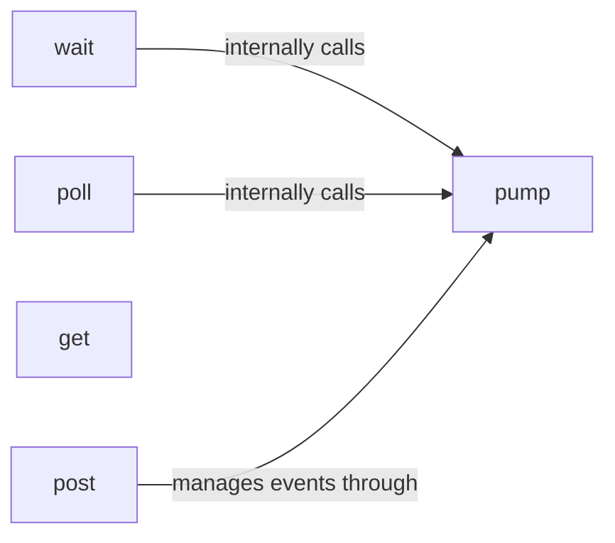

## Component Details

The Event Management component in Pygame handles user input and system events, enabling interactive game experiences. It manages an event queue, processes events like keyboard presses and mouse movements, and allows the game to respond to user interactions. The core of this system revolves around the `fastevent` module, which provides functions for managing the event queue and retrieving events. The `pump` function is central to this process, ensuring the event queue is updated. Other functions like `wait`, `poll`, `get`, and `post` provide different ways to interact with the event queue, allowing for both blocking and non-blocking event handling, as well as the ability to create custom events.

### pump
The `pump` function is the core of the event processing system. It internally updates the event queue, ensuring that events are properly managed by the system. It is implicitly called by other event functions.
- **Related Classes/Methods**: `pygame.src_py.fastevent:pump`

### wait
The `wait` function pauses the program until an event is available in the queue. It's useful when the game doesn't need to constantly check for events, allowing the system to conserve resources. It blocks until an event occurs and internally calls pump.
- **Related Classes/Methods**: `pygame.src_py.fastevent:wait`

### poll
The `poll` function checks if any events are available in the queue without blocking. It returns `True` if an event is present and `False` otherwise, useful for non-blocking event handling and internally calls pump.
- **Related Classes/Methods**: `pygame.src_py.fastevent:poll`

### get
The `get` function retrieves all events currently in the queue, returning a list of events for processing by the game logic. This is a common way to handle events in a game loop.
- **Related Classes/Methods**: `pygame.src_py.fastevent:get`

### post
The `post` function allows manually adding events to the event queue, useful for creating custom events or simulating user input. It adds an event to the queue for later processing and internally calls pump.
- **Related Classes/Methods**: `pygame.src_py.fastevent:post`
