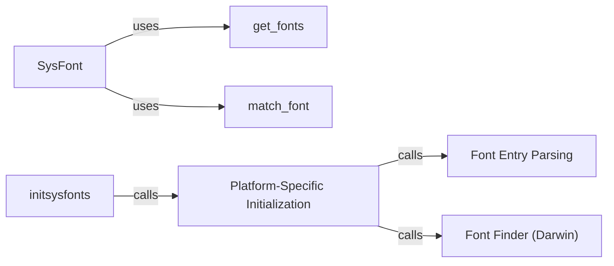

## Component Details

The Font & Text Support component in Pygame provides the functionality to render text using system fonts and FreeType fonts. It encompasses font loading, glyph rendering, and text surface creation, enabling the display of text in games and applications. The component abstracts platform-specific font handling, offering a consistent interface for developers to add text to their projects.

### SysFont
The `SysFont` class is responsible for loading and managing system fonts. It allows users to specify font attributes like name, size, bold, and italic. It interacts with the operating system to locate and load the requested font, providing a consistent interface across different platforms.
- **Related Classes/Methods**: `pygame.src_py.sysfont:SysFont`

### get_fonts
The `get_fonts` function retrieves a list of available fonts on the system. It interacts with the operating system's font management APIs to enumerate the installed fonts. The returned list can be used to select a font for use with the `SysFont` class.
- **Related Classes/Methods**: `pygame.src_py.sysfont:get_fonts`

### match_font
The `match_font` function attempts to find a font that matches the specified name and style attributes. It searches the available fonts on the system and returns a list of matching font names. This function is used to find suitable fonts when the exact font name is not known.
- **Related Classes/Methods**: `pygame.src_py.sysfont:match_font`

### initsysfonts
The `initsysfonts` function initializes the system font module. It performs platform-specific initialization tasks, such as loading font libraries and enumerating available fonts. This function must be called before using any other functions in the `sysfont` module.
- **Related Classes/Methods**: `pygame.src_py.sysfont:initsysfonts`

### Platform-Specific Initialization
These functions (`initsysfonts_win32`, `initsysfonts_darwin`, `initsysfonts_unix`) handle the platform-specific initialization of system fonts. They are responsible for finding and loading fonts available on their respective operating systems (Windows, macOS, and Unix-like systems).
- **Related Classes/Methods**: `pygame.src_py.sysfont:initsysfonts_win32`, `pygame.src_py.sysfont:initsysfonts_darwin`, `pygame.src_py.sysfont:initsysfonts_unix`

### Font Entry Parsing
These functions (`_parse_font_entry_win`, `_parse_font_entry_darwin`, `_parse_font_entry_unix`) parse font entries on their respective operating systems. They extract relevant information from the font entry to be used by the system.
- **Related Classes/Methods**: `pygame.src_py.sysfont:_parse_font_entry_win`, `pygame.src_py.sysfont:_parse_font_entry_darwin`, `pygame.src_py.sysfont:_parse_font_entry_unix`

### Font Finder (Darwin)
The `_font_finder_darwin` function finds fonts on macOS (Darwin) systems. It searches for available fonts and returns a list of font names.
- **Related Classes/Methods**: `pygame.src_py.sysfont:_font_finder_darwin`
