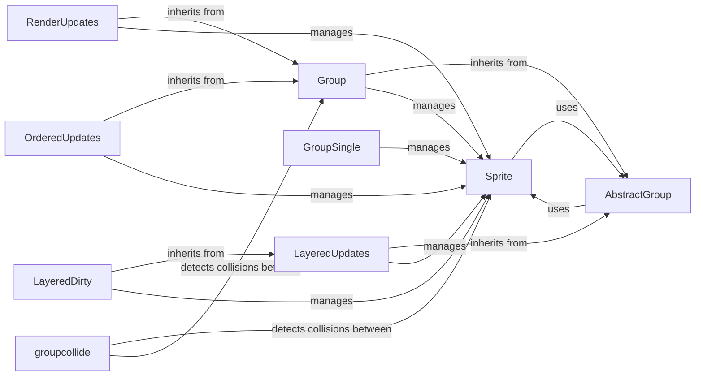

## Component Details

The Game Object Management component in Pygame provides a structured way to organize and interact with game entities. It revolves around the `Sprite` class, which serves as the base for all visible game objects, encapsulating their image and rectangular area. Sprites are managed using different types of `Group` classes, each offering unique functionalities like collision detection, layering, and optimized rendering. The `groupcollide` function facilitates collision detection between sprites in different groups. This system simplifies game development by providing tools for managing game objects, handling their interactions, and optimizing rendering performance.

### Sprite
The base class for visible game objects. It contains the basic functionality for a sprite, including its image and rectangular area. Sprites can be added to groups for management.
- **Related Classes/Methods**: `pygame.src_py.sprite.Sprite`

### AbstractGroup
Abstract base class for sprite groups. It provides common functionalities like adding, removing, iterating, and updating sprites. Concrete group classes inherit from this class.
- **Related Classes/Methods**: `pygame.src_py.sprite.AbstractGroup`

### Group
A simple group class for managing multiple Sprite objects. It inherits from AbstractGroup and provides basic functionalities for adding, removing, and updating sprites.
- **Related Classes/Methods**: `pygame.src_py.sprite.Group`

### RenderUpdates
A group class that extends Group and keeps track of which areas of the screen need to be updated. This is useful for optimizing drawing performance.
- **Related Classes/Methods**: `pygame.src_py.sprite.RenderUpdates`

### OrderedUpdates
A group class that maintains the order in which sprites are added. This is important for controlling the drawing order of sprites.
- **Related Classes/Methods**: `pygame.src_py.sprite.OrderedUpdates`

### LayeredUpdates
A group class that allows sprites to be organized into layers. This provides more control over the drawing order of sprites and allows for more complex visual effects.
- **Related Classes/Methods**: `pygame.src_py.sprite.LayeredUpdates`

### LayeredDirty
A group class that combines the features of LayeredUpdates and DirtySprite. It allows sprites to be organized into layers and only redraws the areas of the screen that have changed.
- **Related Classes/Methods**: `pygame.src_py.sprite.LayeredDirty`

### GroupSingle
A group class that can only contain a single sprite. This is useful for representing objects that should only have one instance, such as the player character.
- **Related Classes/Methods**: `pygame.src_py.sprite.GroupSingle`

### groupcollide
A function that detects collisions between sprites in two groups. It returns a dictionary of sprites that have collided.
- **Related Classes/Methods**: `pygame.src_py.sprite:groupcollide`
