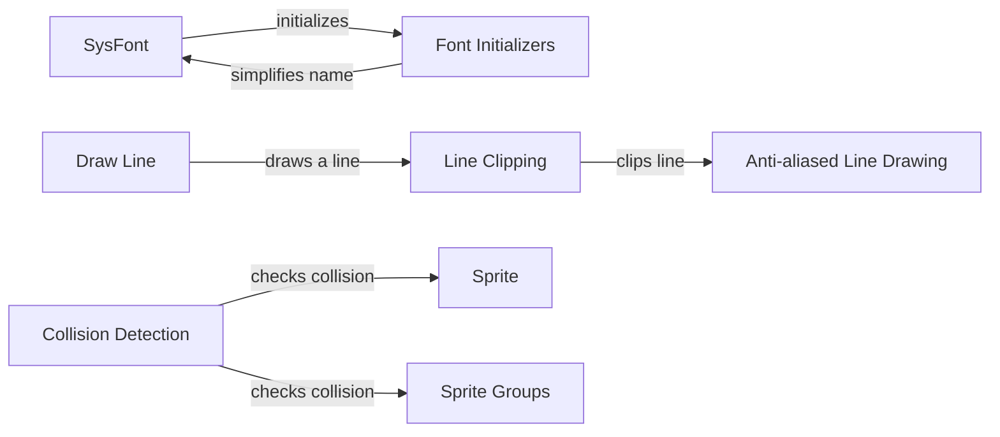

## Component Details

### SysFont
The SysFont component manages system fonts in Pygame. It initializes the font system, searches for available fonts on the operating system, and creates font objects for rendering text. It handles platform-specific font loading and uses FreeType for advanced rendering when available.
- **Related Classes/Methods**: `repos.pygame.src_py.sysfont`

### Font Initializers
The Font Initializers component consists of functions responsible for initializing the system font module and parsing font entries. `initsysfonts` detects the OS and calls platform-specific initialization. `_parse_font_entry_win`, `_parse_font_entry_darwin`, and `_parse_font_entry_unix` parse font entries from system configuration files. `_addfont` adds fonts to the internal list, and `_simplename` simplifies font names for matching.
- **Related Classes/Methods**: `repos.pygame.src_py.sysfont`

### Draw Line
The Draw Line component provides functions for drawing lines on surfaces. `draw_line` draws a basic line, while `draw_aaline` draws an anti-aliased line. These functions use clipping functions to ensure the lines are drawn within the surface boundaries.
- **Related Classes/Methods**: `repos.pygame.src_py.draw_py`

### Line Clipping
The Line Clipping component includes functions for clipping lines to a specified rectangle. `_clip_and_draw_line` and `_clip_and_draw_aaline` clip lines and draw them. `clip_line` is the core function that performs the clipping calculations.
- **Related Classes/Methods**: `repos.pygame.src_py.draw_py`

### Anti-aliased Line Drawing
The Anti-aliased Line Drawing component focuses on drawing smooth lines. `_draw_aaline` draws an anti-aliased line using helper functions to handle horizontal and vertical lines differently.
- **Related Classes/Methods**: `repos.pygame.src_py.draw_py`

### Sprite
The Sprite component is a base class for visible game objects. It manages the sprite's image, position, and visibility. It also provides methods for adding and removing the sprite from sprite groups.
- **Related Classes/Methods**: `repos.pygame.src_py.sprite`

### Sprite Groups
The Sprite Groups component provides classes for managing collections of sprites. `AbstractGroup` is an abstract base class, and `Group` is a concrete implementation. These classes allow for adding, removing, and updating sprites in a group.
- **Related Classes/Methods**: `repos.pygame.src_py.sprite`

### Collision Detection
The Collision Detection component provides functions for detecting collisions between sprites or sprite groups. `groupcollide` checks for collisions between two sprite groups and can optionally kill colliding sprites.
- **Related Classes/Methods**: `repos.pygame.src_py.sprite`
