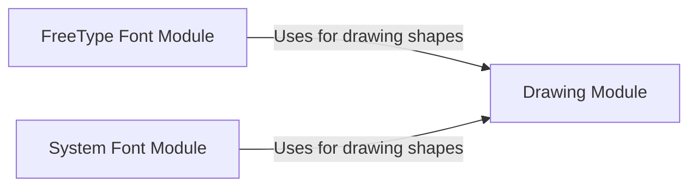

## Component Details

The Graphics and Display Manager in Pygame handles the rendering of visuals, including shapes, lines, images, and text, onto surfaces. It leverages modules for basic drawing operations, font rendering using FreeType, and system font access to provide a comprehensive suite of functionalities for displaying graphical content in games and applications.

### Drawing Module
The Drawing Module provides functions for drawing basic shapes and lines on a Pygame Surface. It supports various shapes like lines, rectangles, polygons, circles, ellipses, and arcs. It also includes functionalities for clipping lines and handling antialiasing to improve the visual quality of rendered graphics.

**Related Classes/Methods**:

- <a href="https://github.com/pygame/pygame/blob/master/src_py/draw_py.py#L75-L89" target="_blank" rel="noopener noreferrer">`src_py.draw_py:_clip_and_draw_horizline` (75:89)</a>
- <a href="https://github.com/pygame/pygame/blob/master/src_py/draw_py.py#L92-L107" target="_blank" rel="noopener noreferrer">`src_py.draw_py:_clip_and_draw_vertline` (92:107)</a>
- <a href="https://github.com/pygame/pygame/blob/master/src_py/draw_py.py#L129-L188" target="_blank" rel="noopener noreferrer">`src_py.draw_py:clip_line` (129:188)</a>
- <a href="https://github.com/pygame/pygame/blob/master/src_py/draw_py.py#L191-L240" target="_blank" rel="noopener noreferrer">`src_py.draw_py:_draw_line` (191:240)</a>
- <a href="https://github.com/pygame/pygame/blob/master/src_py/draw_py.py#L243-L298" target="_blank" rel="noopener noreferrer">`src_py.draw_py:_draw_aaline` (243:298)</a>
- <a href="https://github.com/pygame/pygame/blob/master/src_py/draw_py.py#L301-L318" target="_blank" rel="noopener noreferrer">`src_py.draw_py:_draw_aaline_dy` (301:318)</a>
- <a href="https://github.com/pygame/pygame/blob/master/src_py/draw_py.py#L321-L345" target="_blank" rel="noopener noreferrer">`src_py.draw_py:_draw_aaline_dx` (321:345)</a>
- <a href="https://github.com/pygame/pygame/blob/master/src_py/draw_py.py#L351-L369" target="_blank" rel="noopener noreferrer">`src_py.draw_py:_clip_and_draw_line` (351:369)</a>
- <a href="https://github.com/pygame/pygame/blob/master/src_py/draw_py.py#L372-L410" target="_blank" rel="noopener noreferrer">`src_py.draw_py:_clip_and_draw_line_width` (372:410)</a>
- <a href="https://github.com/pygame/pygame/blob/master/src_py/draw_py.py#L413-L422" target="_blank" rel="noopener noreferrer">`src_py.draw_py:_clip_and_draw_aaline` (413:422)</a>
- <a href="https://github.com/pygame/pygame/blob/master/src_py/draw_py.py#L428-L431" target="_blank" rel="noopener noreferrer">`src_py.draw_py:draw_aaline` (428:431)</a>
- <a href="https://github.com/pygame/pygame/blob/master/src_py/draw_py.py#L434-L437" target="_blank" rel="noopener noreferrer">`src_py.draw_py:draw_line` (434:437)</a>
- <a href="https://github.com/pygame/pygame/blob/master/src_py/draw_py.py#L443-L489" target="_blank" rel="noopener noreferrer">`src_py.draw_py:_multi_lines` (443:489)</a>
- <a href="https://github.com/pygame/pygame/blob/master/src_py/draw_py.py#L494-L496" target="_blank" rel="noopener noreferrer">`src_py.draw_py:draw_lines` (494:496)</a>
- <a href="https://github.com/pygame/pygame/blob/master/src_py/draw_py.py#L499-L501" target="_blank" rel="noopener noreferrer">`src_py.draw_py:draw_aalines` (499:501)</a>
- <a href="https://github.com/pygame/pygame/blob/master/src_py/draw_py.py#L504-L541" target="_blank" rel="noopener noreferrer">`src_py.draw_py:draw_polygon` (504:541)</a>

### FreeType Font Module
The FreeType Font Module provides the `Font` object, enabling the rendering of text onto a Surface. It utilizes the FreeType library to handle font rendering, offering support for various font styles and sizes. This module is essential for displaying text within Pygame applications.

**Related Classes/Methods**:

- <a href="https://github.com/pygame/pygame/blob/master/src_py/ftfont.py#L169-L200" target="_blank" rel="noopener noreferrer">`src_py.ftfont:SysFont` (169:200)</a>

### System Font Module
The System Font Module provides access to system fonts, allowing Pygame applications to utilize fonts installed on the user's system. It includes functions for initializing system fonts, retrieving a list of available fonts, and matching fonts based on name and style. This module facilitates the use of diverse fonts for text rendering.

**Related Classes/Methods**:

- <a href="https://github.com/pygame/pygame/blob/master/src_py/sysfont.py#L55-L92" target="_blank" rel="noopener noreferrer">`src_py.sysfont:initsysfonts_win32` (55:92)</a>
- <a href="https://github.com/pygame/pygame/blob/master/src_py/sysfont.py#L95-L121" target="_blank" rel="noopener noreferrer">`src_py.sysfont:_parse_font_entry_win` (95:121)</a>
- <a href="https://github.com/pygame/pygame/blob/master/src_py/sysfont.py#L124-L149" target="_blank" rel="noopener noreferrer">`src_py.sysfont:_parse_font_entry_darwin` (124:149)</a>
- <a href="https://github.com/pygame/pygame/blob/master/src_py/sysfont.py#L152-L180" target="_blank" rel="noopener noreferrer">`src_py.sysfont:_font_finder_darwin` (152:180)</a>
- <a href="https://github.com/pygame/pygame/blob/master/src_py/sysfont.py#L183-L200" target="_blank" rel="noopener noreferrer">`src_py.sysfont:initsysfonts_darwin` (183:200)</a>
- <a href="https://github.com/pygame/pygame/blob/master/src_py/sysfont.py#L204-L245" target="_blank" rel="noopener noreferrer">`src_py.sysfont:initsysfonts_unix` (204:245)</a>
- <a href="https://github.com/pygame/pygame/blob/master/src_py/sysfont.py#L248-L268" target="_blank" rel="noopener noreferrer">`src_py.sysfont:_parse_font_entry_unix` (248:268)</a>
- <a href="https://github.com/pygame/pygame/blob/master/src_py/sysfont.py#L342-L363" target="_blank" rel="noopener noreferrer">`src_py.sysfont:initsysfonts` (342:363)</a>
- <a href="https://github.com/pygame/pygame/blob/master/src_py/sysfont.py#L390-L460" target="_blank" rel="noopener noreferrer">`src_py.sysfont:SysFont` (390:460)</a>
- <a href="https://github.com/pygame/pygame/blob/master/src_py/sysfont.py#L463-L473" target="_blank" rel="noopener noreferrer">`src_py.sysfont:get_fonts` (463:473)</a>
- <a href="https://github.com/pygame/pygame/blob/master/src_py/sysfont.py#L476-L515" target="_blank" rel="noopener noreferrer">`src_py.sysfont:match_font` (476:515)</a>