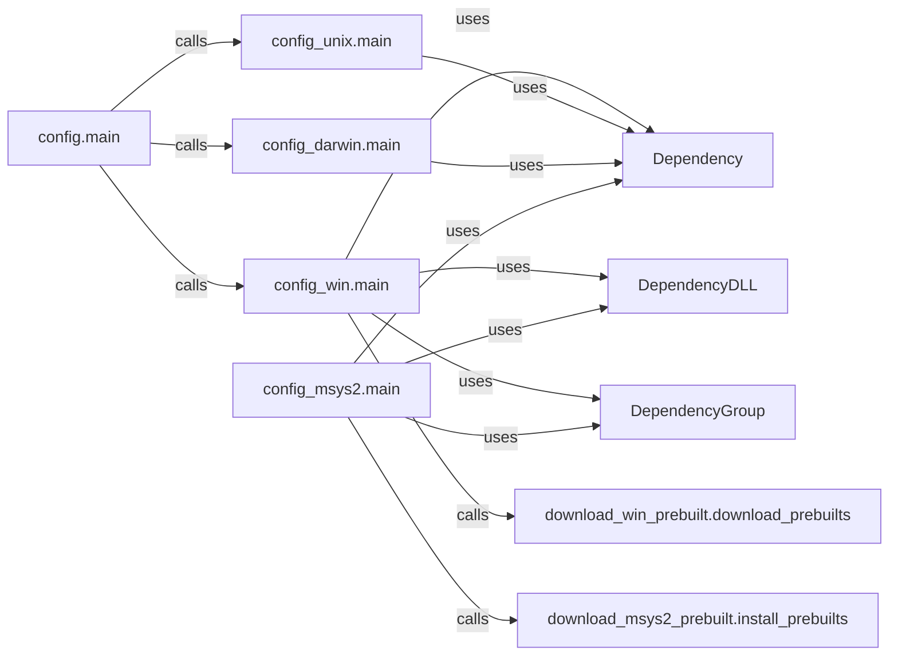

## Component Details

The build configuration system for Pygame is responsible for detecting dependencies, downloading prebuilt binaries when necessary, and setting up the build environment for different platforms (Windows, Unix, macOS). It uses a modular design with platform-specific configuration modules and dependency management classes to ensure that all required resources are available before the game starts. The main flow involves identifying the platform, configuring dependencies using platform-specific logic, and downloading/installing prebuilt binaries if needed.

### config.main
The main entry point for the build configuration process. It determines the platform and calls the appropriate platform-specific configuration module (e.g., config_win.main, config_unix.main, config_darwin.main).
- **Related Classes/Methods**: `pygame.buildconfig.config:main`

### config_win.main
Handles build configuration specifically for Windows. It detects dependencies, downloads prebuilt binaries if necessary using download_win_prebuilt.download_prebuilts, and sets up the build environment. It uses Dependency, DependencyDLL, and DependencyGroup classes to manage dependencies.
- **Related Classes/Methods**: `pygame.buildconfig.config_win:main`

### config_unix.main
Handles build configuration for Unix-like systems. It detects dependencies and sets up the build environment. It uses the Dependency class to manage dependencies.
- **Related Classes/Methods**: `pygame.buildconfig.config_unix:main`

### config_darwin.main
Handles build configuration specifically for macOS (Darwin). It detects dependencies and sets up the build environment. It uses the Dependency class to manage dependencies.
- **Related Classes/Methods**: `pygame.buildconfig.config_darwin:main`

### Dependency
A base class for representing a dependency (e.g., SDL2). It provides methods for finding and configuring the dependency. It is used by platform-specific configuration modules to manage dependencies.
- **Related Classes/Methods**: `pygame.buildconfig.config_win.Dependency:findhunt`, `pygame.buildconfig.config_win.Dependency:prunepaths`, `pygame.buildconfig.config_win.Dependency:configure`, `pygame.buildconfig.config_msys2.Dependency:findhunt`, `pygame.buildconfig.config_msys2.Dependency:prunepaths`, `pygame.buildconfig.config_msys2.Dependency:configure`

### DependencyDLL
Represents a DLL dependency. It extends the Dependency class and adds functionality for handling DLL-specific configuration. It is used by config_win.main and config_msys2.main to manage DLL dependencies.
- **Related Classes/Methods**: `pygame.buildconfig.config_win.DependencyDLL:__init__`, `pygame.buildconfig.config_win.DependencyDLL:configure`, `pygame.buildconfig.config_win.DependencyDLL:check_roots`, `pygame.buildconfig.config_msys2.DependencyDLL:__init__`, `pygame.buildconfig.config_msys2.DependencyDLL:configure`, `pygame.buildconfig.config_msys2.DependencyDLL:check_roots`

### DependencyGroup
A class for grouping dependencies together. It provides methods for adding and configuring dependencies within the group. It is used by config_win.main and config_msys2.main to group and manage dependencies.
- **Related Classes/Methods**: `pygame.buildconfig.config_win.DependencyGroup:add`, `pygame.buildconfig.config_win.DependencyGroup:add_win`, `pygame.buildconfig.config_win.DependencyGroup:add_dll`, `pygame.buildconfig.config_win.DependencyGroup:add_dummy`, `pygame.buildconfig.config_win.DependencyGroup:configure`, `pygame.buildconfig.config_msys2.DependencyGroup:add`, `pygame.buildconfig.config_msys2.DependencyGroup:add_win`, `pygame.buildconfig.config_msys2.DependencyGroup:add_dll`, `pygame.buildconfig.config_msys2.DependencyGroup:add_dummy`, `pygame.buildconfig.config_msys2.DependencyGroup:configure`

### download_win_prebuilt.download_prebuilts
Downloads prebuilt binaries for Windows dependencies. It is called by config_win.main when prebuilt binaries are needed.
- **Related Classes/Methods**: `pygame.buildconfig.download_win_prebuilt:download_prebuilts`

### download_msys2_prebuilt.install_prebuilts
Installs prebuilt binaries for MSYS2 environment. It is called by config_msys2.main when prebuilt binaries are needed.
- **Related Classes/Methods**: `pygame.buildconfig.download_msys2_prebuilt:install_prebuilts`

### config_msys2.main
Handles build configuration specifically for Windows using MSYS2. It detects dependencies, downloads prebuilt binaries if necessary using download_msys2_prebuilt.install_prebuilts, and sets up the build environment. It uses Dependency, DependencyDLL, and DependencyGroup classes to manage dependencies.
- **Related Classes/Methods**: `pygame.buildconfig.config_msys2:main`
