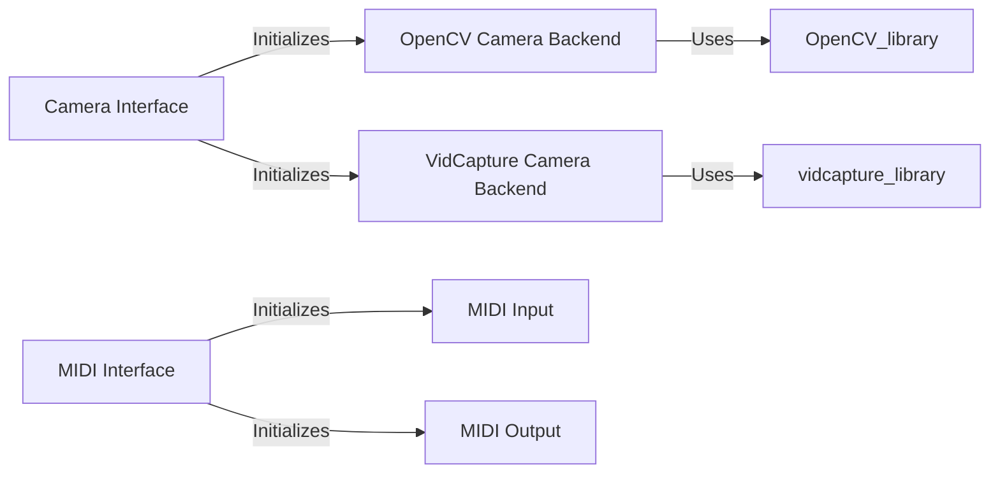

## Component Details

The Input Device Handling subsystem in Pygame enables developers to integrate alternative input methods into their games, expanding beyond traditional keyboard and mouse controls. This is achieved through camera and MIDI device support. The camera components allow capturing images from various camera backends (OpenCV, vidcapture), while the MIDI components facilitate interaction with MIDI devices for musical input and control. The subsystem initializes the respective device systems, provides interfaces for reading input, and allows for sending output to MIDI devices.

### Camera Interface
The Camera Interface provides a unified way to access camera functionality within Pygame, abstracting away the specifics of different camera backends. It handles initialization of the camera system and selection of the appropriate backend based on availability and user preference.
- **Related Classes/Methods**: `pygame.src_py.camera`

### OpenCV Camera Backend
The OpenCV Camera Backend implements the camera interface using the OpenCV library. It provides methods for capturing images, setting camera controls (e.g., brightness, contrast), and retrieving camera information. This backend offers advanced image processing capabilities but requires OpenCV to be installed.
- **Related Classes/Methods**: `pygame.src_py._camera_opencv.Camera`

### VidCapture Camera Backend
The VidCapture Camera Backend implements the camera interface using the vidcapture library. It provides a simpler interface for capturing images from cameras. This backend is typically easier to set up than the OpenCV backend but may offer fewer advanced features.
- **Related Classes/Methods**: `pygame.src_py._camera_vidcapture.Camera`

### MIDI Interface
The MIDI Interface provides the core functionality for MIDI operations in Pygame. It handles initialization and quitting of the MIDI system, as well as functions for getting information about MIDI devices.
- **Related Classes/Methods**: `pygame.src_py.midi`

### MIDI Input
The MIDI Input component allows receiving MIDI messages from connected MIDI devices. It provides methods for polling for new MIDI events and reading the data associated with those events. This enables games to respond to musical input or control signals from MIDI controllers.
- **Related Classes/Methods**: `pygame.src_py.midi.Input`

### MIDI Output
The MIDI Output component enables sending MIDI messages to connected MIDI devices. It provides methods for writing different types of MIDI messages, such as note on/off, control change, and program change. This allows games to control external synthesizers or other MIDI-enabled devices.
- **Related Classes/Methods**: `pygame.src_py.midi.Output`
