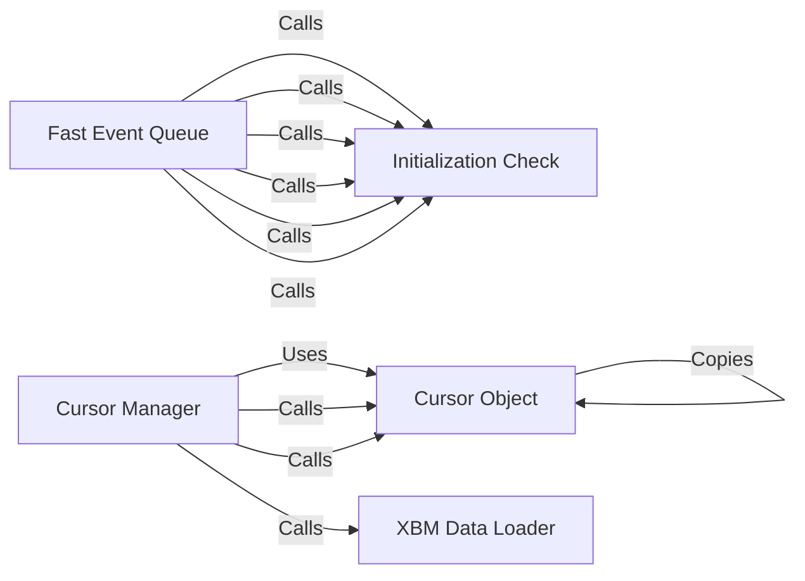

## Component Details

The Input Event Manager is responsible for handling user input events efficiently. It utilizes the `fastevent` module for fast event queue operations, allowing the application to quickly process events such as keyboard presses and mouse movements. The `cursors` module enables the creation and management of custom mouse cursors, enhancing the user interface. The manager ensures proper initialization of the `fastevent` module and provides functionalities for setting and retrieving cursor data.

### Fast Event Queue
The `fastevent` module provides a faster event queue implementation for Pygame. It offers functions for posting, getting, polling, and waiting for events, improving event handling performance. It uses `_ft_init_check` to ensure proper initialization before any operation.

**Related Classes/Methods**:

- <a href="https://github.com/pygame/pygame/blob/master/src_py/fastevent.py#LNone-LNone" target="_blank" rel="noopener noreferrer">`src_py.fastevent` (full file reference)</a>
- <a href="https://github.com/pygame/pygame/blob/master/src_py/fastevent.py#L51-L56" target="_blank" rel="noopener noreferrer">`src_py.fastevent:pump` (51:56)</a>
- <a href="https://github.com/pygame/pygame/blob/master/src_py/fastevent.py#L59-L64" target="_blank" rel="noopener noreferrer">`src_py.fastevent:wait` (59:64)</a>
- <a href="https://github.com/pygame/pygame/blob/master/src_py/fastevent.py#L67-L72" target="_blank" rel="noopener noreferrer">`src_py.fastevent:poll` (67:72)</a>
- <a href="https://github.com/pygame/pygame/blob/master/src_py/fastevent.py#L75-L80" target="_blank" rel="noopener noreferrer">`src_py.fastevent:get` (75:80)</a>
- <a href="https://github.com/pygame/pygame/blob/master/src_py/fastevent.py#L83-L88" target="_blank" rel="noopener noreferrer">`src_py.fastevent:post` (83:88)</a>

### Initialization Check
The `_ft_init_check` function checks if the `fastevent` module has been properly initialized before performing any operations. It ensures that the module is in a valid state before functions like `pump`, `wait`, `poll`, `get`, and `post` are called.

**Related Classes/Methods**:

- <a href="https://github.com/pygame/pygame/blob/master/src_py/fastevent.py#L16-L21" target="_blank" rel="noopener noreferrer">`src_py.fastevent._ft_init_check` (16:21)</a>

### Cursor Manager
The `cursors` module provides functionalities for creating and managing custom mouse cursors in Pygame. It allows loading cursor data and setting the active cursor. It uses the `Cursor` class to represent cursor objects and `load_xbm.bitswap` to handle xbm data.

**Related Classes/Methods**:

- <a href="https://github.com/pygame/pygame/blob/master/src_py/cursors.py#LNone-LNone" target="_blank" rel="noopener noreferrer">`src_py.cursors` (full file reference)</a>
- <a href="https://github.com/pygame/pygame/blob/master/src_py/cursors.py#L135-L139" target="_blank" rel="noopener noreferrer">`src_py.cursors:set_cursor` (135:139)</a>
- <a href="https://github.com/pygame/pygame/blob/master/src_py/cursors.py#L147-L150" target="_blank" rel="noopener noreferrer">`src_py.cursors:get_cursor` (147:150)</a>
- <a href="https://github.com/pygame/pygame/blob/master/src_py/cursors.py#L775-L837" target="_blank" rel="noopener noreferrer">`src_py.cursors:load_xbm` (775:837)</a>

### Cursor Object
The `Cursor` class represents a custom mouse cursor. It stores the cursor's image data and provides methods for comparing cursor instances and creating copies.

**Related Classes/Methods**:

- <a href="https://github.com/pygame/pygame/blob/master/src_py/cursors.py#L56-L131" target="_blank" rel="noopener noreferrer">`src_py.cursors.Cursor` (56:131)</a>
- <a href="https://github.com/pygame/pygame/blob/master/src_py/cursors.py#L106-L107" target="_blank" rel="noopener noreferrer">`src_py.cursors.Cursor:__ne__` (106:107)</a>
- <a href="https://github.com/pygame/pygame/blob/master/src_py/cursors.py#L103-L104" target="_blank" rel="noopener noreferrer">`src_py.cursors.Cursor:__eq__` (103:104)</a>
- <a href="https://github.com/pygame/pygame/blob/master/src_py/cursors.py#L109-L112" target="_blank" rel="noopener noreferrer">`src_py.cursors.Cursor:__copy__` (109:112)</a>

### XBM Data Loader
The `load_xbm.bitswap` function is used to swap the bits of the xbm data when loading a cursor from an XBM file. This is necessary to handle different byte orders.

**Related Classes/Methods**:

- <a href="https://github.com/pygame/pygame/blob/master/src_py/cursors.py#L784-L789" target="_blank" rel="noopener noreferrer">`src_py.cursors.load_xbm.bitswap` (784:789)</a>