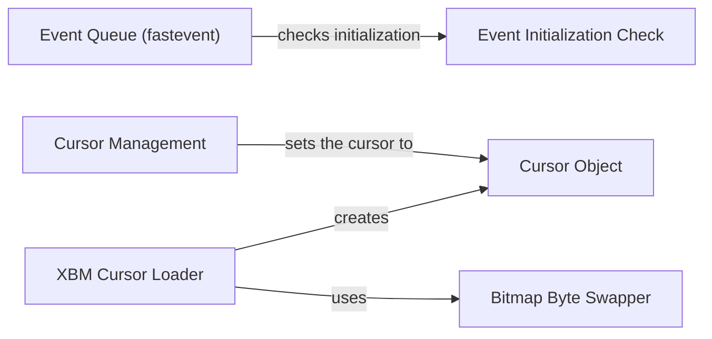

## Component Details

### Event Queue (fastevent)
The `fastevent` module provides a faster event queue implementation for Pygame. It allows posting and retrieving events, offering performance advantages over the standard Pygame event system. It manages the event queue and ensures proper initialization before event operations.
- **Related Classes/Methods**: `repos.pygame.src_py.fastevent`

### Event Initialization Check
The `_ft_init_check` function ensures that the `fastevent` module is properly initialized before any event operations are performed. It is called by other functions within the `fastevent` module to prevent errors caused by uninitialized state.
- **Related Classes/Methods**: `repos.pygame.src_py.fastevent`

### Cursor Management
The `cursors` module provides functionalities for managing mouse cursors, including loading custom cursors from XBM files and setting the active cursor. It allows developers to create visually appealing and informative cursors for their applications.
- **Related Classes/Methods**: `repos.pygame.src_py.cursors`

### Cursor Object
The `Cursor` class represents a custom mouse cursor. It encapsulates the data and methods required to define and manipulate a cursor, such as setting the cursor's image and hotspot. It provides methods for comparing and copying cursor objects.
- **Related Classes/Methods**: `repos.pygame.src_py.cursors`

### XBM Cursor Loader
The `load_xbm` function loads cursor data from an XBM (X BitMap) file. It reads the bitmap data, performs necessary byte swapping, and creates a `Cursor` object. This function enables the use of custom cursors defined in the XBM format.
- **Related Classes/Methods**: `repos.pygame.src_py.cursors`

### Bitmap Byte Swapper
The `bitswap` function is a helper function used by `load_xbm` to swap the byte order of the bitmap data. This is necessary to handle different endianness and ensure that the cursor is displayed correctly.
- **Related Classes/Methods**: `repos.pygame.src_py.cursors`
