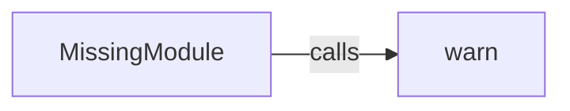

## Component Details

The Module Management component in Pygame gracefully handles missing optional modules. It uses the `MissingModule` class as a placeholder. When an attribute of a missing module is accessed, a warning is issued to the user, preventing the application from crashing due to unavailable dependencies. The `warn` function is used to display these warnings.

### MissingModule
This class acts as a placeholder for missing Pygame modules. When an attribute is accessed on an instance of this class, it issues a warning to the user, indicating that the module is not available.

**Related Classes/Methods**:

- <a href="https://github.com/pygame/pygame/blob/master/src_py/__init__.py#L53-L84" target="_blank" rel="noopener noreferrer">`src_py.__init__.MissingModule` (53:84)</a>
- <a href="https://github.com/pygame/pygame/blob/master/src_py/__init__.py#L56-L63" target="_blank" rel="noopener noreferrer">`src_py.__init__.MissingModule.__init__` (56:63)</a>
- <a href="https://github.com/pygame/pygame/blob/master/src_py/__init__.py#L65-L70" target="_blank" rel="noopener noreferrer">`src_py.__init__.MissingModule.__getattr__` (65:70)</a>
- <a href="https://github.com/pygame/pygame/blob/master/src_py/__init__.py#L75-L84" target="_blank" rel="noopener noreferrer">`src_py.__init__.MissingModule.warn` (75:84)</a>

### warn
This method is responsible for displaying a warning message to the user when an attribute of a missing module is accessed. It uses `pygame.warn` to show the warning.

**Related Classes/Methods**:

- <a href="https://github.com/pygame/pygame/blob/master/src_py/__init__.py#L75-L84" target="_blank" rel="noopener noreferrer">`src_py.__init__.MissingModule.warn` (75:84)</a>